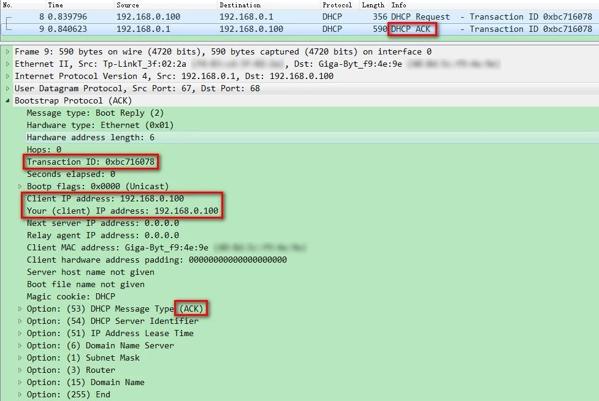
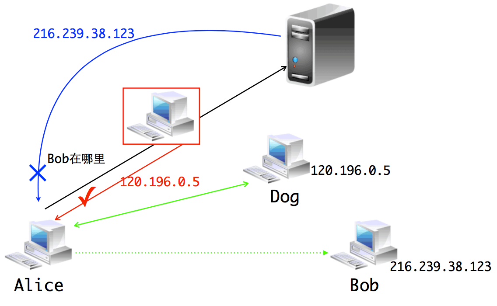
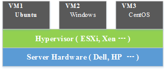
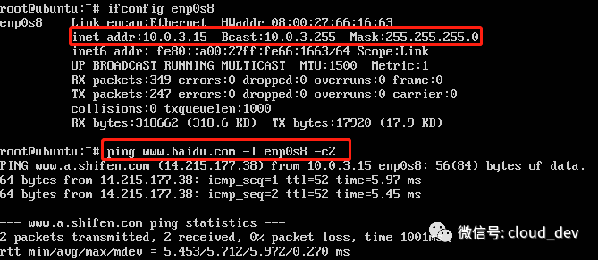
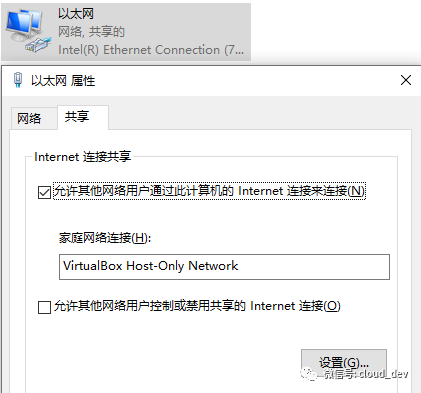
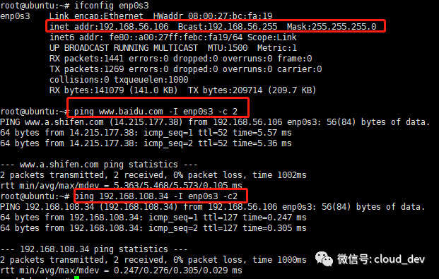
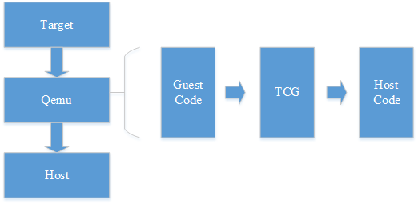

这份文档的所有文章都是首发于公众号「Linux云计算网络（id:cloud_dev）」，正在看文章的你如果还没有关注，赶快去关注下，相信我，这绝对是一个宝藏公众号。


<center><b>Linux云计算网络</b></center>
<center>微信扫描二维码，快快关注我吧</center>

如果你想加群和一群既有技术又有趣的人一起讨论学习，可以加博主的微信（id:clouddev），记得备注「加群」，我会拉你进群。


<center>微信扫描二维码，等你来撩</center>

PS：需要说明的是，这份文档只是公众号内容的冰山一角，从建号到现在，公众号已经推文 600 余篇，所以，你想看更多的干货，可以到公众号去搜索。这份文档更多记录的是一些由浅入深的基础知识，而且目前还不是完善的。

博主还在不定期“肝文”，且不定期更新文档，不定期在公众号发布最新的版本，所以，大家如果对这些内容感兴趣的话，一定关注公众号，不然咱们的缘分也就到此为止了。

文档内容和公众号的内容也是一样的，主要专注「Linux」、「云计算」、「网络」 三个方面的知识普及。这三块的技术栈可以说博大而精深，随便拎出一个都够你学了，所以我们不一定都要学，截取对自己有用的，搞定它就完了。

PSS：为了防止被不良人士窃取，文档会加少许水印，不会影响阅读，希望大家能够理解。

# Linux性能优化一览

## 一文掌握 Linux 性能分析之 CPU 篇


> 文章首发于我的公众号「Linux云计算网络」，欢迎关注，第一时间掌握技术干货！


平常工作会涉及到一些 Linux 性能分析的问题，因此决定总结一下常用的一些性能分析手段，仅供参考。

说到性能分析，基本上就是 CPU、内存、磁盘 IO 以及网络这几个部分，本文先来看 CPU 这个部分。

### CPU 基础信息

---

进行性能分析之前，首先得知道 CPU 有哪些信息，可以通过以下方法查看 CPU 配置信息。

#### **lscpu**

在 Linux 下，类似 lsxxx 这样的命令都是用来查看基本信息的，如 ls 查看当前目录文件信息，lscpu 就用来查看 CPU 信息，类似还有 lspci 查看 PCI 信息。


可以看到我的机器配置很低，1 核 2.5GHz（在阿里云买的最低配的服务器）。

#### **/proc/cpuinfo**

/proc 目录是内核透传出来给用户态使用的，里面记录着很多信息文件，比如还有内存文件 meminfo 等。可以使用 cat /proc/cpuinfo 查看 CPU 信息。


这里显示的信息可以具体到每个逻辑核上，由于我只有一个核，所以只显示一组信息。

#### **dmidecode**

这个命令是用来获取 DMI（Desktop Management Interface）硬件信息的，包括 BIOS、系统、主板、处理器、内存、缓存等等。对于 CPU 信息，可以使用 dmidecode -t processor 来查看。


### CPU 使用情况分析

---

知道了 CPU 的基本信息，我们就可以使用另外的命令来对 CPU 的使用情况分析一通了。

#### **top**

相信大家对下面这玩意不陌生，Windows 的任务管理器，top 的作用和它是一样的。


top 显示的效果虽说不像它这么华丽，但已然让人惊呼他俩怎么长得这么像。


我们重点关注这么几个字段：

- load average：三个数字分别表示最近 1 分钟，5 分钟和 15 分钟的负责，数值越大负载越重。一般要求不超过核数，比如对于单核情况要 < 1。如果机器长期处于高于核数的情况，说明机器 CPU 消耗严重了。
- %Cpu(s)：表示当前 CPU 的使用情况，如果要查看所有核（逻辑核）的使用情况，可以按下数字 “1” 查看。这里有几个参数，表示如下：

```
- us    用户空间占用 CPU 时间比例
- sy    系统占用 CPU 时间比例
- ni    用户空间改变过优先级的进程占用 CPU 时间比例
- id    CPU 空闲时间比
- wa    IO等待时间比（IO等待高时，可能是磁盘性能有问题了）
- hi    硬件中断
- si    软件中断
- st    steal time
```

每个进程的使用情况：这里可以罗列每个进程的使用情况，包括内存和 CPU 的，如果要看某个具体的进程，可以使用 `top -p pid` 查看。

和 top 一样的还有一个改进版的工具：htop，功能和 top 一样的，只不过比 top 表现更炫酷，使用更方便，可以看下它的效果。


#### **ps**

可能很多人会忽略这个命令，觉得这不是查看进程状态信息的吗，其实非也，这个命令配合它的参数能显示很多功能。比如 ps aux。如果配合 watch，可以达到跟 top 一样的效果，如：`watch -n 1 "ps aux"`（-n 1 表示每隔 1s 更新一次）


#### **vmstat**

这个命令基本能看出当前机器的运行状态和问题，非常强大。可以使用 `vmstat n` 后面跟一个数字，表示每隔 ns 显示系统的状态，信息包括 CPU、内存和 IO 等。


几个关键的字段：

- r 值：表示在 CPU 运行队列中等待的进程数，如果这个值很大，表示很多进程在排队等待执行，CPU 压力山大。
- in 和 cs 值：表示中断次数和上下文切换次数，这两个值越大，表示系统在进行大量的进程（或线程）切换。切换的开销是非常大的，这时候应该减少系统进程（或线程）数。
- us、sy、id、wa 值：这些值上面也提到过，分别表示用户空间进程，系统进程，空闲和 IO 等待的 CPU 占比，这里只有 id 很高是好的，表示系统比较闲，其他值飚高都不好。

这个工具强大之处在于它不仅可以分析 CPU，还可以分析内存、IO 等信息，犹如瑞士军刀。

#### **dstat**

这个命令也很强大，能显示 CPU 使用情况，磁盘 IO 情况，网络发包情况和换页情况，而且输出是彩色的，可读性比较强，相对于 vmstat 更加详细和直观。使用时可以直接输入命令，也可以带相关参数。


### 进程使用 CPU 情况分析

---

上面说的是系统级的分析，现在来看单个进程的 CPU 使用情况分析，以便于我们能对占用 CPU 过多的进程进行调试和分析，优化程序性能。

其实前面 top 和 ps 这样的命令就可以看每个进程的 CPU 使用情况，但我们需要更专业的命令。

#### **pidstat**

这个命令默认统计系统信息，也包括 CPU、内存和 IO 等，我们常用 pidstat -u -p pid [times] 来显示 CPU 统计信息。如下统计 pid = 802 的 CPU 信息。


#### **strace**

这个命令用来分析进程的系统调用情况，可以看进程都调用了哪些库和哪些系统调用，进而可以进一步优化程序。比如我们分析 ls 的系统调用情况，就可以用 strace ls：


可以看到，一个简单的 ls 命令，其实有不少系统调用的操作。

此外，还可以 attach（附着）到一个正在运行的进程上进行分析，比如我 attach 到 802 这个进程显示：


根据这些输出信息，其实就能够很好地帮我们分析问题，从而定位到问题所在了。

OK，以上就是平常比较常用的一些工具，当然除了这些，还有很多很多工具，下面放一张图，来自 Linux 大牛，Netflix 高级性能架构师 Brendan Gregg。看完了，你也许会感叹“这世界太疯狂了（just crazy）”。


Reference：
[1]. http://rdc.hundsun.com/portal/article/731.html


## 一文掌握 Linux 性能分析之内存篇


> 文章首发于我的公众号「Linux云计算网络」，欢迎关注，第一时间掌握技术干货！


### 内存信息

---


同样在分析内存之前，我们得知到怎么查看系统内存信息，有以下几种方法。

#### **/proc/meminfo**

这个文件记录着比较详细的内存配置信息，使用 cat /proc/meminfo 查看。


我们比较关心的是下面几个字段：

- MemTotal：系统总内存，由于 BIOS、内核等会占用一些内存，所以这里和配置声称的内存会有一些出入，比如我这里配置有 2G，但其实只有 1.95G 可用。
- MemFree：系统空闲内存。
- MemAvailable：应用程序可用内存。有人会比较奇怪和 MemFree 的区别，可以从两个层面来区分，MemFree 是系统层面的，而 MemAvailable 是应用程序层面的。系统中有些内存虽然被使用了但是有一部分是可以回收的，比如 Buffers、Cached 及 Slab 这些内存，这部分可以回收的内存加上 MemFree 才是 MemAvailable 的内存值，这是内核通过特定算法算出来的，是一个估算值。
- Buffers：缓冲区内存
- Cached：缓存

上面信息没有 MemUsed 的值，虽然可以用现有的值大致估算出来，但是我们想一步到位，就用下面的 free 命令。

#### **free**

这个命令估计用的人就多了（我一般都是用这个命令）。


这里存在一个计算公式：

**MemTotal = used + free + buff/cache（单位 K）**

几个字段和上面 /proc/meminfo 的字段是对应的。还有个 shared 字段，这个是多进程的共享内存空间，不常用。

我们注意到 free 很小，buff/cache 却很大，这是 Linux 的内存设计决定的，Linux 的想法是内存闲着反正也是闲着，不如拿出来做系统缓存和缓冲区，提高数据读写的速率。但是当系统内存不足时，buff/cache 会让出部分来，非常灵活的操作。

要看比较直观的值，可以加 -h 参数：


#### **dmidecode**

同样可以使用这个命令，对于内存，可以使用 dmidecode -t memory 查看：


#### **vmstat**

这个命令也是非常常用了。但对于内存，显示信息有限。它更多是用于进行系统全局分析和 CPU 分析。详细可以看 CPU 分析一文。


### 进程内存使用情况分析

---

最常用的两个命令 ps 和 top，虽然很简单的两个命令，但还是有不少学问的。

#### **top/htop**

top 命令运行时默认是按照 CPU 利用率进行排序的，如果要按照内存排序，该怎么操作呢？两种方法，一种直接按 “M”（相应的按 “P” 是 CPU），另外一种是在键入 top 之后，按下 “F”，然后选择要排序的字段，再按下 “s” 确认即可。


可以看到，我按照 “%MEM” 排序的结果。这个结果对于查看系统占用内存较多的哪些进程是比较有用的。

然后这里我们会重点关注几个地方，上面横排区，和前面几个命令一样可以查看系统内存信息，中间标注的横条部分，和内存相关的有三个字段：VIRT、RES、SHR。

- VIRT：virtual memory usage，进程占用的虚拟内存大小。
- RES：resident memory usage，进程常驻内存大小，也就是实际内存占用情况，一般我们看进程占用了多少内存，就是看的这个值。
- SHR：shared memory，共享内存大小，不常用。

#### **ps**

ps 同样可以查看进程占用内存情况，一般常用来查看 Top n 进程占用内存情况，如：

`ps aux --sort=rss | head -n`，表示按 rss 排序，取 Top n。


这里也关注三个字段：

- %MEM：进程使用物理内存所占百分比。
- VSZ：进程使用虚拟内存大小。
- RSS：进程使用物理内存大小，我们会重点关注这个值。

#### **pmap**

这个命令用于查看进程的内存映像信息，能够查看进程在哪些地方用了多少内存。常用 `pmap -x pid` 来查看。


可以看到该进程内存被哪些库、哪些文件所占用，据此我们定位程序对内存的使用。

几个字段介绍一下：

- Address：占用内存的文件的内存起始地址。
- Kbytes：占用内存的字节数。
- RSS：实际占用内存大小。
- Dirty：脏页大小。
- Mapping：占用内存的文件，[anon] 为已分配的内存，[stack] 为程序堆栈
- 最后的 total 为统计的总值。我们可以使用 pmap -x pid | tail -1 这样只显示最后一行，循环显示最后一行，达到监控该进程的目的。使用：
  `while true; do pmap -x pid | tail -1; sleep 1; done`

OK，以上工具都是 Linux 自带的，当然还有很多高阶的工具，比如 atop、memstat 等等，对于内存泄漏有一个比较常用的检测工具 Valgrind，这些等之后再找时间跟大家分享了。

通过以上手段，我们基本上就能定位内存问题所在了，究竟是内存太小，还是进程占用内存太多，有哪些进程占用较多，这些进程又究竟有哪些地方占用较多，这些问题通过以上方法都能解决。

最后简单总结下，以上不少工具可能有人会犯选择困难症了。对于我来说，查看系统内存用 free -h，分析进程内存占用用 ps 或者 top（首选 ps），深入分析选择 pmap，就酱。


Reference：
1.Linux下查看内存使用情况的多种方法：
http://stor.51cto.com/art/201804/570236.htm

## 一文掌握 Linux 性能分析之 IO 篇


> 文章首发于我的公众号「Linux云计算网络」，欢迎关注，第一时间掌握技术干货！


这是 Linux 性能分析系列的第三篇。

IO 和 存储密切相关，存储可以概括为磁盘，内存，缓存，三者读写的性能差距非常大，磁盘读写是毫秒级的（一般 0.1-10ms），内存读写是微妙级的（一般 0.1-10us），cache 是纳秒级的（一般 1-10ns）。但这也是牺牲其他特性为代价的，速度快的，价格越贵，容量也越小。

IO 性能这块，我们更多关注的是读写磁盘的性能。首先，先了解下磁盘的基本信息。


### 磁盘基本信息

---

#### **fdisk**

查看磁盘信息，包括磁盘容量，扇区大小，IO 大小等信息，常用 `fdisk -l `查看：


可以看到 /dev/ 下有一个 40G 的硬盘，一共 8K 多万个扇区，每个扇区 512字节，IO 大小也是 512 字节。

#### **df**

查看磁盘使用情况，通常看磁盘使用率：


### 磁盘性能分析

---

主要分析磁盘的读写效率（IOPS：每秒读写的次数；吞吐量：每秒读写的数据量），IO 繁忙程度，及 IO 访问对 CPU 的消耗等性能指标。

#### **vmstat**

第一个较为常用的还是这个万能的 vmstat：


对于 IO，我们常关注三个部分：

- b 值：表示因为 IO 阻塞排队的任务数
- bi 和 bo 值：表示每秒读写磁盘的块数，bi（block in）是写磁盘，bo（block out）是读磁盘。
- wa 值：表示因为 IO 等待（wait）而消耗的 CPU 比例。

一般这几个值偏大，都意味着系统 IO 的消耗较大，对于读请求较大的服务器，b、bo、wa 的值偏大，而写请求较大的服务器，b、bi、wa 的值偏大。

#### **iostat**

vmstat 虽然万能，但是它分析的东西有限，iostat 是专业分析 IO 性能的工具，可以方便查看 CPU、网卡、tty 设备、磁盘、CD-ROM 等等设备的信息，非常强大，总结下来，共有以下几种用法：

**1）iostat -c 查看部分 CPU 使用情况：**


这里显示的是多个 CPU 的平均值，每个字段的含义我就不多解释了，我一般会重点关注 %iowait 和 %idle，分别表示 CPU 等待 IO 完成时间的百分比和 CPU 空闲时间百分比。

如果 %iowait 较高，则表明磁盘存在 IO 瓶颈，如果 %idle 较高，则 CPU 比较空闲，如果两个值都比较高，则有可能 CPU 在等待分配内存，瓶颈在内存，此时应该加大内存，如果 %idle 较低，则此时瓶颈在 CPU，应该增加 CPU 资源。

**2）iostat -d 查看磁盘使用情况，主要是显示 IOPS 和吞吐量信息**（-k : 以 KB 为单位显示，-m：以 M 为单位显示）：


其中，几个参数分别解释如下：

- tps：设备每秒的传输次数（transfers per second），也就是读写次数。
- kB_read/s 和 kB_wrtn/s：每秒读写磁盘的数据量。
- kB_read 和 kB_wrtn：读取磁盘的数据总量。

**3）iostat -x 查看磁盘详细信息：**


其中，几个参数解释如下；

- rrqm/s 和 wrqm/s：分别每秒进行合并的读操作数和写操作数，这是什么意思呢，合并就是说把多次 IO 请求合并成少量的几次，这样可以减小 IO 开销，buffer 存在的意义就是为了解决这个问题的。
- r/s 和 w/s：每秒磁盘读写的次数。这两个值相加就是 tps。
- rkB/s 和 wkB/s：每秒磁盘读写的数据量，这两个值和上面的 kB_read/s、kB_wrnt/s 是一样的。
- avgrq-sz：平均每次读写磁盘扇区的大小。
- avgqu-sze：平均 IO 队列长度。队列长度越短越好。
- await：平均每次磁盘读写的等待时间（ms）。
- svctm：平均每次磁盘读写的服务时间（ms）。
- %util：一秒钟有百分之多少的时间用于磁盘读写操作。

以上这些参数太多了，我们并不需要每个都关注，可以重点关注两个：

**a. %util：衡量 IO 的繁忙程度**

这个值越大，说明产生的 IO 请求较多，IO 压力较大，我们可以结合 %idle 参数来看，如果 %idle < 70% 就说明 IO 比较繁忙了。也可以结合 vmstat 的 b 参数（等待 IO 的进程数）和 wa 参数（IO 等待所占 CPU 时间百分比）来看，如果 wa > 30% 也说明 IO 较为繁忙。

**b. await：衡量 IO 的响应速度**

通俗理解，await 就像我们去医院看病排队等待的时间，这个值和医生的服务速度（svctm）和你前面排队的人数（avgqu-size）有关。如果 svctm 和 await 接近，说明磁盘 IO 响应时间较快，排队较少，如果 await 远大于 svctm，说明此时队列太长，响应较慢，这时可以考虑换性能更好的磁盘或升级 CPU。

**4）iostat 1 2 默认显示 cpu 和 吞吐量信息，1 定时 1s 显示，2 显示 2 条信息**


### 进程 IO 性能分析

---

有了以上两个命令，基本上能对磁盘 IO 的信息有个全方位的了解了。但如果要确定具体哪个进程的 IO 开销较大，这就得借助另外的工具了。

#### **iotop**

这个命令类似 top，可以显示每个进程的 IO 情况，有了这个命令，就可以定位具体哪个进程的 IO 开销比较大了。


### 总结

---

OK，最后还是总结下，fdisk -l 和 df 查看磁盘基本信息，iostat -d 查看磁盘 IOPS 和吞吐量，iostat -x 结合 vmstat 查看磁盘的繁忙程度和处理效率。

下文我们将探讨网络方面的的性能分析问题。

Reference：

1. linux 性能分析：
   http://linuxtools-rst.readthedocs.io/zh_CN/latest/tool/iostat.html

2. linux 性能分析工具总结：
   http://rdc.hundsun.com/portal/article/731.html

## 一文掌握 Linux 性能分析之网络篇


> 文章首发于我的公众号「Linux云计算网络」，欢迎关注，第一时间掌握技术干货！


这是 Linux 性能分析系列的第四篇。

比较宽泛地讲，网络方向的性能分析既包括主机测的网络配置查看、监控，又包括网络链路上的包转发时延、吞吐量、带宽等指标分析。包括但不限于以下分析工具：

- ping：测试网络连通性
- ifconfig：接口配置
- ip：网络接口统计信息
- netsat：多种网络栈和接口统计信息
- ifstat：接口网络流量监控工具
- netcat：快速构建网络连接
- tcpdump：抓包工具
- sar：统计信息历史
- traceroute：测试网络路由
- pathchar：确定网络路径特征
- dtrace：TCP/IP 栈跟踪
- iperf / netperf / netserver：网络性能测试工具
- perf ：性能分析神器

本文先来看前面 7 个。

#### **ping**

---

ping 发送 ICMP echo 数据包来探测网络的连通性，除了能直观地看出网络的连通状况外，还能获得本次连接的往返时间（RTT 时间），丢包情况，以及访问的域名所对应的 IP 地址（使用 DNS 域名解析），比如：


我们 `ping baidu.com，-c `参数指定发包数。可以看到，解析到了 baidu 的一台服务器 IP 地址为 220.181.112.244。RTT 时间的最小、平均、最大和算术平均差分别是 40.732ms、40.762ms、40.791ms 和 0.248。

#### **ifconfig**

---


ifconfig 命令被用于配置和显示 Linux 内核中网络接口的统计信息。通过这些统计信息，我们也能够进行一定的网络性能调优。

**1）ifconfig 显示网络接口配置信息**


其中，RX/TX packets 是对接收/发送数据包的情况统计，包括错误的包，丢掉多少包等。RX/TX bytes 是接收/发送数据字节数统计。其余还有很多参数，就不一一述说了，性能调优时可以重点关注 MTU（最大传输单元） 和 txqueuelen（发送队列长度），比如可以用下面的命令来对这两个参数进行微调：

```
ifconfig eth0 txqueuelen 2000
ifconfig eth0 mtu 1500
```

**2）网络接口地址配置**

ifconfig 还常用来配置网口的地址，比如：
为网卡配置和删除 IPv6 地址：

```
ifconfig eth0 add 33ffe:3240:800:1005::2/64    #为网卡eth0配置IPv6地址
ifconfig eth0 del 33ffe:3240:800:1005::2/64    #为网卡eth0删除IPv6地址
```

修改MAC地址：

```
ifconfig eth0 hw ether 00:AA:BB:CC:dd:EE
```

配置IP地址：

```
ifconfig eth0 192.168.2.10
ifconfig eth0 192.168.2.10 netmask 255.255.255.0
ifconfig eth0 192.168.2.10 netmask 255.255.255.0 broadcast 192.168.2.255
```

#### **IP**

---

ip 命令用来显示或设置 Linux 主机的网络接口、路由、网络设备、策略路由和隧道等信息，是 Linux 下功能强大的网络配置工具，旨在替代 ifconfig 命令，如下显示 IP 命令的强大之处，功能涵盖到 ifconfig、netstat、route 三个命令。


#### **netstat**

---

netstat 可以查看整个 Linux 系统关于网络的情况，是一个集多钟网络工具于一身的组合工具。

常用的选项包括以下几个：

- 默认：列出连接的套接字
- -a：列出所有套接字的信息
- -s：各种网络协议栈统计信息
- -i：网络接口信息
- -r：列出路由表
- -l：仅列出有在 Listen 的服务状态
- -p：显示 PID 和进程名称

各参数组合使用实例如下：

- netstat -at 列出所有 TCP 端口
- netstat -au 列出所有 UDP 端口
- netstat -lt 列出所有监听 TCP 端口的 socket
- netstat -lu 列出所有监听 UDP 端口的 socket
- netstat -lx 列出所有监听 UNIX 端口的 socket
- netstat -ap | grep ssh 找出程序运行的端口
- netstat -an | grep ':80' 找出运行在指定端口的进程

**1）netstat 默认显示连接的套接字数据**


整体上来看，输出结果包括两个部分：

- Active Internet connections ：有源 TCP 连接，其中 Recv-Q 和 Send-Q 指的是接收队列和发送队列，这些数字一般都是 0，如果不是，说明请求包和回包正在队列中堆积。
- Active UNIX domain sockets：有源 UNIX 域套接口，其中 proto 显示连接使用的协议，RefCnt 表示连接到本套接口上的进程号，Types 是套接口的类型，State 是套接口当前的状态，Path 是连接到套接口的进程使用的路径名。

**2）netstat -i 显示网络接口信息**


接口信息包括网络接口名称（Iface）、MTU，以及一系列接收（RX-）和传输（TX-）的指标。其中 OK 表示传输成功的包，ERR 是错误包，DRP 是丢包，OVR 是超限包。

这些参数有助于我们对网络收包情况进行分析，从而判断瓶颈所在。

**3）netstat -s 显示所有网络协议栈的信息**


可以看到，这条命令能够显示每个协议详细的信息，这有助于我们针对协议栈进行更细粒度的分析。

**4）netstat -r 显示路由表信息**


这条命令能够看到主机路由表的一个情况。当然查路由我们也可以用 ip route 和 route 命令，这个命令显示的信息会更详细一些。

#### **ifstat**

---

ifstat 主要用来监测主机网口的网络流量，常用的选项包括：

- -a：监测主机所有网口
- -i：指定要监测的网口
- -t：在每行输出信息前加上时间戳
- -b：以 Kbit/s 显示流量数据，而不是默认的 KB/s
- delay：采样间隔（单位是 s），即每隔 delay 的时间输出一次统计信息
- count：采样次数，即共输出 count 次统计信息

比如，通过以下命令统计主机所有网口某一段时间内的流量数据：


可以看出，分别统计了三个网口的流量数据，前面输出的时间戳，有助于我们统计一段时间内各网口总的输入、输出流量。

#### **netcat**

---

netcat，简称 nc，命令简单，但功能强大，在排查网络故障时非常有用，因此它也在众多网络工具中有着“瑞士军刀”的美誉。

它主要被用来构建网络连接。可以以客户端和服务端的方式运行，当以服务端方式运行时，它负责监听某个端口并接受客户端的连接，因此可以用它来调试客户端程序；当以客户端方式运行时，它负责向服务端发起连接并收发数据，因此也可以用它来调试服务端程序，此时它有点像 Telnet 程序。

常用的选项包括以下几种：

- -l：以服务端的方式运行，监听指定的端口。默认是以客户端的方式运行。
- -k：重复接受并处理某个端口上的所有连接，必须与 -l 一起使用。
- -n：使用 IP 地址表示主机，而不是主机名，使用数字表示端口号，而不是服务名称。
- -p：当以客户端运行时，指定端口号。
- -s：设置本地主机发出的数据包的 IP 地址。
- -C：将 CR 和 LF 两个字符作为结束符。
- -U：使用 UNIX 本地域套接字通信。
- -u：使用 UDP 协议通信，默认使用的是 TCP 协议。
- -w：如果 nc 客户端在指定的时间内未检测到任何输入，则退出。
- -X：当 nc 客户端与代理服务器通信时，该选项指定它们之间的通信协议，目前支持的代理协议包括 “4”（SOCKS v.4），“5”（SOCKS v.5）和 “connect” （HTTPs Proxy），默认使用 SOCKS v.5。
- -x：指定目标代理服务器的 IP 地址和端口号。

下面举一个简单的例子，使用 nc 命令发送消息：
首先，启动服务端，用 nc -l 0.0.0.0 12345 监听端口 12345 上的所有连接。


然后，启动客户端，用 nc -p 1234 127.0.0.1 12345 使用 1234 端口连接服务器 127.0.0.1::12345。


接着就可以在两端互发数据了。这里只是抛砖引玉，更多例子大家可以多实践。

#### **tcpdump**

---

最后是 tcpdump，强大的网络抓包工具。虽然有 wireshark 这样更易使用的图形化抓包工具，但 tcpdump 仍然是网络排错的必备利器。

tcpdump 选项很多，我就不一一列举了，大家可以看文章末尾的引用来进一步了解。这里列举几种 tcpdump 常用的用法。

**1）捕获某主机的数据包**

比如想要捕获主机 200.200.200.100 上所有收到和发出的所有数据包，使用：

```
tcpdump host 200.200.200.100
```

**2）捕获多个主机的数据包**

比如要捕获主机 200.200.200.1 和主机 200.200.200.2 或 200.200.200.3 的通信，使用：

```
tcpdump host 200.200.200.1 and \(200.200.200.2 or \)
```

同样要捕获主机 200.200.200.1 除了和主机 200.200.200.2 之外所有主机通信的 IP 包。使用：

```
tcpdump ip host 200.200.200.1 and ! 200.200.200.2
```

**3）捕获某主机接收或发出的某种协议类型的包**
比如要捕获主机 200.200.200.1 接收或发出的 Telnet 包，使用：

```
tcpdump tcp port 23 host 200.200.200.1
```

**4）捕获某端口相关的数据包**

比如捕获在端口 6666 上通过的包，使用：

```
tcpdump port 6666
```

**5）捕获某网口的数据包**
比如捕获在网口 eth0 上通过的包，使用：

```
tcpdump -i eth0
```

下面还是举个例子，抓取 TCP 三次握手的包：
首先，用 nc 启动一个服务端，监听端口 12345 上客户端的连接：

```
nc -v -l 0.0.0.0 12345
```

接着，启动 tcpdump 监听端口 12345 上通过的包：

```
tcpdump -i any 'port 12345' -XX -nn -vv -S
```

然后，再用 nc 启动客户端，连接服务端：

```
nc -v 127.0.0.1 12345
```

最后，我们看到 tcpdump 抓到包如下：


怎么分析是 TCP 的三次握手，就当做小作业留给大家吧，其实看图就已经很明显了。

在上篇中，我们已经介绍了几个 Linux 网络方向的性能分析工具，本文再补充几个。总结下来，余下的工具包括但不限于以下几个：

- sar：统计信息历史
- traceroute：测试网络路由
- dtrace：TCP/IP 栈跟踪
- iperf / netperf / netserver：网络性能测试工具
- perf 性能分析神器

由于篇幅有限，本文会先介绍前面两个，其他工具留作后面介绍，大家可以持续关注。

#### **sar**


sar 是一个系统历史数据统计工具。统计的信息非常全，包括 CPU、内存、磁盘 I/O、网络、进程、系统调用等等信息，是一个集大成的工具，非常强大。在 Linux 系统上 `sar --help` 一下，可以看到它的完整用法。

- -A：所有报告的总和
- -u：输出 CPU 使用情况的统计信息
- -v：输出 inode、文件和其他内核表的统计信息
- -d：输出每一个块设备的活动信息
- -r：输出内存和交换空间的统计信息
- -b：显示 I/O和传送速率的统计信息
- -a：文件读写情况
- -c：输出进程统计信息，每秒创建的进程数
- -R：输出内存页面的统计信息
- -y：终端设备活动情况
- -w：输出系统交换活动信息
- -n：输出网络设备统计信息

在平时使用中，我们常常用来分析网络状况，其他几项的通常有更好的工具来分析。所以，本文会重点介绍 sar 在网络方面的分析手法。

Linux 系统用以下几个选项提供网络统计信息：

- -n DEV：网络接口统计信息。
- -n EDEV：网络接口错误。
- -n IP：IP 数据报统计信息。
- -n EIP：IP 错误统计信息。
- -n TCP：TCP 统计信息。
- -n ETCP：TCP 错误统计信息。
- -n SOCK：套接字使用。

我们来看几个示例：

**（1）每秒打印 TCP 的统计信息：**

`sar -n TCP 1`


几个参数了解一下：

- active/s：新的 TCP 主动连接（也就是 socket 中的 connect() 事件），单位是：连接数/s。
- passive/s：新的 TCP 被动连接（也就是 socket 中的 listen() 事件）。
- iseg/s：接收的段（传输层以段为传输单位），单位是：段/s
- oseg/s：发送的段。
  通过这几个参数，我们基本可以知道当前系统 TCP 连接的负载情况。

**（2）每秒打印感兴趣的网卡的统计信息：**

`sar -n DEV 1 | awk 'NR == 3 || $3 == "eth0"'`


几个参数了解一下：

- rxpck/s / txpck/s：网卡接收/发送的数据包，单位是：数据包/s。
- rxkB/s / txkB/s：网卡接收/发送的千字节，单位是：千字节/s。
- rxcmp/s / txcmp/s：网卡每秒接受/发送的压缩数据包，单位是：数据包/s。
- rxmcst/s：每秒接收的多播数据包，单位是：数据包/s。
- %ifutil：网络接口的利用率。
  这几个参数对于分析网卡接收和发送的网络吞吐量很有帮助。

**（3）错误包和丢包情况分析：**

`sar -n EDEV 1`


几个参数了解一下：

- rxerr/s / txerr/s：每秒钟接收/发送的坏数据包
- coll/s：每秒冲突数
- rxdrop/s：因为缓冲充满，每秒钟丢弃的已接收数据包数
- txdrop/s：因为缓冲充满，每秒钟丢弃的已发送数据包数
- txcarr/s：发送数据包时，每秒载波错误数
- rxfram/s：每秒接收数据包的帧对齐错误数
- rxfifo/s / txfifo/s：接收/发送的数据包每秒 FIFO 过速的错误数

当发现接口传输数据包有问题时，查看以上参数能够让我们快速判断具体是出的什么问题。

OK，这个工具就介绍到这里，以上只是抛砖引玉，更多技巧还需要大家动手去探索，只有动手，才能融会贯通。

#### **traceroute**

traceroute 也是一个排查网络问题的好工具，它能显示数据包到达目标主机所经过的路径（路由器或网关的 IP 地址）。如果发现网络不通，我们可以通过这个命令来进一步判断是主机的问题还是网关的问题。

它通过向源主机和目标主机之间的设备发送一系列的探测数据包（UDP 或者 ICMP）来发现设备的存在，实现上利用了递增每一个包的 TTL 时间，来探测最终的目标主机。比如开始 TTL = 1，当到达第一个网关设备的时候，TTL - 1，当 TTL = 0 导致网关响应一个 ICMP 超时报文，这样，如果没有防火墙拦截的话，源主机就知道网关设备的地址。以此类推，逐步增加 TTL 时间，就可以探测到目标主机之间所经过的路径。

为了防止发送和响应过程出现问题导致丢包，traceroute 默认会发送 3 个探测包，我们可以用 -q x 来改变探测的数量。如果中间设备设置了防火墙限制，会导致源主机收不到响应包，就会显示 * 号。如下是 `traceroute baidu` 的结果：


每一行默认会显示设备名称（IP 地址）和对应的响应时间。发送多少个探测包，就显示多少个。如果只想显示 IP 地址可以用 -n 参数，这个参数可以避免 DNS 域名解析，加快响应时间。

和这个工具类似的还有一个工具叫 pathchar，但平时用的不多，我就不介绍了。
以上就是两个工具的简单介绍，工具虽然简单，但只要能解决问题，就是好工具。当然，性能分析不仅仅依靠工具就能解决的，更多需要我们多思考、多动手、多总结，逐步培养自己的系统能力，才能融会贯通。

#### 总结

---

本文总结了几种初级的网络工具，一般的网络性能分析，通过组合以上几种工具，基本都能应付。


Reference：

1. ip 和 ipconfig：
   https://blog.csdn.net/freeking101/article/details/68939059
2. 性能之巅：Linux网络性能分析工具
   http://www.infoq.com/cn/articles/linux-networking-performance-analytics
3. 抓包工具tcpdump用法说明
   https://www.cnblogs.com/f-ck-need-u/p/7064286.html

## 未完待续


# 网络协议森林

## 网络协议森林之 ARP


> 文章首发于我的公众号「Linux云计算网络」，欢迎关注，第一时间掌握技术干货！


对于 ARP 协议，你想知道的，可能包括以下几点：

- ARP 是啥
- 为啥需要 ARP
- ARP 是怎么工作的
- ARP 报文格式长啥样
- ARP 安全吗
- 有哪些命令可以操作 ARP
- ARP 有哪些内核配置参数

带着这些问题，下面我们就来一一解答。

### ARP 是啥

ARP 全称为  Address Resolution Protocol ，即地址解析协议，主要用于根据 IP 地址求出主机所对应的物理地址（或者叫 MAC 地址）。

它还有个孪生兄弟叫 RARP(Reverse  ARP)，即反向地址解析协议，也就是根据主机 MAC 地址求出对应的 IP 地址，但是这个协议不常用，通常只用在无盘系统中。

ARP 只用于 IPv4，IPv6 使用邻居发现协议( Neighbor Discovery Protocol, NDP) 来代替 ARP 的功能。

### 为啥需要 ARP

在网络通信中，主机和主机之间的通信需要根据 OSI 模型进行数据包的封装和解封装，这里面不仅需要封装源目的 IP 地址，也需要源目的 MAC 地址，那么 MAC 地址从哪里来呢，一般情况下，上层应用只知道 IP 地址，而并不关心 MAC 地址，所以就需要通过一个协议来获知目的 MAC 地址，完成数据的封装，这个协议就是 ARP 协议该干的活。

### ARP 是怎么工作的

在介绍 ARP 如何工作之前，需要知道一个概念 **ARP 缓存表** 。在每台安装有 TCP/IP 协议的电脑或网络设备里都有一个 ARP 缓存表，表中记录的是 IP 地址和 MAC 地址的映射关系，比如：


以上表中的主机 A 向主机 B 发送数据为例，说一下 ARP 的工作流程：

1. 当发送数据时，主机 A 会在自己的 ARP 缓存表中寻找是否有目标 IP 地址，如果找到，就把对应的目标 MAC 地址封装进帧里进行发送。
2. 如果没有找到，主机 A 就会向网络中发送一个广播（ARP request），和主机 A 同网段内的所有主机都会收到这个请求，该请求的目标 MAC 地址是"FF.FF.FF.FF.FF.FF"，目标 IP 是主机 B 的 IP。
3. 只有主机 B 会接收这个请求，并且向主机 A 做出回应（ARP response），而其他主机接收到请求之后发现目标 IP 不是自己，就会选择丢弃。主机 B 从请求中获得主机 A 的 MAC 地址和 IP 地址，所以会以单播的方式进行回应，同时更新自己的 ARP 缓存表。
4. 主机 A 接收到主机 B 的响应之后，也会更新自己的 ARP 缓存，下次再访问主机 B 时，就直接从 ARP 缓存里查找即可。

**ARP缓存超时：** 既然是缓存表，意味着有时效性。ARP 缓存表采用老化机制，在一段时间内如果表中的某一条目没有使用，就会被删除，这样可以减少缓存表的长度，加快查询速度。

缓存时间，一般是 **20 分钟** ，但 RFC 也有规定一些不完整条目是 3 分钟，什么是不完整条目，比如下面这条，对一个不存在的主机执行了一次 ARP 请求，就是一条不完整的条目：

```sh
# arp -a
?(10.0.0.99) at <incomplete> on eth0
```

### ARP 报文格式长啥样

首先看一个以太网帧中，ARP 报文处在一个什么位置。

以下是一个以太网帧的简化图，这里只是为了说明 ARP  报文在整个以太网帧中所处的位置，所以这个以太网帧并不是完整的。


我们看到，以太网帧通过一个 2 字节的帧类型来表示它后面的数据负载（payload）部分具体是什么类型的数据，如果帧类型是 16进制的 0x0800，则表示 payload 是 IP 报文，如果是 0x0806，就表示 ARP 报文，包括 ARP 请求报文和应答报文。当然，这里还有其他类型的数据，比如 ARAP，我们就不一一列出了。

下面，继续走进 ARP 报文内部，看看它包含哪些字段：


- 硬件类型：指出硬件地址类型，对于以太网，该值是 1
- 协议类型：指出网络层协议类型，对于 IPv4，该值是 0x0800
- 硬件大小和协议大小：分别指出后面的硬件地址和协议地址的大小，对于使用 IPv4 的 ARP 报文，该值分别是 6 和 4
- Op：指出该报文是 ARP 请求（值为 1）、ARP 应答（2）、RARP 请求（3） 或 RARP 应答（4）
- 后面的 4 个字段和前面 4 个字段对应，分别表示源目的 MAC 和源目的 IP 地址

我们通过 Wireshark 抓包看看。

ARP 请求报文：


ARP 应答报文：


可以看到 Op 字段，对于 ARP 请求和应答报文分别为 1 和 2，其他字段大家也可以看看比较直观。


### ARP 安全吗

ARP 提供的功能简单高效，但和所有网络协议一样，它并不是完美的。它的不完美主要体现在它并不安全。

1. ARP 报文没有任何认证。攻击者可以发送伪造的 ARP 报文（尤其是应答报文），恶意修改网关或网络内其他主机的 ARP 表项，造成报文的转发异常，这就是 ARP 欺骗攻击（ *ARP spoofing* ）。
2. ARP 报文没有状态。它不会去检查自己是否发过请求包，也不知道自己是否发过请求包，也不管应答是合理，只要收到目标 MAC 是自己的 reply 或者 request 广播包，都会照单全收，写进自己的 ARP 缓存，原有相同的表项就会被替换。如果攻击者利用这一特性，发送大量伪造的 ARP 应答报文，造成主机 ARP 表项溢出，导致无法缓存正常的 ARP 表项，从而影响报文的正常转发，这就是大名鼎鼎的拒绝服务攻击（*DDoS*）或 ARP 泛洪攻击。

这两种攻击都会导致：

1.  网络不稳定，引发用户无法上网或者企业断网导致重大生产事故。
2.  非法获取游戏、网银、文件服务等系统的帐号和口令，给被攻击者造成利益上的重大损失。

**解决方案**

那么遇到这些攻击，该如何避免呢？

因为攻击者在暗处，我们用户在明处，显然无法知道攻击者的信息，从而加以检测。所以就只能从我们自己身上来避免了。主要要做到两点：

1. 保证不接收 ARP 欺骗包
2. 保证接收到 ARP 欺骗包之后不相信，直接丢弃

那么根据这两点，业界也提出了一些方案，比如

**动态 ARP 检测方案（DAI）**

这种方案一般是在网络设备（比如交换机和路由器）上来做，在攻击数据进入用户主机之前，就将它阻隔。

简单来说，就是交换机或者路由器维护着一个 DAI 表，表中记录这每个接口对应的 IP 和 MAC，比如：`port<->mac<->ip`。如果当某个接口收到的 ARP 应答包，IP 和 MAC 对应关系和 DAI 表中记录的不一致，那么就可以将这个包丢弃。

一般这种技术都只用在高端的网络设备上，基本都是企业级的产品。

对于我们普通用户，没必要为了防止 ARP 攻击而去买这种设备，那应该怎么办呢？

这就只能在自己的电脑端加以防护了，我们可以：

**1）安装 ARP 防火墙** ，很多安全产品都自带这个功能，比如腾讯电脑管家，360安全卫士等，也有专业的 ARP 的防火墙，比如金山贝壳，360 ARP 防火墙等。这些防火墙的技术原理，主要是根据网络数据包的特征，自动识别局域网存在的 ARP 扫描和欺骗行为，并做出攻击判断（哪个主机做了攻击，IP 和 MAC 是多少）。

**2）自己手动绑定局域网 IP 和 MAC 的映射关系** ，这样即便收到 ARP 欺骗包，由于静态绑定的 ARP 项优先级高于动态学习到的，可以保证不被欺骗。这种方法的缺点也很明显，如果局域网内的主机很多的话，工作量将会很大。

### 有哪些命令可以操作 ARP

**① arp**

用法：

```sh
# arp (选项)(参数)

-a <主机IP>：显示 arp 缓冲区中的所有条目
-e：以 Linux 的显示风格显示 arp 缓冲区中的条目
-v：显示详细的 arp 缓冲区条目，包括缓冲区条目的统计信息
-i <接口>：显示指定接口的 arp 缓存条目
-s <主机IP><MAC>：配置主机的 IP 地址与 MAC 地址的静态映射
-d <主机>：删除 arp 条目
-f <文件>：从文件 /etc/ethers（默认）或者指定文件中记录的 arp 条目配置静态映射
```


**② ip neigh**

`ip neigh` 是和 `arp` 相同功能但不同用法的另一套命令，全称为 `ip neighbour`。

用法：

```sh
# ip neigh help
ip neigh { add | del | change | replace }
         { ADDR [ lladdr LLADDR ] [ nud STATE ] | proxy ADDR } [ dev DEV ]
ip neigh { show | flush } [ proxy ] [ to PREFIX ] [ dev DEV ] [ nud STATE ][ vrf NAME ]

# 其中几个选项的意思解释
- to ADDR: 协议地址，指定主机的 IP 地址
- dev DEV: 指定网口
- lladdr LLADDR: 指定 MAC 地址
- nud STATE: 状态值，有以下几个值：
	- permanent：永久有效
	- noarp：有效，不会验证此条目，但可以在其生命周期到期时将其删除
	- reachable：有效，直到可达性超时到期
	- stale：有效但可疑
	- all：列出所有状态

# 常用操作

1. 列出所有 arp 条目
# ip neigh show

2. 添加 arp 静态条目
# ip neigh add 192.168.10.11 lladdr 00:01:02:03:04:05 dev eth0

3. 删除指定 IP 或者网口的 arp 条目
# ip neigh del 192.168.10.11 dev eth0

4. 刷新 arp 表
# ip neigh flush 192.168.10.11

# 此外还有两个命令，可以更改 arp 条目
# ip neighbour change - 更改
# ip neighbour replace - 添加新的或更改
```


**③ arping**

`arping` 和 `ping` 相似，主要是通过发送 ARP 请求查看 IP 和 MAC 的映射关系，以及探测 IP 的冲突问题。更多的用法可以参见这篇文章 xxx


**④ arpwatch**

`arpwatch` 主要用于监听网络中的 ARP 数据的变化关系并记录，可以将监听到的变化通过 E-mail 发送。

用法：

```sh
# arpwatch [-d][-f <记录文件>][-i <接口>][-r <记录文件>]

监听 eth0 的 ARP 信息
# arpwatch -i eth0

将监听到的 ARP 记录存储到文件
# arpwatch -i eth0 -f /var/arpwatch/arp.dat

从指定文件中读取 ARP 记录，而不是从网络中监听
# arpwatch -r /var/arpwatch/arp.dat
```


### ARP 有哪些内核配置参数

从上文我们知道，ARP 是一个无状态协议，就是说它不管自己是否发过请求，也不管应答是否合理，再加上广播的特性，有时候通信上会出现一些匪夷所思的问题，系统会通过以下几个配置参数来规避这些问题。

要说清楚这些参数，我们先上个图：


在这样一个局域网的图示中，B 向 A 的 eth0 接口发送 ARP 请求，由于是广播，并且 IP 地址针对的是整个主机，而不是特定的某个接口，所以，A 的两个口 eth0 和 eth1 都会接收请求并发出应答，而 B 则以最后应答的 MAC 地址为准。

这就会带来第一个问题，如果 B 本来想获取 eth0 的 MAC 地址，但却得到 eth1 的，这就会导致后续发送数据的不准确。


解决这个问题可以用两个内核参数，这两个参数都是在 ARP 应答上做文章，让它能够正确应答。

**① arp_ignore**

定义了对本机 IP 的 ARP 请求时不同的应答模式，它有 8 个整数值：

- 0：默认值，对本机某个网口的 ARP 请求，所有网口都可以进行 ARP 应答
- 1：只应答被请求的网口
- 2：只应答被请求的网口，且请求的 IP 必须在该网口的子网段内
- 3：不应答该网口的 arp 请求，而只对设置的唯一和连接地址做出回应
- 4-7：保留未使用
- 8：不应答所有（本地地址）的 ARP 请求


所以，解决上面的问题，只需要让该网口的 `arp_ignore=1`即可。

在内核参数中，除了每个网口都有自己的 `arp_ignore` 配置外，还有两个(一个是默认 default，一个是全局 all)，如下。一般，如果网口自身的 `arp_ignore` 不配置的情况下，使用 default 的配置，如果 all 和网口自身都配置的情况下，使用两者中较大的那一个。

```sh
# sysctl -a | grep arp_ignore
net.ipv4.conf.default.arp_ignore=1
net.ipv4.conf.all.arp_ignore=1
net.ipv4.conf.lo.arp_ignore=1
net.ipv4.conf.eth0.arp_ignore=1
net.ipv4.conf.eth1.arp_ignore=1
```


关于配置这块，有临时生效和永久生效的配置方式，文末有进一步说明。


**② arp_filter **

这个参数和 `arp_ignore`能够达到相同的目的，但 `arp_filter`会更严格一些，它在选网口应答的时候会按照路由来选。它是一个 bool 值，具体为：

- 0：默认值，所有网口都可以响应 ARP 请求
- 1：会根据本机路由表来验证哪个网口应该进行应答，优先选择在路由表前面的网口，也就是会有一个反向路由验证的问题。

同样，他也有以下的参数：

```sh
$ sysctl -a | grep arp_filter
net.ipv4.conf.all.arp_filter = 0
net.ipv4.conf.default.arp_filter = 0
net.ipv4.conf.eth0.arp_filter = 0
net.ipv4.conf.eth1.arp_filter = 0
net.ipv4.conf.lo.arp_filter = 0
```


上面两个参数解决的是 ARP 应答方向上的问题，而下面的 `arp_announce` 是解决 ARP 请求方向上的问题。它可以控制本机发出的 ARP 请求中的源 IP 地址使用哪个网口的地址。


**③ arp_announce**

它有以下 3 个整数值：

- 0：默认值，可以在任意网口上发送 ARP 请求，但是请求的源 IP 地址与当前发送的网口没有关系。也就是说如果源 IP 地址与当前发送网口的地址不同（使用其他网口作为源 IP 地址），使用原本的源 IP 地址。
- 1：要求尽量避免使用不在当前发送网口子网段内的 IP 地址作为 ARP 请求的源 IP 地址，也就是说系统会遍历所有网口的 IP，然后看哪个网口的 IP 和 ARP 请求包中的源 IP 在同一个网段内，优先选择哪个进行发送，如果都不在，就采用下面级别 2 的方式来选择。
- 2：1 是看源 IP 地址，这种方式是看目标 IP 地址，选择与目标 IP 地址在同一个网段内的网口 IP 作为 ARP 请求的源 IP 地址，如果还是没找到，则直接选择当前网口的 IP 或者能够接受到 ARP 回应的网口 IP 来发送 ARP 请求，并设源 IP 为发送网口的 IP。


此外，还有两个参数：

**④ arp_accept**

默认对不在 ARP 表中的 IP 地址发出的 APR 包的处理方式

- 0：不在 ARP 表中创建对应 IP 地址的表项
- 1：在 ARP 表中创建对应 IP 地址的表项


**⑤ arp_notify**

ARP 通知链操作

- 0：不做任何操作
- 1：当设备或硬件地址改变时自动产生一个 ARP 请求


**附参数配置方法：**

Linux内核各种参数的配置，包括以上几个，也包括其他的一些参数，配置上都可以参考以下两种方法：

**1、临时生效的配置方法**

1）使用 `sysctl -w` 参数配置

```sh
# sysctl -w net.ipv4.conf.default.arp_ignore=1
# sysctl -w net.ipv4.conf.all.arp_ignore=1
```


2）修改内核参数的映射文件

```sh
# echo 1 > /proc/sys/net/ipv4/conf/default/arp_ignore
# echo 1 > /proc/sys/net/ipv4/conf/all/arp_ignore
```


**2、永久生效的配置方法**

在 `/etc/sysctl.conf` 配置文件中加入如下的配置项：

```sh
net.ipv4.conf.default.arp_ignore=1
net.ipv4.conf.all.arp_ignore=1
```

然后一定记得执行 `sysctl -p` 使之生效。


### 总结

本文我们从 ARP 基本概念，到报文结构，再到安全相关的内容，最后到命令、相关内核参数配置上，可以说基本囊括了 ARP 协议的所有内容，大家还有什么内容想交流可以留言指出。

## 网络协议森林之 ICMP


> 文章首发于我的公众号「Linux云计算网络」，欢迎关注，第一时间掌握技术干货！


对于 ICMP 协议，你想知道的，可能包括以下几点：

- ICMP 是啥
- 为啥需要 ICMP
-  ICMP 有哪些报文类型
- ICMP 报文格式长啥样
- 有哪些命令用了 ICMP
- ICMP 有哪些内核参数
- ICMP 的问题

带着这些问题，下面我们就来一一解答。

### 01 ICMP 是啥

ICMP，全称是 Internet Control Message Protocol，即互联网控制报文协议，所谓控制，就是通过下发指令来感知和控制网络环境，所以它一定是配合一个无法感知网络环境的协议来工作的，这个协议就是 IP（包括 IPv4 和 IPv6）。

所以，ICMP 通常被认为是 IP 协议的一部分，它封装在 IP 层中，使用 IP 协议进行传输。因此，严格来说，ICMP 既不是一个网络层协议，也不是一个传输层协议，而是介于两者之间的一个协议。

它的主要功能是传输网络诊断信息，信息主要包括两类：

- 一类是 **查询类报文** ：主要用于信息的查询和采集，比如采集传输路径上的每个路由器都是谁，本次传输的报文是否达到目的地等等。
- 另一类是 **差错诊断类报文** ：主要用于诊断网络故障，比如传输报文被丢弃的原因是什么等等。

### 02 为啥需要 ICMP

我们都知道，IP 协议是一个不可靠协议，如果 IP 包在传输过程中出现错误，比如 checksum 对不上，拥塞，超时等等，那么 IP 包是会直接被丢弃的，之后也不会有进一步的努力来修正。

这是 IP 协议的一个设计准则决定的，也就是 best effort，尽力而为，这样的好处是让 IP 协议尽量保持简单的形态，只负责有效率的数据传输，而更多的质量控制交给高层的协议去处理（比如 TCP）。

但高层能提供质量控制的协议毕竟在少数，所以就需要在下层有协议来辅助 IP 完成必要的网络质量管理。ICMP 协议自然就被提出来了。

通过 ICMP 协议，当 IP 包发生错误的时候，上层发送 IP 包的主机或路由器并不知道下层发生了错误，这个时候，下层的主机或路由器就可以通过发送 ICMP 包，将错误信息汇报给上层，从而让上层的主机或路由器进行调整。

不过需要注意的是，ICMP 仅仅只能提供某些特定类型的错误信息汇报，并不能帮助 IP 协议成为可靠的协议。它能做的事还是有限，但用于基本的网络质量管理是足够了。

### 03 ICMP 报文格式长啥样

如下图所示，ICMP 报文是被封装在 IP 数据报中传输的。

IP 报头中的 `Protocol` 字段为 1 即表示该报文携带的是 ICMP 报文。（此处只是为了说明问题，因此 IP 报头是简化了的）


进一步看，ICMP 报头为 4 个字节：

- 类型 type：占 1 个字节，表示较大范围类型分类的 ICMP 报文
- 代码 code：占 1 个字节，表示较小范围类型分类的 ICMP 报文（type的细分）
- 校验和 checksum：占 2 个字节，ICMP checksum 的计算方法类似于 IP checksum，但是不同的是 IP 只校验头部，ICMP 校验头部+数据部分

后面紧接的 ICMP 数据部分，根据前面的类型和代码字段的不同，具有不同的内容。

### 04 ICMP 有哪些报文类型

ICMP 支持的报文类型非常多，详细看下表：


类型字段指代了一大类，代码字段又细分了几大小类。

上面可能不够明确，我们通过下面这两张表来列举一下，由于类型太多了，而且有些平时非常少见，因此，这里我们只列举常见的一些类型。

**第一张表：类型表**

| 类型 |    内容    | 种类 |          解释           |
| :--: | :--------: | :--: | :---------------------: |
|  0   |    应答    |  R   |        ping应答         |
|  3   | 目的不可达 |  E   | 很多细分，如主机/协议等 |
|  4   |  源端抑制  |  E   |        表示拥塞         |
|  5   |   重定向   |  E   |   表示最优的路由路径    |
|  8   |    请求    |  R   |        ping请求         |
|  9   | 路由器通告 |  R   |     告知路由器地址      |
|  10  | 路由器请求 |  R   |     请求路由器通告      |
|  11  |    超时    |  E   |          TTL=0          |
|  12  |  参数问题  |  E   |      有问题的报文       |

>  注：R表示查询报文，E表示差错报文

进一步，对于每种类型，又可以根据代码字段细分多种子类型，请看第二张表：

**第二张表：类型细分表**

| 类型 | 代码 |          内容          |               解释               |
| :--: | :--: | :--------------------: | :------------------------------: |
|  3   |  0   |       网络不可达       |         没有路由到目的地         |
|  3   |  1   |       主机不可达       |        已知但不可达的主机        |
|  3   |  2   |       协议不可达       |            未知的协议            |
|  3   |  3   |       端口不可达       |            未知的端口            |
|  3   |  4   | 要分片但设置了不分片位 |  路由器MTU限制需分片但无法分片   |
|  3   |  5   |       源路由失败       |           中间跳不可达           |
|  3   |  13  |      管理禁止通信      |       被过滤策略禁止的通信       |
|  3   |  14  |     违反主机优先级     |    src/dst/port不准许的优先级    |
|  3   |  15  |     优先级终止生效     |          在最小ToS之下           |
|  5   |  1   |    主机重定向数据报    |    指示一个可选的路由器/主机     |
|  11  |  0   |   在传输期间时间超时   |         跳数限制/TTL超时         |
|  11  |  1   |    分片重组时间超时    | 重组计时器超时之前，有分片未到达 |
|  12  |  0   |      指针指示差错      |   字节偏移量指示第一个问题字段   |
|  12  |  2   |       错误的长度       |  数据包有无效的Total Length字段  |

通过这两张表，每一种类型的 ICMP 包的意思应该都比较清楚了。

有一种可能不太好理解，这里再重点讲解一下：

**① 源端抑制**

属于差错信息。如果某个源主机向目的主机快速地发送数据包，但目的主机来不及处理，就会向源主机发出该类型的 ICMP 包，提醒源主机放慢发送速度。

**② 重定向**

属于差错信息。如果某个源主机向网络中发送一个 IP 包，路径中某个路由器收到这个 IP 包，对照其路由表，发现自己不应该接收该包（包需要原路返回，或者不是最佳路由路径），就会向源主机发送该类型的 ICMP 包，提醒源主机修改自己的路由表，下次路由到另外一个更好的路由器。

**③ 需要分片但设置了不分片位**

属于差错信息。如果某个源主机在发送一个 IP 包之前，对该 IP 包中的首部字段 DF 位设为 1，也就是“分片禁止位=1”，表示该包在传输的过程中不允许分片，但是中间某个路由器允许传输的最大路径 MTU 小于该包大小，需要分片才能传输，但是由于设置不分片位，路由器会将该包丢弃，并向源主机发送一个携带 MTU 信息的 ICMP 包，提醒源主机下次发包的大小不应超过该 MTU 的值。

这种类型的 ICMP 包通常用来发现传输路径上的 MTU 值。

**④ TTL超时**

属于差错信息。超时定义了数据包在网络中存活的最长时间，IPv4 中的 TTL 字段和 IPv6 中的 Hop Limit 字段都表示了这层意思，它们是一个整数值，会随着经过的路由器而递减，当减为 0 时，就认为该 IP 包超时，然后当前减为 0 的路由器会向源主机发送 ICMP 包，通知它发生了超时错误。

### 05 有哪些命令体现了 ICMP

ICMP 的这些包的类型，用户可以充分用来诊断网络的故障情况。

因此诞生了一些利用 ICMP 协议的网络诊断工具，其中比较知名的就是 `ping` 和 `traceroute`。这两工具分别利用两种类型的 ICMP 报文：

- `ping` 使用查询类型报文
- `traceroute` 使用差错类型报文

**① ping**

`ping` 使用了查询报文中的请求报文（类型为 8）和应答报文（类型为 0），主要查询某个网络节点的连通性，如果出现网络不连通的情况，具体是什么问题，会在应答报文中附带相关的差错信息予以告知。比如网络不可达（Network Unreacheable）、主机不可达（Host Unreachable）等等，然后用户就可以根据这些信息来分析具体是哪个环节出现问题。

下面一张图，显示了一个 `ping` 包的完整流程：


可以看到，通过各层协议栈的层层封装和解封装，一个 `ping` 包从一台主机发送到另一台主机，包括请求包和应答包。其中，如果目标 MAC 地址未知的话，需要先发出 ARP 请求拿到，然后再进行封装。

关于 `ping` 命令的使用案例可以参考这篇文章：xxx

**② traceroute**

`traceroute` 是类 Linux 系统自带的工具，Windows 上类似的工具是 `tracert`，两者有些许不同，`tracert` 默认使用 ICMP 报文探测，而 `traceroute` 默认使用 UDP，但是也可以使用 TCP/ICMP 三种报文探测。

`traceroute` 利用 ICMP 差错报文，主要用来确定这几件事：

- 确定通信双方路径上经过的路由器设备
- 确定 UDP 包是否成功达到目的地
- 发现路径 MTU

**确定通信双方路径上经过的路由器设备** 。就是利用上面提到的超时类型的 ICMP 报文来实现。`traceroute` 向目的地发送 IP 包，刚开始的时候，将 TTL 设置为 1，当经过第一个路由器时，TTL -1 = 0 引发超时错误，第一个路由器回复 ICMP 超时报文，源主机就可以知道路径第一个路由器的信息，随后 TTL 被设置为 2、3、4, ...，直到到达目的地，这样，沿途每个路由器都会向源主机回复 ICMP 超时报文，`traceroute` 就可以拿到所有的路由器信息了。

不过这里要 **注意** ，并不是所有路由器都会返回 ICMP 报文，因为出于安全性考虑，大多数防火墙以及启用了防火墙功能的路由器都默认配置为不返回任何 ICMP 报文，管理员也会主动配置，所以这时使用 `traceroute` 就不一定能拿到所有路由器信息了。

**确定 UDP 包是否成功达到目的地** 。使用上面的方法能拿到路由器信息，但并不能确定发的包是否到达目的地。`traceroute` 通过发送 UDP 包来解决了这个问题，因为 UDP 包的可用端口号范围 <3000，所以就可以在发送 UDP 包的时候填入一个 >3000 的端口号，这样，如果当包确实到达了目的地，由于端口不匹配，就会返回一个端口不可达的 ICMP 报文，源主机就可以确定包确实到了目的地了。

**发现路径 MTU** 。这块在上面讲 “需要分片但设置了不分片位” 类型报文的时候已经讲过，`traceroute` 就是利用这种类型报文来逐一地确认传输路径上各个路由器之间的 MTU 值。

关于 `traceroute` 命令的使用案例可以参考这篇文章：xxx

**③ MTR**

MTR 全称 `my traceroute`，相对以上两个其实是更好的网络排障工具，只是用的人不多，导致它不太出名。之所以说它好，是因为它结合了 `ping` 、`nslookup`、`traceroute` 三款工具的特性。

关于 MTR 的安装和使用分析详见这篇文章：xxx

**④ tcptraceroute**

这块工具从名称就可以看出，是基于 TCP 的 `traceroute`，也就是它使用 TCP 包（具体是 TCP 的 SYN 包）来进行网络探测，而不是 ICMP 包。

从上面我们已经知道，`traceroute -T` 就是使用 TCP 包进行探测，所以 `tcptraceroute` 其实等效于 `traceroute -T` 。

使用 TCP 包进行探测的原因，主要是因为现代广泛使用的防火墙，出于安全的考虑，都会拦截 UDP 包和 ICMP 包，而通常不会拦截 TCP SYN 包。所以使用 TCP 包探测能够通过大多数的网络设备，使探测结果更加精确。

### 06 ICMP 有哪些内核参数

总结了下面一幅图，其中比较常用的是 `net.ipv4.icmp_echo_ignore_all`，这是禁 ping 的一个参数，禁 ping 有几种方法，可以参考这篇文章：xxx

其他的参数大家有兴趣也可以看看，遇到不懂的直接查这个图即可。


### 07 ICMP 的问题

ICMP 协议是 IP 协议的助手，能够为 IP 协议提供相关的故障诊断和控制信息，但 ICMP 仍然不能为 IP 提供可靠性，最常见的丢包（路由器缓冲区溢出）并不会触发任何的 ICMP 信息，只能由其他协议如 TCP 来处理这种情况。

此外，正因为 ICMP 能够查询网络设备相关的配置信息，并且使用简单，黑客们都比较青睐使用 ICMP 报文来构建攻击报文。所以很多的网络设备都会用防火墙来阻止 ICMP 报文，这让很多诊断工具，比如上面介绍的几种，都很难发挥用武之地。

常见的 ICMP 攻击是 ICMP 泛洪攻击，这是一种 DDoS 攻击。简单说就是攻击者向一个子网的的广播地址发送多个 ICMP echo 包，包的源地址伪装成他想要攻击的目的主机的 IP，然后该子网的所有主机的 ICMP reply 包都会送到被攻击主机，该主机瞬时收到大量的 ICMP 回复包，消耗大量资源，来不及处理，便会进入瘫痪或无法提供正常服务。

解决 ICMP 泛洪攻击最简单的方法就是禁 ping 了。 只要禁 ping，不管黑客有多少肉机，他都无可奈何了。

当然还有更高级的攻击的方式，以及更好的防护方式，道高一尺魔高一丈，大家有兴趣可以查阅相关资料了解。

## 网络协议森林之 NAT


> 文章首发于我的公众号「Linux云计算网络」，欢迎关注，第一时间掌握技术干货！


对于 NAT，你想知道的，可能包括以下几点：

- NAT 是啥
- 为啥需要 NAT
- NAT 的分类
- NAT 是怎么实现的
- NAT 有什么问题
- 防火墙与 NAT

### 01 NAT 是啥

NAT，全称叫 Network Address Translation，网络地址转换/翻译，简单讲就是能将私有地址和公有地址进行转换的一个技术。NAT 功能通常会被集成到路由器、防火墙、或独立的 NAT 设备中。

### 02 为啥需要 NAT

为什么需要转换私有地址和公有地址，以及什么是私有地址和公有地址？

我们知道，由于历史原因，IPv4 地址起初设计的时候，长度只有 32 位，所以只能提供大约 40 亿个地址。这造成了 IPv4 地址的耗尽危机。虽然后面 IPv6 地址被设计出来，能够提供更多的 IP 地址。

但 IPv4 和 IPv6 并不兼容，IPv4 向 IPv6 迁移也并不容易。在迁移的这段时间内，急需一些替代技术来缓解 IPv4 地址的稀缺。NAT 就是其中一种，另外还有 CIDR。

理论上，每个 IP 地址代表了 Internet 上的一个设备，但有一些地址被保留，用作私有的 IP 地址，如下面的三段：

```
From         	To
10.0.0.0     	10.255.255.255
172.16.0.0		172.31.255.255
192.168.0.0		192.168.255.255
```

私有地址只用于局域网内部通信，与之对应的就是公有地址。理论上，私有地址不应该在互联网被看到，而公有地址正恰好相反。由于互联网上有通信需求的设备众多，所以公有地址就显得格外稀缺而珍贵，这个时候，如果说能将私有地址在不同的私有网络中重复使用，那将大大缓解公有地址的使用耗尽。

NAT 就是提出来为私有网络服务的。在私有网络中的主机使用私有 IP 地址，当需要与外部 Internet 通信时，网关路由器执行 NAT 功能，将私有 IP 地址转为公有地址。这就可以缓解设备对公有 IP 地址的需求。

### 03 NAT 的分类

NAT 从概念上说很简单，就是进行私有地址和公有地址的转换，但是怎么转换的，一对一，还是多对一？不同的方法对公网 IP 地址的节省都不一样，根据使用公网 IP 地址数量的不同， NAT 分为以下三类：

**① 静态 NAT**

这个是最基本的，一对一 NAT，就是静态配置一个私有地址对应一个公网地址，但是问题也很明显，基本没有缓解对公网 IP 地址的使用。

| 内网 IP   |外网 IP|
| :-------- |:---|
| 192.168.1.10 |219.152.168.222|
| 192.168.1.11 |219.152.168.223|
| 192.168.1.12 |219.152.168.224|


**② 动态 NAT**

也叫地址池 NAT，网关路由器维护一个动态变化的 NAT 地址池，当有私网设备要访问公网时，会得到一个临时的公有 IP 地址，若该设备在一定时间内没有和公网通信，这个临时地址就会被释放，给其他设备用，有关它的 IP 映射关系也会从 NAT table 中删除。

通常来说，一个局域网中只有少数设备处于开机状态，且有访问外网的需求，动态 NAT 就非常适用，它可以极大减少公有 IP 地址的分配和使用。但这样还不够，公有地址分配还是相对较多，且管理上不够灵活，所以就有了下面这种方式。

**NAPT**

全称叫  Network Address and Port Translation，网络地址和端口转换，它比前面的方式多利用了 Port 层面的信息进行转换，可以实现多对一，即多个私有地址映射一个公有地址的需求，更能节省地址且管理更灵活。

其实更为准确的理解应该是 IP + session 的转换，session 是更为通用的一种说法，指代的是能够对不同类型的数据进行标识的特定字段，比如 TCP/UDP 报文，session=port，ICMP 报文，session=ICMP Indentifier。下面显示一个带 IP+端口号的 NAT 表：

| 内网 IP      | 外网 IP         |
| :----------- | :-------------- |
| 192.168.1.10:5566 | 219.152.168.222:9200 |
| 192.168.1.11:80 | 219.152.168.223:9201 |
| 192.168.1.12:4465 | 219.152.168.224:9202 |

可以看到，只用了一个 公网 IP，即可完成三个内网 IP 的转换。

以上方法是根据使用公网 IP 地址数量进行分类，也有一种分类是根据 NAT 的数据流向进行分类，将 NAT 分为：

- **SNAT** ：数据流从私网访问公网，到达 NAT 网关进行 SNAT，根据配置的 NAT 表，将数据包的 `src_ip`  改为对应的公网地址，如果 port 有记录，也要相应修改
- **DNAT** ：数据流从公网访问私网，由于不知道私网地址，所以数据包的 `dst_ip` 是 NAT 网关对外的公网地址，到达 NAT 网关进行 DNAT，同理将数据包 `dst_ip` 改为对应的私网地址，同样 port 有记录也做修改


### 04 NAT 是怎么实现的

啰嗦这么多，想必大家应该都知道 NAT 是怎么实现的了，无非就是网关设备或者专用 NAT 设备维护一个 NAT 映射表来完成 NAT 的转换工作，这个过程我们重点注意两点：

- 连接跟踪
- checksum 修改

在 NAT 网关收到响应包的时候，它是如何知道要传给内部的具体哪个主机呢？这里主要用到的技术就是连接跟踪。

在 NAT 网关收到内部主机的请求包之后，会做 SNAT ，然后把本次连接记录保存到一个连接跟踪表（Track Table）里，当收到响应包之后，就可以根据 Track table 确定目标主机，然后做 DNAT，转发给主机。


如果是存在端口转换的情况，即 NAPT，那么需要在 Track table 里加入端口信息区分，这样来回的 NAT 转换也就不会有问题。

](./images/net/napttrack.jpg)


checksum 的修改就是很自然的，源目的 IP （NAPT 还有端口）改变了，包头中有关联的字段也要相应改变，其中关联的就是 checksum 字段。

checksum 字段存在于 IP 头部和 TCP/UDP 头部（UDP 头部是可选的），IP 头部 checksum 的校验范围只在头部，TCP/UDP checksum 则包括一个伪首部+TCP/UDP header + TCP/UDP payload，伪首部就包含了 IP 地址信息，所以当 IP 改变了，IP 头部和 TCP/UDP 头部（如果有）的 checksum 都需要相应改变。

另外，还需要注意的是，其他的一些协议，比如说 ICMP、FTP、DNS 等，它们的数据中如果有携带 IP 和 TCP port 信息的，也需要修改 checksum 的字段。

### 05 NAT 有什么问题

看很多资料上，罗列了好几种 NAT 的问题，比如说 “违反 IP 的体系结构、分层原则，网关设备变重等等”，这些问题在我看来有点鸡蛋里挑骨头，要减缓公网 IP 地址的使用，这是必然的做法。

要说问题，可能就在于两点：

1）从性能上来说，地址转换增加了延迟，这个也有点挑，对于高性能的应用来说，能直接转必然也不会考虑 NAT。

2）有些嵌入 IP 地址或端口的应用可能工作会比较麻烦。典型的比如 FTP，它的 payload 中会嵌入一些 IP 地址和端口号的信息，这种情况下除了需要 NAT 转换表负责转换包头的 IP 和端口字段外，还需要额外的程序来处理 payload 中关联的字段，就会给网关设备带来更加繁重的处理压力。


### 06 NAT 与防火墙

NAT 将网络划分为内部网络和外部网络这个特性，基本就是实现一个防火墙的功能了。它隐藏了主机自己的真实 IP，仅通过端口复用来与外网通信。所以我们也看到，Linux系统实现的内部防火墙 iptables 中就有 NAT 的实现。

下面就来看看 iptables 中的 NAT 是如何做到防护的。

我们都知道，iptables 有 4 表 5 链的防护体系，NAT 就是其中的一张表，它可以作用在 PREROUTING、OUTPUT、POSTROUTING 这 3 条链上（有些系统还包含INPUT 链，不是必须的），如下图所示：


其中，SNAT 因为要负责转换出本机的包，所以是作用在 OUTPUT 和 POSTROUTING 两条链上，OUTPUT 负责从本机发出的包的 NAT，POSTROUTING 负责非本机转发的包的 NAT（也就是经过 FORWARD 链转发的包）；

而 DNAT 则是负责转换进入主机的包，所以作用在 PREROUTING 链上。

通过 iptables 的命令，我们可以配置下面的 SNAT 和 DNAT 命令来实现地址的转换。

**1. 首先配置 SNAT，我们配到 POSTROUTING 链上：**

```sh
iptables -t nat -A POSTROUTING -s 10.10.0.0/16 -j SNAT --to-source 公网IP
```

这条命令的意思是将来自 10.10.0.0/16 网段的报文的源地址改为公司的公网 IP 地址。

- -t nat：表示 NAT 表
- -A POSTROUTING：表示将该条规则添加到 POSTROUTING 链的末尾，A 就是 append。
- -j SNAT：表示使用 SNAT 动作
- --to-source：表示将报文的源 IP 修改为哪个公网 IP 地址


**2. 然后配置 DNAT，配到 PREROUTING 链上：**

```sh
iptables -t nat -I PREROUTING -d 公网IP -p tcp --dport 公网端口 -j DNAT --to-destination 私网IP:端口号
```

这条命令的意思是将来自公网IP:端口号的报文的目的地址改为私网IP:端口，可以看到这里多了端口的信息。原因是要区分公网访问的是私网的那个服务，所以需要明确到端口层级，才能精确送到客户端。而 SNAT 不需要端口信息也可以完成正确转发。

- -I PREROUTING：表示将该条规则插入到 PREROUTING 的首部，I 就是 insert
- --to-destination：表示将报文的目的 IP：端口修改为哪个私网IP：端口

### 06 总结

NAT 的分类，现在主要的应用都是 NAPT

SNAT、DNAT，NAT 与防火墙的实现

IPv6 也有 NAT 的版本，叫 NAT6，为什么 IPv6 也需要 NAT 呢？大家可以思考一下。


**参考：**

https://blog.csdn.net/G_BrightBoy/article/details/7755384

https://www.cnblogs.com/dongzhuangdian/p/5105844.html

http://www.zsythink.net/archives/1764

## 网络协议森林之 DHCP


> 文章首发于我的公众号「Linux云计算网络」，欢迎关注，第一时间掌握技术干货！


对于 DHCP 协议，你可能想知道以下几个问题：

- DHCP 是啥
- 为啥需要 DHCP
- DHCP 的工作机制
- DHCP 如何分配地址
- DHCP 报文格式长啥样
- DHCP 中继是啥
- DHCP 有什么问题
- DHCP 使用到哪些工具

下面我们就带着这些问题，来一探究竟。

### 01 DHCP 是啥

DHCP 全称是 Dynamic Host Configuration Protocol，动态主机配置协议，主要用来给主机配置 IP 地址等网络信息的。IP 地址可以手动配（用 `ifconfig/ipconfig/ip addr` 等工具），也可以自动配，自动配就通过 DHCP 这个协议来完成，IPv6 有对应的 DHCPv6 协议。

### 02 为啥需要 DHCP

首先当然是方便了，手动配一台可以，如果让你去配一个数据中心所有的主机，怎么办？

还有有些主机可能经常要移动，这就意味着要提供灵活的重新分配地址的机制，不然人工操作相当麻烦。

再有有些系统，可能不仅仅需要配置某个网卡的地址，还需要配置出口网关地址，DNS 域名服务器地址等等，这同样面临操作成本的问题。

最后相比程序化的机器，人是最容易出错的，如果不小心操作不当，那可能会面临严重的 IT 事故。

因此，急需一个程序（协议）来自动化完成这件事，这就是 DHCP 必然存在的原因。

### 03 DHCP 的工作机制

DHCP 协议以 C/S 的方式进行工作。现在的操作系统的协议栈中都是包含 DHCP 功能的，当你的主机启动时，它就是一台 DHCP 客户端，会向当前局域网内的 DHCP 服务器获取 IP 地址等网络信息。

DHCP 服务器为了能够正确分发 IP 地址，需要完成两方面的内容：

- IP 地址管理：包括维护 IP 地址池、IP 地址租约管理等
- 配置数据交付：包括 DHCP 协议的消息格式和状态机处理等

**IP 地址管理**

DHCP 服务器通常会维护两张表：IP 地址池表和租约表（通常保存在持久性存储器中，比如非易失性内存或磁盘中）。

IP 地址池表是专门为 DHCP 用途而分配的一个连续的 IP 地址范围，我们可以在开启 DHCP 服务的主机上看到，大概像这样：

```sh
#cat /etc/dhcp/dhcpd.conf
subnet 10.10.0.0 netmask 255.255.0.0 {
  range 10.10.0.2 10.10.0.254;
  option routers 10.10.0.1;
}
```

所有新的客户端请求都会从 IP 地址池表中选择一个地址作为响应，等到确定该地址可以给某个客户端使用时，将其加入租约表中进行管理。

租约表主要维护已分配地址的租约时间。DHCP 协议规定每个地址都有一定的租约周期要求，要不然这个地址池分分钟就被耗尽了。有了租约时间，DHCP 服务器就可以动态地管理自己所管辖范围内的所有主机的进进出出，就像去餐厅吃饭，位置就那么几个，但是服务的客流量可能很大。

租约时间可以从几分钟到几天或更长时间。租约时间的长短各有利弊，时间较长，会较快耗尽可用的地址池，但却提供稳定的地址和减少网络开销（因为续租请求较少）；反之亦然。所以，确定租约时间的最佳值需要对预期客户数、地址池大小和地址稳定性等因素进行权衡。常见的默认值包括 **12~24 小时** 。而微软则建议较小的网络采用 **8 天** ，较大的网络采用 **16~24 天** 。

客户端在租约时间 **过半时** 需要向服务端尝试续订租约，服务端在确定本次续约成功后，也会更新相关的租约信息。

为了更好地给用户体验，很多系统都会提供配置 DHCP 地址池的界面：


**配置数据交付**

DHCP 客户端和服务端通过数据交互来完成地址的分配和租约更新。这些消息有不同的格式和作用，双方会根据收到的不同消息，进入不同的状态进行处理。

总的来说，包括以下 8 种消息：

- DHCP DISCOVER
- DHCP OFFER
- DHCP REQUEST
- DHCP ACK
- DHCP NAK
- DHCP RELEASE
- DHCP DECLINE
- DHCP INFORM

那这 8 种消息是如何进行交互来分配 IP 地址的呢？下面就来一探究竟。

### 04 DHCP 如何分配地址（消息交互流程）

如下图，是客户端接入网络时发生的消息交互流程：


**① 客户端初始请求 DHCP 服务器：发送 DHCP DISCOVER 包**

当 DHCP Client 第一次启动接入网络时，此时还没有 IP 地址，它就向网络当中所有的 DHCP Server 发送一个 DCHP DISCOVER 的广播包。其中包的源目的端口分别是 67、68（DHCP 基于 UDP 协议，使用 UDP 67、68 端口来指代客户端和服务端）；源目的 IP 地址分别是 `0.0.0.0`，`255.255.255.255`；然后包的内容会包含标识客户端的 MAC 地址和主机名等信息。（等于向网络传达：我是新人，谁能给我分配个 IP）。


DHCP DISCOVER 消息有超时时间限制，默认是 1s。如果包发出去，在 1s 之内没有得到回应，就会发第二次，还是没有回应，就继续发，一共会发 四次，以 2、4、8、16s 为时间间隔。

如果 四次之后还是没有得到 DHCP Server 的回应，Client 就会从 `169.254.0.0/16` 这个自动保留的私有 IP 地址域中选用一个 IP 地址。同时它还会继续向服务端请求，每隔 5min 请求一次，如果收到Server 响应了，就选用响应的地址。

**② 服务端响应 IP 地址租用：发送 DHCP OFFER 包**

网络中可能存在着多台 DHCP Server ，它们都会收到 DHCP DISCOVER 包，然后从自身维护的 IP 地址池中根据一定的规则选择一个可用的 IP 地址（比如看是否有 IP 之前分配给该 Client，如没有，则选择一个最小可用的 IP ），并发送 DHCP OFFER 广播包。其中，包的源目的端口号分别为 68、67，源 IP 为该 Server 的 IP，目的 IP 仍然为广播地址，包的内容包含 IP 地址、子网掩码、租约时间以及其他配置信息（如网关、DNS 服务器等）。（等于告诉 Client：我这有可用的地址，你可以使用）。

同时，DHCP Server 会为此 Client 保留为它提供的 IP 地址信息，不让其他 Client 分配此 IP。


**③ 客户端进行 IP 地址租约：发送 DHCP REQUEST 包**

Client 可能会收到多台 DHCP Server 的响应，它会按照一定的规则选择一个 DHCP OFFER（一般是先到达的那个）。这个时候 Client 还不能使用这个 DHCP OFFER 提供的 IP，因为网络中其他的 DHCP Server 还不知情，所以 Client 会再发一个 DHCP REQUEST 广播包，一方面是告诉它接受 IP 的 DHCP Server：我打算用你分配的 IP 了，另一方面也是告诉其他 DHCP Server，我已经接受了别人分配的 IP，你们给我分配的 IP 可以撤销了。


其中，包的源 IP 仍然是 `0.0.0.0`，因为还没有得到 DHCP Server 的确认，包的内容包含 Client 的 MAC 地址、接受租约的 IP 地址以及提供此租约的 DHCP Server 的地址等信息。

DHCP REQUEST 包除了以上初始化的过程用到，在整个地址租约生命周期内都会用到，比如租约更新、重新分配等等，不过在租约更新过程中使用的是单播包，因为这个时候 Server 的地址是明确的，也不需要告知其他 Server。

**④ 服务端对 IP 租约进行确认：发送 DHCP ACK 包**

当被 Client 接受的 DHCP Server 收到 DHCP REQUEST 包时，会根据 REQUEST 包中携带的 Client 的 MAC 来查找是否有相应的租约记录，如果有则广播一个 DHCP ACK 包，仍然还是广播，因为 Client 的地址还是未知的。其中，包的内容包含分配的 IP 地址、租约时间等确定的信息。

当 Client 收到包之后，并不会立马使用，详细解释见 DHCP DECLINE 包的部分。




**⑤ 服务端拒绝本次租约：发送 DHCP NAK 包**

DHCP Server 可能存在这种情况：待分配的 IP 无法使用了，或者与 DHCP Client 的 MAC 无法对应，这个时候，DHCP Server 就会发送 DHCP  NAK 包给 Client，表示：这个 IP 目前异常，不能分配给你了。

**⑥ 客户端不再使用该 IP 地址，发送 DHCP RELEASE 包**

但 Client 不再使用已分配的 IP 地址时，会主动向 DHCP Server 发送一个 DHCP RELEASE 的单播包，告诉 Server 我不再使用该地址了，你可以释放相关的租约信息了。


**⑦ 客户端发现地址冲突不可用，发送 DHCP DECLINE 包**

在 Client 收到 DHCP ACK 包之后，它并不会立即就使用。因为网络当中可能存在多台 Client 同时在请求地址，这势必会造成信息的不同步，也就是说可能当前 Client 分配的 IP 可能被其他 Client 分配了。

所以当前 Client 收到 ACK 包之后，会通过发送 ARP 请求来检查地址是否冲突（会发送三次 ARP），如果出现冲突了，表明该地址不能使用了，遂向 DHCP Server 发送 DHCP DECLINE 的单播包，并重新进入 DHCP DISCOVER 的流程。DHCP Server 端也会显示该 IP 地址为 `BAD_ADDRESS`，避免被再次分配。

**⑧ 客户端想获取除 IP 外更为详细的网络信息，发送 DHCP INFORM 包**

以上所有的包类型，一般只是针对主机的 IP 地址进行分配，当然，DHCP 是可以提供更多的网络信息的，比如网关地址、DNS 服务器地址等等，这些信息一般就是通过 DHCP INFORM 消息单独获得，当 DHCP Server 收到该报文时，会查询相关的租约信息，找到相应的配置信息后，发送 DHCP ACK 报文给到 Client。


OK，以上就是 8 种消息的交互流程，及可能出现的场景，有些消息通过抓包一探究竟，有些消息不太好构造，就没有抓包结果，大家知道什么情况下会出现就行了。

### 05 DHCP 报文格式长啥样

DHCP 有一个前身协议，叫 BOOTP，DHCP 扩展了 BOOTP 的报文格式。BOOTP 是最早用于分配 IP 地址的协议，常用于无盘工作站的局域网中。DHCP 为了和它保持兼容，就选择在它的基础上进行扩展。


其中：

- Op：分别表示请求（1）or 应答（2）
- HW 类型：二层类型值，比如以太网，值为 1
- HW 长度：表示硬件（MAC）地址的长度，以太网值为6
- 跳步数：记录消息传输过程中的中继次数，发送方将该值置为 0，每次中继时递增
- 事务ID：Client 产生的一个随机数，用于标识当前的事务，Server 响应时需要携带同样的 ID，将请求和响应进行匹配
- 秒数：Client 进行设置，表示第一次尝试申请或重新申请地址经过的秒数，用于地址租约
- 标志：广播标志，表示 Client 只能处理广播包
- ciaddr：Client IP 地址，如果未知，就是 `0.0.0.0`
- yiaddr：“你的”IP 地址，Server 向 Client 提供的 IP 地址
- siaddr：（下一）服务器 IP 地址，这个用于 Client 的自举过程
- giaddr：网关（中继）IP 地址，这个地址一般由 DHCP 中继填写（如果有），它们在转发 DHCP 消息时填写
- chaddr：Client 硬件地址，标识一个唯一的 Client，Server 利用它可以为同一个 Client 每次的请求分配同一个 IP 地址
- sname：服务器名，非必须填写，可附到 options 字段中
- bootfile：引导文件名，非必须填写，可附到 options 字段中
- options：选项字段，长度可变，有多种选项，其中选项 53 就用于标识上述的各种消息

常见的选项有：

填充（0）、子网掩码（1）、路由器地址（3）、域名服务器（6）、域名（15）、请求的 IP 地址（50）、地址租用期（51）、 **DHCP 消息类型（53）** 、服务器标识符（54）、DHCP 错误消息（56）、租约更新时间（58）、租约重新绑定时间（59）、客户机标识符（61）和结束（255）。

其中，DHCP 消息类型（53）就指代上面提到的各种消息，如：DHCP DISCOVER（1）、DHCP OFFER（2）、DHCP REQUEST（3）、DHCP DECLINE、（4）DHCP ACK（5）、DHCP NAK（6）、DHCP RELEASE（7）、DHCP INFORM（8）等。


### 06 DHCP 中继

DHCP 消息交互过程中，全程都是使用的 UDP 广播通信。这就问题来了：

如果 DHCP 服务器和客户端不是在同一个子网内，而路由器又不能转发广播包，这个时候该怎么办呢？难道每个子网都要配一个 DHCP 服务器吗？这显然不合常理。

为了解决这一问题，就出现了 DHCP 中继代理。

DHCP 中继解决了跨越多个网段申请 IP 地址的问题，对不同网段的 IP 地址分配可以只由一个 DHCP 服务器进行统一管理和运维。

每个网段可以设置一个 DHCP 中继（可以在路由器上设或者直接在主机上配置），它可以配置 DHCP 服务器的地址，这样通过中继代理即可完成和 DHCP 服务器之间的交互（通过选项字段来标识 DHCP 中继的信息）。

具体地，当 DHCP 中继收到 DHCP Client 发来的广播请求包（DHCP 只中继广播包），由于事先配置好了 DHCP Server 的地址，所以 DHCP 中继发送单播包给到 DHCP  Server，Server 收到包之后再向 DHCP 中继响应，由于之前 DHCP 中继接收请求包时已经记录下 Client 的 MAC 地址，所以这时直接将包转发给 DHCP Client。

由此，通过 DHCP 中继即可完成了跨不同网络的 IP 地址申请（实际上，DHCP 中继远比上面描述的要复杂，比如二层中继和三层中继等，大家有兴趣可以进一步查阅相关资料了解）。


### 07 DHCP 的问题

一定程度上说，DHCP  服务器就是个活雷锋，为网络上的设备提供公共服务，掌握了很大的公共权力，一些黑客就比较青睐这种角色，如果攻陷了 DHCP 服务器，自己也相应获取了 DHCP 服务器的权力。

比较典型的攻击还是泛洪攻击，攻击者可以不断发出 DHCP 请求，冒充新入网的客户端，这样，DHCP 服务器的地址池就会被耗干，无法为正常的用户提供服务。接着攻击者可能继续下连环套，从 DHCP 服务器骗取了大量 IP 地址，自己就可以装扮成新的 DHCP 服务器，将骗来的地址分配给 DHCP 客户端，从而控制客户端。

进一步，还有更危险的，因为 DHCP 还能提供其他的网络信息，比如 DNS 服务器地址和网关地址，攻击者就可以让自己成为 DNS 服务器或者网关，于是，客户端的域名解析和外网通信，都必须经过攻击者的电脑。这个时候，攻击者的权限就很大了，它可以偷听通信、伪装、假扮成某个域名的网站，比如说，攻击者可以篡改域名解析，让你在访问 `www.baidu.com` 的时候，实际上访问的是攻击者提供的一个网页。当你在这个网页上输入用户名和密码时，信息就会泄露给攻击者。

DHCP 攻击让人防不胜防。DHCP 协议在设计中并没有考虑到安全性的问题，所以很难从软件上杜绝 DHCP 攻击。某些品牌的交换机上，可以指定特定端口给合法的DHCP 服务器，以免其他人伪装。当然，最重要的保护方式，还是防止攻击者连入局域网。

### 08 DHCP 使用到了哪些工具

首先是 Windows 上的工具，主要是 `ipconfig`：

- `ipconfig /all` 查看 DHCP 分配到的所有网络信息
- `ipconfig /release` 释放 DHCP 租约
- `ipconfig /renew` 获取/更新 DHCP 租约

Linux 上，主要是 `dhclient` 工具：

- `dhclient` 获取/更新 DHCP 租约
- `dhclient -r` 释放 DHCP 租约


### 09 总结

本文从 DHCP 的工作机制、报文格式、交互的消息报文到 DHCP 中继、存在的问题，再到用户可以用到的配置工具，全面地介绍了 DHCP 协议。DHCP 是针对的 IPv4 地址，IPv6 则是 DHCPv6，和 DHCP 有些许的不同，这块就留作后面的文章再来讲解。


参考：

极客时间《趣谈网络协议专栏》

《TCP/IP 协议详解卷一》

https://mp.weixin.qq.com/s/RC5usdL7SkAzck10H8vSMg

## 网络协议森林之 DNS


> 文章首发于我的公众号「Linux云计算网络」，欢迎关注，第一时间掌握技术干货！


对于 DNS 协议，你可能想知道以下几个问题：

- DNS 是啥
- DNS 服务器有哪些
- DNS 查询方式有哪些
- DNS 缓存如何提升性能
- DNS 协议格式长啥样
- DNS 有哪些安全问题
- DNS 的应用场景有哪些
- DNS 的工具有哪些


### 01 DNS 是啥


DNS 协议简单说就是为了 **将用户可读的域名转换为 IP 地址** 。域名就是 IP 地址的代号，为什么互联网会有域名这一说法，主要是为了方便记忆，也为了掩盖对象本身的真实信息，使信息对用户透明，比如在周星驰的电影《唐伯虎点秋香》中，9527 就是唐伯虎的的代号。


### 02 DNS 服务器

为了根据域名得到 IP 地址，需要建立一个域名和 IP 地址之间的映射关系，简单点就是用一个文件来完成，这种叫 **静态映射** ，复杂点就是用专门的服务器来完成，这种叫 **动态映射** ，提供动态映射服务的服务器就叫 **DNS 服务器** 。

> windows 用户比较熟悉的静态映射方法就是通过 hosts 文件，位置在 C:\Windows\System32\drivers\etc\hosts，只要在 hosts 文件中写上你想访问的域名和地址，系统内置的 DNS 解析器会优先解析，不会访问 DNS 服务器。Linux 下是 /etc/hosts。

由于存在单点故障，DNS 服务器不可能设计成集中式的，由于需要解析的域名信息众多且复杂，DNS 服务器必须足够多，为了方便管理，DNS 服务器最后呈现的是 **具有层次结构的大型分布式集群系统** 。如下图所示：


总体形成一个分级的树状体系，每个节点为一个 DNS 服务器，每个节点都有自己的 IP 地址。每一层的角色不一样，从上到下分别表示：

- 根域名服务器（Root Domain）：用 · （句点）表示，根域名服务器全球的数量是固定的，为 13 个（当然这里的“个”是“组”的意思），至于为什么是 13 个？见文末的问题部分。
- 顶级域名服务器（Top-Level Domain, TLD）：指代某个国家/地区或组织使用的类型名称，如 com、cn、edu 等。
- 次级域名服务器（Second-Level Domain, SLD）：个人或组织在 Internet 上注册的名称，如 qq.com、gitHub.com 等
- 三次域名服务器或权威域名服务器（如果有）：这层严格来说是次级域名的子域，是二层域名派生的域名，通俗说就是网站名，如 cs.berkeley.edu
- 主机名（如果有）：主机名称标签，通常在 DNS 域名最左侧，标识网络上的特定计算机，如 www.berkeley.edu

> 附：13 个根服务器的配置文件： https://www.internic.net/domain/named.root

DNS 服务器有一个区域的概念。由于 DNS 服务器要为全球的用户提供查询和数据库的服务，对计算、存储、网络带宽都要求很高，所以就必须组织成域名服务器集群，使它们协同工作，共同提供域名解析服务。每个集群就负责管理相应的域名名字空间，也就是说每个集群负责不同的 **DNS 区域（DNS Zone）** 。比如每个根域名服务器节点指向的下一级就是它管理的 DNS 区域，同样再往下，cn 顶级域名服务器节点下面就管理中国区的 DNS 区域。

通过这种区域管理的方法，就很容易进行 DNS 查询。每一级的 DNS 区域域名服务器会保存下一级的 DNS 区域域名服务器的信息，如果从根域名服务器出发，一级级的往下查找，就可以得到目标域名对应的 IP 信息。

可能你会有问题，怎么找到根域名服务器呢？

上面已经提到过，全球的根域名服务器总的只有 13个，这 13 个的信息都是公开的，也就是说每一个用户的出口 DNS 服务器上都有这些根域名服务器的已知信息。有了这些信息，查找就不是问题了。

除了以上所列的 DNS 服务器，严格来说还有三种 DNS 服务器角色不容忽视。一种是本地 DNS 服务器，一种是 ISP DNS 服务器，还有一种是公共 DNS 服务器。

一个大概的图示如下所示：


**本地 DNS 服务器** ，特指内网的 DNS 服务器，提供内网主机之间的域名查询服务，一般作为缓存/转发之用，当在该服务器上找不到相应域名时，它会将请求转发到上级 DNS 服务器作进一步查询。它会依赖于两个文件，以 Linux 为例，就是 `/etc/hosts` 和 `/etc/resolv.conf` ，前者记录了内网主机 hostname 和 IP 之间的映射关系，后者记录了外网的 DNS 服务器地址。

当本地 DNS 服务器在 `/etc/hosts` 和自身的缓存中都找不到相应的域名时，就会从 `/etc/resolv.conf` 中记录的地址进行进一步查询。

这个角色也可以用软件的形式来实现，我们常见的 Linux操作系统中内置的 DNS 域名解析模块（DNS Resolver）或者类似 Dnsmasq 这种软件都可以完成。

**ISP DNS 服务器** ，如果你的电脑是连接到运营商（ISP）的网络，那么外网 DNS 服务器就是指代的 ISP DNS 服务器。ISP DNS 服务器相比本地 DNS 服务器，多了递归和迭代向各分级 DNS 服务器查询的功能。

**公共 DNS 服务器** ，如果不想通过 ISP 的 DNS 服务器查询，也可以向公共的 DNS 服务器去查询。现在很多公共的 DNS 服务器，相信大家应该很熟悉了，随便列几个：

```yaml
# Google 提供公共 DNS：
8.8.8.8 # 主
8.8.8.4 # 备

# 国内三大运营商提供的公共 DNS：
114.114.114.114
114.114.115.115

# 阿里提供的
223.5.5.5
223.6.6.6

# 百度提供的：
180.76.76.76
```

当然，在实际中，我们也经常看到，这三种服务器角色都可以看做是一个整体，没有那么严格地区分。

#### 03 DNS 查询

下面我们就来具体看看具体的查询过程是什么样的。

DNS 查询有两种方法，一种是 **递归查询** ，一种是 **迭代查询** 。

#### 递归查询

递归查询就是一层接一层地去查询，直到查询到最终的结果之后才返回。如下图所示：


#### 迭代查询

迭代查询就是每一层查询完之后都会返回，返回的结果是下一层 DNS 服务器的地址，根据返回的结果，接着去查询下一层，直到查询到最终的结果为止，如下图所示：


实际中，根域名服务器和其他的 TLD 服务器，它们不执行递归查询，因为这些服务器是相当宝贵的资源，需要为全球的用户提供 DNS 解析服务，执行 DNS 递归查询会导致全球互联网性能不佳。

所以，通常这两种查询方式是一起用的，本地 DNS 服务器和 ISP DNS 服务器可以执行递归查询，而其他层级 DNS 服务器执行迭代查询，对照第一小节出现的图：


我们总结整个查询过程如下：

1. 本地终端发出域名解析请求，到本地 DNS 服务器（如果是 web 请求，会先查看浏览器缓存）
2. 本地 DNS 服务器首先查看自身缓存，如果不存在则向 ISP DNS 服务器发出查询请求
3. ISP DNS 服务器同样先查看缓存，不存在再向众所周知的全球 13 台根服务器发出请求
4. 根 DNS 服务器收到请求后会判断该域名（比如.com）由谁授权管理，返回管理这个域名的顶级 DNS 服务器的 IP，给到 ISP DNS 服务器
5. ISP DNS 服务器根据返回的 IP 继续请求顶级 DNS 服务器
6. 该顶级 DNS 服务器收到请求后，如果自己无法解析，也会判断对应域名（比如qq.com）由下一级的哪个 DNS 服务器授权管理，并将该次级 DNS 服务器的 IP 发给 ISP DNS 服务器。
7. ISP DNS 服务器继续根据返回的 IP 请求次级 DNS 服务器
8. 次级 DNS 服务器如果解析出对应的域名（比如 www.qq.com），就将该域名对应的 IP 返回给 ISP DNS 服务器，如果没有，就继续重复上述动作。
9. ISP DNS 服务器缓存一份域名与 IP 的映射关系，并将结果返回给本地 DNS 服务器
10. 本地 DNS 服务器同样会缓存一份，然后将结果给到请求的终端，完成本次查询。


### 04 DNS 缓存

我们都知道大名鼎鼎的 80/20 原则，用在网站访问上就是 80% 的时间我们都在看那些 20% 的网站 。

所以，如果把常用的信息缓存起来，那么后面的请求将会大大缩短访问时间。对于 DNS 请求来说，如果中间的 DNS 服务器都设有缓存，缓存那些经常会用到的域名信息，那将大大提高 DNS 的解析效率。

在 DNS 查询解析的过程会用到的 DNS 缓存有：

- 浏览器缓存： 当用户通过浏览器访问某域名时，浏览器首先会在自己的缓存中查找是否有该域名对应的IP地址
- 系统缓存：一般 DNS Resolver 模块通常设有 DNS cache，hosts 文件也可以看做是缓存
- 本地 DNS 缓存（如果有）：这里特指硬件服务器，和系统缓存对应
- 路由器缓存：一般现在的出口路由器也会设有 DNS 缓存，当以上都查询不到，会在路由器缓存中查询
- ISP DNS 缓存：ISP 网络提供的 DNS 服务器缓存。
- 根域名/顶级域名/次级域名等缓存

当完成一次完整的查询之后，中间的 DNS 服务器缓存会将返回的结果一次存放入自己的缓存中，以备下次使用。

DNS 缓存当然能够加快 DNS 查询的效率，但有时也会影响网络问题排查。这个时候需要将 DNS 缓存清除，清除的方法如下：

- 对于 Windows 系统，在命令行输入 ` ipconfig /flushdns ` 即可
- 对于 Linux 系统，看有没有使用 `dnsmasq` 之类的缓存服务器，如果使用的话，只需重启缓存服务即可，如重启 `dnsmasq` 服务：`sudo systemctl restart dnsmasq.service`，如果没有使用，则根据各大 Linux 发行版各自的缓存服务来清除，比如 ubuntu 系统，默认使用 `systemd` 解析的服务来缓存 DNS 条目，可以通过 `sudo systemd-resolve --flush-caches` 来清除缓存
- 对于 Web 浏览器的 DNS 缓存，可以在地址栏输入 ` chrome://net-internals/#dnsChrome `，然后再点击 "clear host cache"，也可以通过 `Ctrl+Shift+Del` 打开清除浏览器数据窗口进行清除


### 05 DNS 协议格式

DNS 是用户层协议，传输层主要使用 UDP 协议，只有大包才可能使用 TCP 协议，具体原因请看这篇文章：[为什么 DNS 使用 UDP 协议](https://mp.weixin.qq.com/s/wowPtnx22mWxT_TSWqbl4w)

首先看看 DNS 使用 UDP 协议整个报文的格式如下：


DNS 报文由 12 字节固定长度的首部和 4 个长度可变的字段组成。使用 UDP 时，整个 DNS 报文长度限定为 512 字节，如果使用 TCP 或者扩展域，DNS 消息体的长度可以进行扩展，并在传输时借助 TCP 来分段。

关于 DNS 报文每一个字段的释义，可以参考《TCP/IP 详解 · 卷一》。

### 06 DNS 安全问题

 DNS 安全问题，总的可以总结出以下几个：

- 域名抢注：有些黄牛会批量抢注大量域名，然后转身高价卖给那些对域名感兴趣的人，谋取暴力
- DNS Cache 污染：中间 DNS 服务器将上级服务器返回结果进行修改，给客户端一个改变了（污染）的信息
- DNS 劫持：和 DNS Cache 污染比较像，不过这种可以被外部第三者劫持进行恶意修改
- DNS 欺骗： 用一个假的 DNS 应答来欺骗用户计算机，让其相信这个假的地址，并且忽略真正的 DNS 应答
- DNS 放大攻击： 这是一种 DDoS 攻击， 利用 DNS 回复包比请求包大的特点，放大流量，伪造请求包的源 IP 地址为受害者 IP，将应答包的流量引入受害的服务器
- 系统上运行的 DNS 服务存在漏洞，导致被黑客获取权限，从而篡改 DNS 信息
- DNS 设置不当，导致泄漏一些敏感信息。提供给黑客进一步攻击提供有力信息

下面着重说下 DNS 劫持和 DNS 欺骗。

#### DNS 劫持


有些流氓的域名服务器故意更改一些域名的解析结果，将用户引向一个错误的目标地址。这就叫作 DNS 劫持，主要用来阻止用户访问某些特定的网站，或者是将用户引导到广告页面。 如下图所示：


针对DNS劫持，我们可以简单地更换域名服务器，比较靠谱的一个是Google提供的8.8.8.8。下面用 8.8.8.8 来解析一下 www.google.com 就能看到正确的地址了。

```sh
$ nslookup www.google.com 8.8.8.8
Server:		8.8.8.8
Address:	8.8.8.8#53
Non-authoritative answer:
Name:	www.google.com
Address: 216.58.221.68
```

#### DNS 欺骗

DNS 欺骗简单来说就是用一个假的 DNS 应答来欺骗用户计算机，让其相信这个假的地址，并且抛弃真正的 DNS 应答。在一台主机发出 DNS 请求后，它就开始等待应答，如果此时有一个看起来正确（拥有和DNS请求一样的序列号）的应答包，它就会信以为真，并且丢弃稍晚一点到达的应答。




### 07 DNS 应用

#### DNS 负载均衡器

利用 DNS 服务器实现访问的负载均衡，这是一种较早的负载均衡技术。

具体做法就是在 DNS 服务器中，配置多个 A 记录，这些 A 记录对应的服务器构成集群，然后就可以利用 DNS 轮询解析出不同的 IP 地址，以此实现最简单的轮询式负载均衡。比如 `dig baidu.com` ，我们可以看到 `baidu.com` 对应多个 A 记录：


通常的做法是将 DNS 服务器作为第一级的负载均衡设备，A 记录对应内部负载均衡器或服务器的 IP 地址，通过请求 DNS 服务器，将流量引导内部的负载均衡器或服务器上，作进一步处理。


但这种方案缺点也很明显，就是 DNS 有缓存，如果后端的某个机器出故障，域名解析还是返回那个机器的 IP，那所有的访问都会出问题，所以现在的 LB 都不采用这种 DNS 解析这种做法了。

[参考](https://mp.weixin.qq.com/s/n4q0f__t3FbsFMDs0M-gTw)


#### CDN 专用 DNS

DNS 服务器作为 CDN 专用访问服务器，也是作为第一级负载均衡器来使用。CDN 专用 DNS 服务器会缓存 CDN 的全局负载均衡设备的 IP 地址，而 CDN 全局负载均衡设备知晓全局范围内的所有 CDN 缓存服务器的地址，从而实现就近访问。如下图所示：


具体步骤：

①、当用户点击APP上的内容，APP会根据URL地址去**本地DNS**（域名解析系统）寻求IP地址解析。

②、本地DNS系统会将域名的解析权交给**CDN专用DNS服务器**。

③、CDN专用DNS服务器，将CDN的全局负载均衡设备IP地址返回用户。

④、用户向**CDN的负载均衡设备**发起内容URL访问请求。

⑤、CDN负载均衡设备根据用户IP地址，以及用户请求的内容URL，选择一台用户所属区域的**缓存服务器**。

⑥、负载均衡设备告诉用户这台缓存服务器的IP地址，让用户向所选择的缓存服务器发起请求。

⑦、用户向缓存服务器发起请求，缓存服务器响应用户请求，将用户所需内容传送到用户终端。

⑧、如果这台缓存服务器上并没有用户想要的内容，那么这台缓存服务器就要网站的**源服务器**请求内容。

⑨、源服务器返回内容给缓存服务器，缓存服务器发给用户，并根据用户自定义的缓存策略，判断要不要把内容缓存到缓存服务器上。


[参考](https://mp.weixin.qq.com/s/LfprledUQWxLaOWyH8mOeQ)

#### 服务发现

DNS 能够将一个服务的名字转换为 IP 这种特性，天然就适合作为一种服务发现手段。在目前的集群场景中，很多项目都会使用 DNS 来为集群提供服务发现的功能，比如 Kubernetes 集群中，就常使用 KubeDNS 和 CoreDNS 这两个 DNS 项目来解决服务发现的问题。

从 Kubernetes v1.12 开始，CoreDNS 便取代了 Kube-DNS，成为 Kubernetes 推荐的服务发现项目，CoreDNS 是 Golang 编写的一个插件式 DNS 服务器，关于 CoreDNS 的介绍后面会开一篇文章来单独介绍。

更多信息可以看：https://coredns.io/manual/toc/


### 08 DNS 工具


常用的 DNS 调试工具：

- host
- nslookup
- dig

这三个命令都属于 `bind-utils` 包，CentOS 系用户可以使用 `yum install bind-utils` 安装。


#### dig

dig(Domain Information Groper，域名信息搜索)，是一款 Unix/BSD 系统自带的 DNS 诊断工具。


#### nslookup

nslookup 也是一款 DNS 诊断工具，几乎所有平台带这款工具，使用非常方便。

nslookup 的优势在可以交互式地查询域名记录，比如：

```sh
# nslookup
> github.com
Server:		114.114.114.114
Address:	114.114.114.114#53

Non-authoritative answer:
Name:	github.com
Address: 13.229.188.59
>
```


#### host

host 可以看做是 dig 的简化版，主要将域名解析成 IP 地址或将 IP 地址解析成域名。

**1、 将域名解析为 IP 地址：**

```sh
# host baidu.com
baidu.com has address 39.156.69.79
baidu.com has address 220.181.38.148
baidu.com mail is handled by 20 jpmx.baidu.com.
baidu.com mail is handled by 10 mx.maillb.baidu.com.
baidu.com mail is handled by 20 mx50.baidu.com.
baidu.com mail is handled by 20 mx1.baidu.com.
baidu.com mail is handled by 15 mx.n.shifen.com.
```

可以看到除了返回 IP 地址，还返回域名相关的各种记录。

**2、将 IP 地址解析为域名**

DNS 逆向查询，等同于 `dig -x`。

```sh
# host 13.229.188.59
59.188.229.13.in-addr.arpa domain name pointer ec2-13-229-188-59.ap-southeast-1.compute.amazonaws.com.
```

#### whois

查询域名的注册情况。

```sh
# whois coolshell.cn
Domain Name: coolshell.cn
ROID: 20090825s10001s91994755-cn
Domain Status: ok
Registrant ID: hc401628324-cn
Registrant: 陈皓
Registrant Contact Email: haoel@hotmail.com
Sponsoring Registrar: 阿里云计算有限公司（万网）
Name Server: f1g1ns1.dnspod.net
Name Server: f1g1ns2.dnspod.net
Registration Time: 2009-08-25 00:40:26
Expiration Time: 2023-08-25 00:40:26
DNSSEC: unsigned
```


 https://mp.weixin.qq.com/s/V-uIpMBY-HbHv5TGKlJysw

https://skyao.io/learning-dns/dns/tool/


### 附：为什么根域名服务器全球只有13组？

主要是基于当时的网络环境，从 UDP 分片上考虑，保证报文能畅通无阻。

> **绝大多数的网络接口类型支持IP报文≤576** **字节无需分片自由通行**，考虑到以上诸因素，IETF决定将DNS报文体限制在512字节。每一个根域名服务器占用32字节，其中包括**根域名的名称、IP地址、TTL(Time To Live)**等参数。
>
> 13根域名服务器一共占用416字节，剩余的96字节用于包装DNS报文头以及其它协议参数。所以从空间上来说，没有多余的空间容纳第14个根域名服务器的32字节。

> 容易被大众误解的是，这13个根域名服务器并不等于13台物理服务器，而是代表着13个全球IP地址，由13个机构来管理，对应有不同的名字，分别为“A” 到 “M”，其中美国最大电信运营商Verizon管理两个根域名全球IP地址。
>
> 截至到今天（2019.09）为止，全球一共有 1011台服务器实例（Instances），遍布 5大洲 4大洋。

> 据说目前 **工信部已批复同意中国信息通信研究院设立域名根服务器及域名根服务器运行机构，同时要求其严格遵守相关法律法规、行政规章及行业管理规定，接受工信部的管理和监督检查。**
>
> 在与现有 IPv4 根服务器体系架构充分兼容基础上，中国主导 “雪人计划” 于 2016 年在全球 16 个国家完成 25 台 IPv6 根服务器架设，事实上形成了 13 台原有 IPv4 根加 25 台 IPv6 根的新格局。而在中国，目前部署有 4 台服务器，其中含有 1 台主根服务器和 3 台辅根服务器，这也打破了中国过去没有根服务器的格局。


引用：

[中国终于有自己的 DNS 根服务器了，互联网将迎来一场大变革！](https://mp.weixin.qq.com/s/lu34fW9l-sAyHFpW8IenEg)

[为什么域名根服务器只能有13台呢？](https://www.zhihu.com/question/22587247/answer/66417484)

[DNS协议详解及报文格式分析](https://blog.csdn.net/tianxuhong/article/details/74922454)

[从理论到实践，全方位认识DNS（理论篇）](https://selfboot.cn/2015/11/05/dns_theory/)

[从理论到实践，全方位认识DNS（实践篇）]( https://selfboot.cn/2015/11/14/dns_practice/ )


## 未完待续

# 云计算庞然大物

## KVM

### 初识云计算


> 文章首发于我的公众号「Linux云计算网络」，欢迎关注，第一时间掌握技术干货！


#### 云计算的发展历史

---

我们主要从用户对云计算的认知角度来谈云计算的发展史，至于它从提出到发扬光大的那些大事件，网上搜下就知道了，而且我觉得去谈那些发展事件意义也不大，<!--more-->倒不如说说我们对云计算的一个认知变化过程，我觉得任何事物存在必有其可循的迹象，可能在很久以前这东西就存在了，只不过在当时的情境下不叫这个名字而已，随着技术的发展和环境的变化，自然就演变成今天的样子。

就云计算这个话题，我就拿我们个人来举个例子，假设一个开发者闭关数日，不分白天与黑夜，倾心 Coding，终于开发出一款自认为很牛逼的产品，准备上线了，但是苦于没有服务器（资源）来承载他的产品，于是他勒紧裤腰带买了一台。上线没几天，这款产品出人意料的火爆，完全超出这名开发者的预想，于是，为了支撑流量的上涨，他又买了更多的服务器，为了维护这些服务器集群，他又开始自建机房，自己部署业务系统并运维。看着眼前这小有成就的一切，这名开发者却漏出了难色，这些支离破碎的机房运维管理工作搞得人焦头烂额，都没有心思 Coding 了。这个时候他听说有一些 IDC （Internet Data Center）运营商可以帮助企业或个人托管服务器资源，于是便当机立断把自己的服务器集群转移到 IDC 托管。正当他准备撸起袖子 Coding 之时，想到要定期去采购设备，还要跟 IDC 那边交接托管的事情就头大。这时，他又听朋友说云计算可以解决他这个问题，于是他又跑到一家云计算厂商，租用了一些资源就把这一切都搞定了。忙活了一通，终于可以安心 Coding 了。^=^

上面这个小故事是我杜撰的，或许能在一定程度上帮助你了解云计算的一个发展历史，从自建机房，到 IDC 托管，再到云计算，整体经历过这么三个阶段。当然，从技术的角度来说，云计算的思想也是早已有之，从早期的网格计算，分布式计算，再到虚拟化技术，无不跟云计算息息相关。云计算的出现，离不开人们的需求日益变化和技术人对技术的倾心专研。

#### 云计算服务类型

---

最终，云计算反过来为人们提供更好的服务。从人们的需求来看，云计算总体上提供三类服务：IaaS、PaaS 和 SaaS。

关于这三类服务，我在前文中也说了一些，在这里总结一下，IaaS 主要提供的是底层的资源服务，比如服务器、存储、网络，企业或个人租用了这些资源之后，可以根据自己的需求定制自身的业务系统，如采用什么部署环境，开发环境等，这种一般比较适合于中大规模企业。

PaaS 则是在此基础上事先构建好了所有和开发、测试、运维等相关的环境，个人或企业可以专注在自身的业务逻辑上，不必去关心底层的运行环境，因为它一般能给你提供一个高可用，高可靠，可扩展的环境，这种一般适合于个人或小规模的企业。

SaaS 就更直接一些，提供的是现成的软件或应用的服务，如 email  服务等，这种比较具有普适性，不管是个人，还是任何规模的企业，都有使用现成的各类软件的需求。


图1 云服务类型

#### 云计算的分层架构

---

上面科普完了，下面从技术的角度简要说说云计算的架构。任何技术，总少不了会采用分层的架构（貌似是这样的~），这也验证了某位科学先驱所说的，任何问题，都可以通过增加一个间接的中间层来解决。云计算的分层架构可以从技术和使用者，也就是租户的角度，分为两种不同的架构，如下图，左边是技术视角架构，右边租户视角架构。


图2 云计算的分层架构


从技术视角看，计算、存储、网络等底层基础设施构成硬件资源层，虚拟化层通过虚拟化技术，并根据上层应用需求分配、编排和管理着这些资源，为了让资源具备高可用、高可靠，以及可扩展等特性，增加相应的中间层来支持，最上层则提供 Web 等友好控制台给用户，以 RESTful API 的方式展示资源，提高用户体验。

而从租户视角来看，租户根据自身业务的需求，如高可用，和所属业务领域，如游戏，依据不同的业务逻辑，来申请使用资源。这种方式能够很好隔离资源的提供者和使用者，提高了灵活性，让资源能够得到最大化的利用。

本文的目的是希望对云计算形成一个总体的认识，因为我觉得学习任何知识，按照总-分-总这条路线来进行的话，对后面深入学习会有很大的帮助，但是这得花一些时间去整理、总结，才能比较好的输出，但你们很幸运，可以直接看我总结好的，为了鼓励我更好的输出给你们，动动手指给我个赞吧，另外，由于能力有限，难免会有错误，还望留言给我指出。

### 云计算术语扫盲


> 文章首发于我的公众号「Linux云计算网络」，欢迎关注，第一时间掌握技术干货！


#### 资源
---

在云计算中，资源和服务本质上是一样的，服务可能更泛一些，资源一般特指 CPU（计算）、Mem（存储）和 IO （网络）三大资源，云计算的做法就是将闲置的这些资源充分利用起来，租给用户使用。我觉得这也有点共享经济的意思，大家把自己身边闲置的资源拿出来，分享给别人使用，我为人人，人人为我。只不过云计算这种资源比较奢侈，一般人还提供不起，只有那些大企业，在满足自己业务需求之余，还空闲着很多资源，所以，与其浪费掉，还不如租给用户去使用，既避免了浪费，还能赚钱。


#### 云部署类型
---

资源多了，就会有一个问题，这些资源该放在哪，以及怎么放，这就涉及到云计算资源的部署类型，根据放的地方不同，可以分为公有云、私有云和混合云。公有云就是放在一个公共的地方，这个地方有个术语叫云服务提供商，这一般都是大公司，小公司还玩不转；私有云则是放在企业内部，一般供自身业务需求；而混合云则是两者融合起来，公有云服务体量大的业务，私有云负责数据的安全。而根据怎么放，近年来已经玩出了很多新花样，譬如把和政务相关的资源放一块，形成政务云，跟金融相关的放一块又形成金融云，类似的还有视频云、音乐云、直播云等。


#### 云服务类型
---

资源整合起来，就需要对外提供服务，用户那么多，可能每个用户的对服务的需求都不一样，该怎么满足用户多样的需求，是一个非常关键的问题。比如用户想要一个开发环境，想立马就上手 Coding，你就不能纯粹给他一个裸机资源，又如用户想用 email 服务，你也必须给他装好相应的软件，用户只需动动手指就可以使用。所以，根据提供的服务类型的不同，可以将云服务分为 IaaS（基础设施即服务）、PaaS（平台即服务） 和 SaaS（软件即服务）。同样，如果再细分的话，类似的还有 DaaS（数据即服务）、SDNaaS（SDN 即服务）、CaaS（容器即服务）等。


#### 公有云
---

上面已经说了一些，这里严格定义一下，公有云一般为云服务器提供商所拥有和运营，包括所有硬件、软件和其他支撑性基础设施资源，通过 Internet 向用户提供其资源，用户可以通过 Web 等方式来访问这些资源。业界比较有名的公有云厂商有：Amazon AWS、Microsoft Azure、Google Cloud、阿里云、腾讯云、百度云、UCloud 等。


#### 私有云
---

私有云是专供一个企业或组织使用的云计算资源，一般部署在自家数据中心上，也可以付费给第三方的提供商托管。在私有云中，通过专用网络来维护其服务和基础结构，因而安全性会比较高。业界比较有名的私有云厂商有：VMWare、Nutanix.、深信服、华为云、青云等。


#### 混合云
---

混合云组合了公有云和私有云，通过技术手段支持数据和应用程序在两者之间迁移，能够为企业提供更大的灵活性和更多的部署选项。


#### IaaS
---

IaaS 提供的是比较底层的云计算服务，如服务器和虚拟机、存储空间、网络和操作系统，用户可以根据自己的需求租用特定的资源即可，云服务提供商管理和维护着这些资源，用户只需要购买、安装、配置和管理所需的软件，就可以构建自己的业务系统。


#### PaaS
---

PaaS 则可以按需提供开发、测试、交付和管理应用程序所需的环境，包括中间件和数据库相关的基础结构。用户可以专注在自己的业务逻辑上，无需关心环境的问题，因为一切都就绪，你就开干就行了。


#### SaaS
---

SaaS 则是提供实在的软件服务，一般用户通过订阅的方式来使用软件，随时随地都可以在云上使用现成的软件，无需下载安装，也无需关心软件升级和维护问题，因为这一切在云端都已经帮你做了。


#### 虚拟机
---

虚拟机是资源的的具象，资源太抽象了，虽然说包括但不限于计算、存储和网络这三大资源，但是这些资源都是统一放在一个“池子”里，如何管理这些资源，并根据用户的需求合理地进行划分，虚拟机就是一种非常好的资源管理方式，它将物理主机上的资源进行细分，一个虚拟机使用一部分，彼此之间不会影响。在外部看来，它就像是一台真实的物理主机一样，拥有和主机该有的一切配置，包括 CPU、内存和 IO，只不过这些都是通过程序虚拟出来的。


#### 虚拟化
---

虚拟化就是将资源进行细分（虚拟）的一门技术，它可以虚拟计算、虚拟存储、虚拟网络，以及虚拟网络功能。它的一个宗旨就是将闲置的资源划分出来，虚构一个和真实物理环境没有差别的虚拟环境，这样，用户在使用资源的时候，就像是在使用一台真实物理机一样。常见的虚拟化技术有 KVM、Xen、Qemu 等。

### 虚拟化技术总览


> 文章首发于我的公众号「Linux云计算网络」，欢迎关注，第一时间掌握技术干货！


说起虚拟化，相信大家应该都不陌生，像虚拟内存、Java 虚拟机、Android 模拟器这些都是虚拟化技术的体现，为什么这样说，这个就要回到虚拟化技术的本质上——**虚拟化就是由位于下层的软件模块，根据上层的软件模块的期待，抽象（虚拟）出一个虚拟的软件或硬件模块，使上一层软件直接运行在这个与自己期待完全一致的虚拟环境上**。从这个意义上来看，虚拟化既可以是软件层的抽象，又可以是硬件层的抽象。


虚拟化技术本质上是软/硬件层的抽象


所以说，像虚拟内存、Java 虚拟机、Android 模拟器这些都属于是软件虚拟化技术，而硬件虚拟化技术更多的应用就是在云计算领域。从提出至今，虚拟化技术已经出现了多种实现方式，这些不同的方式其实就是软件和硬件的不同组合。本文主要就是对这些实现方式进行一个总览，形成一个总体认识，方便后面的学习。

#### VMM

---

VMM 全称是 Virtual Machine Monitor，虚拟机监控系统，也叫 Hypervisor，是虚拟化层的具体实现。主要是以软件的方式，实现一套和物理主机环境完全一样的虚拟环境，物理主机有的所有资源，包括 CPU、内存、网络 IO、设备 IO等等，它都有。这样的方式相当于 VMM 对物理主机的资源进行划分和隔离，使其可以充分利用资源供上层使用。虚拟出的资源以虚拟机的形式提供服务，一个虚拟机本质上和一台物理机没有什么区别，可以跑各种操作系统，在之上再跑各种应用。这种方式无疑是计算机历史上非常里程碑的一步，你想想，以前可能要买多台服务器才能解决的事，现在只用一台就解决了。

虚拟机通常叫做客户机（guest），物理机叫宿主机（host），VMM 处在中间层，既要负责对虚拟资源的管理，包括虚拟环境的调度，虚拟机之间的通信以及虚拟机的管理等，又要负责物理资源的管理，包括处理器、中断、内存、设备等的管理，此外，还要提供一些附加功能，包括定时器、安全机制、电源管理等。


VMM


#### VMM 分类

---

VMM 根据平台类型和实现结构有两种不同的分类，按平台类型可以分为完全虚拟化和类虚拟化，完全虚拟化就是 VMM 完全模拟出一个跟物理主机完全一样的环境。但是这个是非常困难的，首先，这需要硬件的支持，而硬件在初期设计的时候，没有那么远的前瞻性，可以预想到为虚拟化提供支持，前次，指令的复杂性，即使通过模拟的方式也很难做到全部指令都模拟。所以，就需要借助其他的一些技术来辅助虚拟化。


VMM 分类


软件辅助虚拟化是通过优先级压缩（Ring Compression）和二进制代码翻译（Binary Translation）这两个技术来完成的。简单讲，RC 基于 CPU 特权级的原理，也就是 guest、VMM 和 host 分别处于不同的特权级上（这个后面讲 CPU 虚拟化的时候会详述），guest 要访问 host 就属于越级访问，会抛异常，这时 VMM 会截获这个异常，并模拟出其可能的行为，从而进行相应处理。但这个问题很明显，就是由于硬件设计的缺陷，有些指令并不能截获，从而导致“漏洞”。

BT 可以弥补这个缺陷，它通过去扫描 guest 的二进制的代码，将难以虚拟化的指令转为支持虚拟化的指令，从而可以配合 VMM 完成虚拟化功能。这两种方式都是通过「打补丁」的方式来辅助虚拟化，很难再架构上保证完整性。

所以，后期的硬件厂商就在硬件上对虚拟化提供了支持，有了硬件辅助的虚拟化。通过对硬件本身加入更多的虚拟化功能，就可以截获更多的敏感指令，填补上漏洞。在这一块，Intel 的 VT-x/d 技术和 AMD 的 AMD-V 技术是其中的代表。

而类虚拟化则是另外一种通过软件来避免漏洞的方式，就是通过修改 guest 操作系统内核代码（API 级）来避免漏洞，这种方式好处就是可以自定义内核的执行行为，某种程度上对性能进行优化。

上面这种分类仅供了解即可，重点掌握下面这种分类，就是根据 VMM 的实现结构分类，主要分类 Hypervisor 模型（1 型）和宿主模型（2 型）。

Hypervisor 模型中 VMM 既是操作系统，也是虚拟化软件，也就是集成了虚拟化功能的操作系统，对上为 guest 提供虚拟化功能，对下管理着所有物理资源，它的优点就是效率高，虚拟机的安全性只依赖于 VMM，缺点就是管理所有的物理资源，意味着 VMM 要承担很多的开发工作，特别是驱动层面的开发，我们知道硬件的 I/O 设备是很多的，这些设备都要有对应的驱动来设配才能为虚拟机提供功能。


Hypervisor 模型或 1 型模型


宿主模型剥离了管理功能和虚拟化功能，虚拟化功能只是作为内核的一个模块来加载，比如 KVM 技术就是其中的佼佼者，KVM 技术可以说是云计算最核心的技术了，后面会经常用到。一般 KVM 只负责 CPU 和内存的虚拟化，I/O 的虚拟化则由另外一个技术来完成，即 Qemu。这些技术都是后面的重点，在这里只是提一下。


宿主模型或 2 型模型


#### 典型的虚拟化产品

---

- **VMware**

VMware 可以说是虚拟化的鼻祖，现在很多公司都是在模仿 VMware 的产品，相应用过 VMware 虚拟机的朋友应该不陌生了，VMware 提供了很多的虚拟化产品，从服务器到桌面都有很多应用。主要有面向企业级应用的 ESX Server，面向服务端的入门级产品 VMware Server，面向桌面的主打产品 VMware Workstation（这个相信大家经常用），面向苹果系统的桌面产品 VMware Fusion，还有提供整套虚拟应用产品的 VMware vSphere，细分的话还有 VMware vStorage（虚拟存储），VMware vNet（虚拟网络）等。


- **Xen**

Xen 是一款开源虚拟机软件，Xen 结合了 Hypervisor 模型和宿主模型，属于一种混合的虚拟化模型，基于 Xen 的虚拟化产品也有很多，比如 Ctrix、VirtualIron、RedHat 和 Novell 等都有相应的产品。这个一般是研究机构用得多一些，生产环境中大部分用的是 KVM。

- **KVM**

KVM 也是一款开源软件，于 2007 年 2 月被集成到了 Linux 2.6.20 内核中，成为了内核的一部分。KVM 采用的是基于 Intel VT 的硬件辅助虚拟化技术，以及结合 Qemu 来提供设备虚拟化，从实现上看，属于宿主模型。使用 KVM 的厂商很多啊，像我们比较熟悉 VMware Workstation 和 VirtualBox 都在使用，在此就不一一列举了。

OK，有了这些基本认识，对于学后面的高深内容可能会好理解一些，大家如果觉得写得不错，可以给我个赞，你的鼓励是我不断输出好内容的动力。现在我开始写公众号，才发现这种看上去很虚的东西其实蛮鼓励人的，我现在看到那些坚持原创的作者都会感同身受，都会忍不住想给他们赞。

### 虚拟机的几种网络模式


> 文章首发于我的公众号「Linux云计算网络」，欢迎关注，第一时间掌握技术干货！


#### 01 从物理网络到虚拟网络

著名的「六度分隔定理」说到，世界上任何两个互不相识的人，只需要最多六个人就能够建立起联系。这个定理成立的前提就是依托于庞大的网络结构。

在虚拟化技术没出现之前，构成网络的元素都是实体的物理设备，比如交换机、路由器、网线等等，人们想要构建一个小型的局域网自己玩玩，都要买各种设备，成本高还不灵活。虚拟化技术普及之后，云计算开始大行其道，我们在自己的单机上就可以建各种虚拟机，想怎么玩就怎么玩。


随之而来的就是网络变得更复杂了，由以前看得见摸得着的物理网络一下变成玄乎的虚拟网络了，好不容易建了几台虚拟机，发现网络不通，或者网络通了，但并不知道是怎么通的，这难言的苦水哽在喉咙实在令人不适。

这篇文章就来说说虚拟机世界里的几种网络模型，我们主要以 `VirtualBox` 和 `VMware Workstation` 这两款目前最主流的桌面虚拟化软件作为例子。


总的来说，目前有四种常见的网络模型：

- 桥接（Bridge Adapter）
- NAT
- 主机（Host-only Adapter）
- 内部网络（Internal）

这也是 `VirtualBox` 支持的四种模型，对于 `VMware`，则只有前三种。

下图显示了 `VirtualBox` 支持的几种网络模型：


#### 02 桥接（Bridge Adapter）

虚拟机桥接网络模型就是使用虚拟交换机（Linux Bridge），将虚拟机和物理机连接起来，它们处于同一个网段，IP 地址是一样的。如下图所示：


在这种网络模型下，虚拟机和物理机都处在一个二层网络里面，所以有：

- 虚拟机之间彼此互通
- 虚拟机与主机彼此可以互通
- 只要物理机可以上网，那么虚拟机也可以。我们来验证下：


桥接网络的好处是简单方便，但也有一个很明显的问题，就是一旦虚拟机太多，广播就会很严重。所以，桥接网络一般也只适用于桌面虚拟机或者小规模网络这种简单的形式。

#### 03 NAT

另一种模型是 NAT，即网络地址转换（Network Address Translatation）。这种模型严格来讲，又可以分为 `NAT` 和 `NAT 网络`两种，我们看上面的图 1 也可以看到。

根据 NAT 的原理，虚拟机所在的网络和物理机所在的网络不在同一个网段，虚拟机要访问物理所在网络必须经过一个地址转换的过程，也就是说在虚拟机网络内部需要内置一个虚拟的 NAT 设备来做这件事。

但其中 `NAT` 和 `NAT 网络` 两者还有些许的不同：

- `NAT`：主机上的虚拟机之间是互相隔离的，彼此不能通信（它们有独立的网络栈，独立的虚拟 NAT 设备）
- `NAT 网络`：虚拟机之间共享虚拟 NAT 设备，彼此互通。

如下图，展示了两者细微的差别：


PS：NAT 网络模式中一般还会内置一个虚拟的 DHCP 服务器来进行 IP 地址的管理。

下面我们通过实验来验证一下两种模式的区别，首先是 `NAT` 模式：

访问外网没问题：



访问其他虚拟机：


可以看到，两个虚拟机由于有隔离的网络栈，所以它们的 IP 地址并不在一个网段，所以 ping 不通。

再来看 `NAT 网络`，访问外网同样没问题，我们来看下 VM 之间的互通：


可以看到，差别体现出来了，`NAT 网络` 虚拟机之间共享网络栈，它们的 IP 地址处于同一个网段，所以彼此是互通的。

总结一下，以上两种 NAT 模式，如果不做其他配置，那么有：

- 虚拟机可以访问主机，反之不行
- 如果主机可以上外网，那么虚拟机也可以
- 对于 `NAT`，同主机上的虚拟机之间不能互通
- 对于 `NAT 网络`，虚拟机之间可以互通

PS：如果做了 **端口映射** 配置，那么主机也可以访问虚拟机。

#### 04 主机网络（Host-only Adapter）

主机网络顾名思义，就是只限于主机内部访问的网络，虚拟机之间彼此互通，虚拟机与主机之间彼此互通。但是默认情况下虚拟机不能访问外网（注意：这里说的是默认情况下，如果稍作配置，也是可以的）。

主机网络看似简单，其实它的网络模型是相对比较复杂的，可以说前面几种模式实现的功能，在这种模式下，都可以通过虚拟机和网卡的配置来实现，这得益于它特殊的网络模型。

主机网络模型会在主机中模拟出一块虚拟网卡供虚拟机使用，所有虚拟机都连接到这块网卡上，这块网卡默认会使用网段 `192.168.56.x`（在主机的网络配置界面可以看到这块网卡），如下是基本的拓扑图示：


默认情况下，虚拟机之间可以互通，虚拟机只能和主机上的虚拟网卡互通，不能和不同网段的网卡互通，更不能访问外网，如果想做到这样，那么需要如图中 **红虚线** 所示，将物理网卡和虚拟网卡桥接或共享。在主机上做如下设置即可：



通过以上配置，我们来验证一下，虚拟机可以访问主机物理网卡和外网了：



#### 05 内部网络（internal）

最后一种网络模型是内部网络，这种模型是相对最简单的一种，虚拟机与外部环境完全断开，只允许虚拟机之间互相访问，这种模型一般不怎么用，所以在 `VMware` 虚拟机中是没有这种网络模式的。这里我们就不多说了。

#### 06 总结

虚拟机的四种网络模型：桥接、NAT、主机和内网模型。

下面以一张表来描述它们之间的通信行为：

|    Model    | VM -> host |   host -> VM    | VM <-> VM | VM -> Internet | Internet -> VM  |
| :---------: | :--------: | :-------------: | :-------: | :------------: | :-------------: |
|   Bridged   |     +      |        +        |     +     |       +        |        +        |
|     NAT     |     +      | Port Forwarding |     -     |       +        | Port Forwarding |
| NAT Network |     +      | Port Forwarding |     +     |       +        | Port Forwarding |
|  Host-only  |     +      |        +        |     +     |       -        |        -        |
|  Internal   |     -      |        -        |     +     |       -        |        -        |


**参考：** 

https://technology.amis.nl/2018/07/27/virtualbox-networking-explained/#prettyPhoto

https://blog.csdn.net/niqinwen/article/details/11761487

https://www.jianshu.com/p/5b8da7a1ad63

### KVM 初探


> 文章首发于我的公众号「Linux云计算网络」，欢迎关注，第一时间掌握技术干货！


KVM 是业界最为流行的 Hypervisor，全称是 Kernel-based Virtual Machine。它是作为 Linux kernel 中的一个内核模块而存在，模块名为 kvm.ko，也可以看作是一个进程，被内核调度并管理，从 Linux 2.6.20 版本开始被完全正式加入到内核的主干开发和正式发布代码中。 KVM 主要用于管理 CPU 和内存的虚拟化，IO 设备的虚拟化则是由 Qemu 来完成。为什么会有这样的分工，请继续往下看。

#### KVM 与 Qemu 的前世今生

---

Qemu 是一个纯软件实现的开源「模拟」软件，它能够模拟整套虚拟机的实现，包括 CPU、内存、各种 IO 设备、鼠标、键盘、USB 、网卡、声卡等等，基本上没有它不能模拟的。有人可能会比较疑惑它跟 KVM 之间到底有何关系，我们可以把它们看成是合作关系，好基友，谁都离不开彼此。

KVM 离不开 Qemu。KVM 实现初期，为了简化开发和代码重用，在 Qemu 的基础上进行了修改，主要是将比较耗性能的 CPU 虚拟化和内存虚拟化部分移到了内核中实现，保留 IO 虚拟化模块在用户空间实现。这样的做法主要是考虑到性能的原因，CPU 和 内存虚拟化是非常复杂的虚拟化模块，而且使用非常频繁，如果实现在用户空间的话，用户态和内核态的频繁切换势必会对性能造成很大的影响。那为什么要单独保留 IO 虚拟化在用户空间呢，这个也是权衡之下的结果，首先 IO 设备太多了，其次 IO 虚拟化相对其他两个模块使用不是很频繁，开销会小一些，所以，为了尽可能保持内核的纯净性，才有了这样的分配。

Qemu 离不开 KVM。上面也说了，Qemu 是一个纯软件的实现，运行在用户空间，性能非常低下，所以，从 Qemu 的角度，可以说是 Qemu 使用了 KVM 的虚拟化功能，为自身虚拟机提供加速。

早期两者还没有区分（没有同居），KVM 修改的模块叫 qemu-kvm，到 Qemu1.3 版本之后，两者就合二为一了（同居啦），如果我们在用 Qemu 创建虚拟机时，要加载 KVM 模块，需要为其指定参数 `--enable-kvm`。


KVM 与 Qemu 的关系（图片来源于网络，侵权必删）


#### KVM 架构

---

KVM 是基于硬件虚拟化（Intel VT 或 AMD-V）实现的一套虚拟化解决方案，通过以上一个与 Qemu 关系的分析，我们基本上知道它在虚拟化领域处在一个什么样的地位。它其实只负责 CPU 和内存的虚拟化，不负责任何设备的模拟，而是提供接口给用户空间的 Qemu 来模拟。这个接口是 /dev/kvm，
Qemu 通过 /dev/kvm 接口设置一个虚拟机的地址空间，然后向它提供模拟好的 I/O 设备，并将相关的设备回显操作映射到宿主机，完成整个 I/O 设备的虚拟化操作。


KVM 架构


/dev/kvm 接口是 Qemu 和 KVM 交互的“桥梁”，基本的原理是：/dev/kvm 本身是一个设备文件，这就意味着可以通过 ioctl 函数来对该文件进行控制和管理，从而可以完成用户空间与内核空间的数据交互。在 KVM 与 Qemu 的通信过程主要就是一系列针对该设备文件的 ioctl 调用。

我就拿创建虚拟机举个例子，虚拟机本质上是宿主机的一个进程，包括用户态数据结构和内核态数据结构，用户态部分由 Qemu 创建并初始化，内核态部分则由 KVM 来完成，完成后会返回一个文件句柄来代表所创建的虚拟机，针对该文件句柄的 ioctl 调用就可以对虚拟机进行相应的管理，比如建立虚拟机地址空间和宿主机地址空间的映射关系，创建多个线程（虚拟处理器，vCPU）来供虚拟机使用等，对于创建出的 vCPU，也会生成相应的文件句柄，同样，对 vCPU 的文件句柄的 ioctl 调用就可以对 vCPU 进行管理。

关于这块的具体细节，后面会有文章来专门讨论。

#### VMM 管理工具 —— libvirt

---

目前，虚拟化这个领域可以说是百花齐放，针对不同的场景提出了很多的虚拟化解决方案，KVM、Xen、VMware、VirtualBox、Hyper-V 等等，具体的这些方案有什么特点，可以看前文「虚拟化技术总览」。这么多方案势必有很多通用的模块，不同之处可能在于，与不同硬件厂商的适配上，为了支持更多厂商，以及应用更多的领域，有很多 IaaS 解决方案需要融合多种虚拟化技术。这个时候如果有一个平台类的管理工具就会非常方便，libvirt 就是这样一个工具。


libvirt 架构（图片来源于网络，侵权必删）


libvirt 除了能够支持多种虚拟化方案之外，还支持 OpenVZ、LXC 等容器虚拟化系统。它提供一套完善的虚拟机管理工具，支持 GUI 和命令行的形式，如 virsh、virt-install、virt-manager。由于它的通用性和易管理，很多云计算框架平台都在底层使用 libvirt 的 API 来管理虚拟机，比如 OpenStack、OpenNebula、Eucalyptus 等。这个工具我们仅仅提一下，有兴趣的可以装个玩玩。

下面给出 KVM 和 Qemu 的 git 路径，有兴趣的可以把源码下下来研究下。

```
kvm.git：
git clone git://git.kernel.org/pub/scm/virt/kvm/kvm.git
qemu.git（包括了 kvm）:
git clone git://git.qemu-project.org/qemu.git
```

### Qemu 初探


> 文章首发于我的公众号「Linux云计算网络」，欢迎关注，第一时间掌握技术干货！


#### Qemu 架构

---

Qemu  是纯软件实现的虚拟化模拟器，几乎可以模拟任何硬件设备，我们最熟悉的就是能够模拟一台能够独立运行操作系统的虚拟机，虚拟机认为自己和硬件打交道，但其实是和 Qemu 模拟出来的硬件打交道，Qemu 将这些指令转译给真正的硬件。

正因为 Qemu 是纯软件实现的，所有的指令都要经 Qemu 过一手，性能非常低，所以，在生产环境中，大多数的做法都是配合 KVM 来完成虚拟化工作，因为 KVM 是硬件辅助的虚拟化技术，主要负责 比较繁琐的 CPU 和内存虚拟化，而 Qemu 则负责 I/O 虚拟化，两者合作各自发挥自身的优势，相得益彰。


Qemu 总结结构


从本质上看，虚拟出的每个虚拟机对应 host 上的一个 Qemu 进程，而虚拟机的执行线程（如 CPU 线程、I/O 线程等）对应 Qemu 进程的一个线程。下面通过一个虚拟机启动过程看看 Qemu 是如何与 KVM 交互的。

```
// 第一步，获取到 KVM 句柄
kvmfd = open("/dev/kvm", O_RDWR);
// 第二步，创建虚拟机，获取到虚拟机句柄。
vmfd = ioctl(kvmfd, KVM_CREATE_VM, 0);
// 第三步，为虚拟机映射内存，还有其他的 PCI，信号处理的初始化。
ioctl(kvmfd, KVM_SET_USER_MEMORY_REGION, &mem);
// 第四步，将虚拟机镜像映射到内存，相当于物理机的 boot 过程，把镜像映射到内存。
// 第五步，创建 vCPU，并为 vCPU 分配内存空间。
ioctl(kvmfd, KVM_CREATE_VCPU, vcpuid);
vcpu->kvm_run_mmap_size = ioctl(kvm->dev_fd, KVM_GET_VCPU_MMAP_SIZE, 0);
// 第五步，创建 vCPU 个数的线程并运行虚拟机。
ioctl(kvm->vcpus->vcpu_fd, KVM_RUN, 0);
// 第六步，线程进入循环，并捕获虚拟机退出原因，做相应的处理。
for (;;) {
ioctl(KVM_RUN)
switch (exit_reason) {
case KVM_EXIT_IO:  /* ... */
case KVM_EXIT_HLT: /* ... */
}
}
// 这里的退出并不一定是虚拟机关机，
// 虚拟机如果遇到 I/O 操作，访问硬件设备，缺页中断等都会退出执行，
// 退出执行可以理解为将 CPU 执行上下文返回到 Qemu。
```

#### Qemu 源码结构

---

Qemu 软件虚拟化实现的思路是采用二进制指令翻译技术，主要是提取 guest 代码，然后将其翻译成 TCG 中间代码，最后再将中间代码翻译成 host 指定架构的代码，如 x86 体系就翻译成其支持的代码形式，ARM 架构同理。



所以，从宏观上看，源码结构主要包含以下几个部分：

- /vl.c：最主要的模拟循环，虚拟机环境初始化，和 CPU 的执行。
- /target-arch/translate.c：将 guest 代码翻译成不同架构的 TCG 操作码。
- /tcg/tcg.c：主要的 TCG 代码。
- /tcg/arch/tcg-target.c：将 TCG 代码转化生成主机代码。
- /cpu-exec.c：主要寻找下一个二进制翻译代码块，如果没有找到就请求得到下一个代码块，并且操作生成的代码块。

其中，涉及的主要几个函数如下：


知道了这个总体的代码结构，再去具体了解每一个模块可能会相对容易一点。

#### Qemu 的使用

---

##### 1. 源码下载

---

```
centos：sudo apt-get install qemu
ubuntu：sudo yum install qemu -y
安装包：
$wget http://wiki.qemu-project.org/download/qemu-2.0.0.tar.bz2
$tar xjvf qemu-2.0.0.tar.bz2
Git：
$git clone git://git.qemu-project.org/qemu.git
```

##### 2. 编译及安装

---

```
$cd qemu-2.0.0 //如果使用的是git下载的源码，执行cd qemu
$./configure --enable-kvm --enable-debug --enable-vnc --enable-werror  --target-list="x86_64-softmmu"
$make -j8
$sudo make install
```

configure 脚本用于生成 Makefile，其选项可以用 ./configure --help 查看。

这里使用到的选项含义如下：

- --enable-kvm：编译 KVM 模块，使 Qemu 可以利用 KVM 来访问硬件提供的虚拟化服务。
- --enable-vnc：启用 VNC。
- --enalbe-werror：编译时，将所有的警告当作错误处理。
- --target-list：选择目标机器的架构。默认是将所有的架构都编译，但为了更快的完成编译，指定需要的架构即可。

安装好之后，会生成如下应用程序：


- ivshmem-client/server：这是一个 guest 和 host 共享内存的应用程序，遵循 C/S 的架构。
- qemu-ga：这是一个不利用网络实现 guest 和 host 之间交互的应用程序（使用 virtio-serial），运行在 guest 中。
- qemu-io：这是一个执行 Qemu I/O 操作的命令行工具。
- qemu-system-x86_64：Qemu 的核心应用程序，虚拟机就由它创建的。
- qemu-img：创建虚拟机镜像文件的工具，下面有例子说明。
- qemu-nbd：磁盘挂载工具。

下面通过创建虚拟机操作来对这些工具有个初步的认识。

##### 3. 创建虚拟机

---


- 使用qemu-img创建虚拟机镜像

虚拟机镜像用来模拟虚拟机的硬盘，在启动虚拟机之前需要创建镜像文件。

```
qemu-img create -f qcow2 test-vm-1.qcow2 10G
```

-f 选项用于指定镜像的格式，qcow2 格式是 Qemu 最常用的镜像格式，采用来写时复制技术来优化性能。test-vm-1.qcow2 是镜像文件的名字，10G是镜像文件大小。镜像文件创建完成后，可使用 qemu-system-x86 来启动x86 架构的虚拟机：

- 使用 qemu-system-x86 来启动 x86 架构的虚拟机

```
qemu-system-x86_64 test-vm-1.qcow2
```

因为 test-vm-1.qcow2 中并未给虚拟机安装操作系统，所以会提示 “No bootable device”，无可启动设备。

- 启动 VM 安装操作系统镜像

```
qemu-system-x86_64 -m 2048 -enable-kvm test-vm-1.qcow2 -cdrom ./Centos-Desktop-x86_64-20-1.iso
```

-m 指定虚拟机内存大小，默认单位是 MB， -enable-kvm 使用 KVM 进行加速，-cdrom 添加 fedora 的安装镜像。可在弹出的窗口中操作虚拟机，安装操作系统，安装完成后重起虚拟机便会从硬盘 ( test-vm-1.qcow2 ) 启动。之后再启动虚拟机只需要执行：

```
qemu-system-x86_64 -m 2048 -enable-kvm test-vm-1.qcow2
```

qemu-img 支持非常多种的文件格式，可以通过 qemu-img -h 查看
其中 raw 和 qcow2 是比较常用的两种，raw 是 qemu-img 命令默认的，qcow2 是 qemu 目前推荐的镜像格式，是功能最多的格式。这些知识后面会有文章来专门讲述。

这篇文章写得有点长，可能是 Qemu 唯一一篇文章，这并不是说 Qemu 不重要，而是我们平时在使用过程中主要把它当工具用，遇到不懂的查就行了，当然，如果你觉得看代码爽一点，非常鼓励，如果看了有什么心得，我们可以一起交流交流。好了，老铁们，看在我深夜一点还在写干货给你们，就给我点个赞吧。

### CPU虚拟化


> 文章首发于我的公众号「Linux云计算网络」，欢迎关注，第一时间掌握技术干货！


前面「虚拟化技术总览」中从虚拟平台 VMM 的角度，将虚拟化分为 Hypervisor 模型和宿主模型，如果根据虚拟的对象（资源类型）来划分，虚拟化又可以分为计算虚拟化、存储虚拟化和网络虚拟化，再细一些，又有中断虚拟化，内存虚拟化，字符/块设备虚拟化，网络功能虚拟化等。

我会将此作为一个系列来写，本文先看 CPU 虚拟化。在这之前，我们先来笼统看下虚拟化的本质是什么，它到底是如何做到将 Host 的硬件资源虚拟化给 Guest 用，我这里用两个词来定义，**intercept** 和 **virtualize**，中文翻译成截获和模拟比较恰当一点，这两个词基本上是虚拟化的终极定义了，带着这两个词去看每一种虚拟化类型，会发现很容易理解和记忆。

#### CPU 软件虚拟化

---

基于软件的 CPU 虚拟化，故名思议，就是通过软件的形式来模拟每一条指令。通过前面的文章我们知道常用的软件虚拟化技术有两种：优先级压缩和二进制代码翻译。这两种是通用技术，可以用在所有虚拟化类型中。我们就结合 intercept 和 virtualize 来看看 CPU 软件虚拟化是怎么做的。

首先，一些必须的硬件知识要知道，X86 体系架构为了让上层的软件（操作系统、应用程序）能够访问硬件，提供了四个 CPU 特权级别，Ring 0 是最高级别，Ring 1 次之，Ring 2 更次之，Ring 3 是最低级别。

一般，操作系统由于要直接访问硬件和内存，因此它的代码需要运行在最高级别 Ring 0 上，而应用程序的代码运行在最低级别 Ring 3 上，如果要访问硬件和内存，比如设备访问，写文件等，就要执行相关的系统调用，CPU 的运行级别发生从 Ring 3 到 Ring 0 的切换，当完成之后，再切换回去，我们熟悉的用户态和内核态切换的本质就来自这里。

虚拟化的实现也是基于这个思想，VMM 本质上是个 Host OS，运行在 Ring 0 上，Guest OS 运行在 Ring 1 上，再往上是相应层次的应用程序运行在 Ring 2 和 Ring 3 上。

当 Guest OS 或上层应用在执行相关的特权指令时，就会发生越权访问，触发异常，这个时候 VMM 就截获（intercept）这个指令，然后模拟（virtualize）这个指令，返回给 Guest OS，让其以为自己的特权指令可以正常工作，继续运行。整个过程其实就是优先级压缩和二进制代码翻译的体现。


#### CPU 硬件虚拟化

---

上面的这种截获再模拟的纯软件的虚拟化方式，势必是性能非常低的。那怎么样提高性能呢，有一种改进的方式是修改 Guest OS 中关于特权指令的相关操作，将其改为一种函数调用的方式，让 VMM 直接执行，而不是截获和模拟，这样就能在一定程度上提高性能。

但这种方式并不通用，要去改 Guest OS 的代码，只能看作是一种定制。为了能够通用，又能够提高性能，就只能从硬件上去做文章了。所以，后来，以 Intel 的 VT-x 和 AMD 的 AMD-V 为主的硬件辅助的 CPU 虚拟化就被提出来（Intel VT 包括 VT-x （支持 CPU 虚拟化）、EPT（支持内存虚拟化）和 VT-d（支持 I/O 虚拟化））。


CPU 硬件辅助虚拟化在 Ring 模式的基础上引入了一种新的模式，叫 VMX 模式。它包括根操作模式（VMX Root Operation）和非根操作模式（VMX Non-Root Operation）。

这两种模式都有 Ring 0 - Ring 3 的特权级。所以，在描述某个应用程序时，除了描述其属于哪个特权级，还要指明其处于根模式还是非根模式。

引入这种模式的好处就在于，Guest OS 运行在 Ring 0 上，就意味着它的核心指令可以直接下达到硬件层去执行，而特权指令等敏感指令的执行则是由硬件辅助，直接切换到 VMM 执行，这是自动执行的，应用程序是感知不到的，性能自然就提高了。

这种切换 VT-x 定义了一套机制，称为 VM-entry 和 VM-exit。从非根模式切换到根模式，也就是从 Guest 切换到 Host VMM，称为 VM-exit，反之称为 VM-entry。

- VM-exit ： 如果 Guest OS 运行过程中遇到需要 VMM 处理的事件，比如中断或缺页异常，或者主动调用 VMCALL 指令调用 VMM 服务的时候（类似于系统调用），硬件自动挂起 Guest OS，切换到根模式，VMM 开始执行。

- VM-entry： VMM 通过显示调用 VMLAUNCH 或 VMRESUME 指令切换到非根模式，硬件自动加载 Guest OS 的上下文，Guest OS 开始执行。


#### KVM CPU 虚拟化

---

KVM 是一种硬件辅助的虚拟化技术，支持 Intel VT-x 和 AMD-v 技术，怎么知道 CPU 是否支持 KVM 虚拟化呢？可以通过如下命令查看：

```
# grep -E '(vmx|svm)' /proc/cpuinfo
```

如果输出是 vmx 或 svm，则表明当前 CPU 支持 KVM，Intel 是 vmx，AMD 是svm。

从本质上看，一个 KVM 虚拟机对应 Host 上的一个 qemu-kvm 进程，它和其他 Linux 进程一样被调度，而 qemu-kvm 进程中的一个线程就对应虚拟机的虚拟 CPU （vCPU），虚拟机中的任务线程就被 vCPU 所调度。

比如下面这个例子，Host 机有两个物理 CPU，上面起了两个虚拟机 VM1 和 VM2，VM1 有两个 vCPU，VM2 有 3 个 vCPU，VM1 和 VM2 分别有 2 个 和 3 个线程在 2 个物理 CPU 上调度。VM1 和 VM2 中又分别有 3 个任务线程在被 vCPU 调度。

所以，这里有两级的 CPU 调度，Guest OS 中的 vCPU 负责一级调度，Host VMM 负责另一级调度，即 vCPU 在物理 CPU 上的调度。


我们也可以看到，vCPU 的个数，可以超过物理 CPU 的个数，这个叫 CPU 「超配」，这正是 CPU 虚拟化的优势所在，这表明了虚拟机能够充分利用 Host 的 CPU 资源，进行相应的业务处理，运维人员也可以据此控制 CPU 资源使用，达到灵活调度。

OK，CPU 虚拟化就到这里，下篇文章将讲述内存虚拟化。觉得写得凑合可以给个赞，谢谢大家的支持。

### 内存虚拟化


> 文章首发于我的公众号「Linux云计算网络」，欢迎关注，第一时间掌握技术干货！


#### 虚拟内存

---

我们知道，早期的计算机内存，只有物理内存，而且空间是极其有限的，每个应用或进程在使用内存时都得小心翼翼，不能覆盖别的进程的内存区。

为了避免这些问题，就提出了虚拟内存的概念，其抽象了物理内存，相当于对物理内存进行了虚拟化，保证每个进程都被赋予一块连续的，超大的（根据系统结构来定，32 位系统寻址空间为 2^32，64 位系统为 2^64）虚拟内存空间，进程可以毫无顾忌地使用内存，不用担心申请内存会和别的进程冲突，因为底层有机制帮忙处理这种冲突，能够将虚拟地址根据一个页表映射成相应的物理地址。

这种机制正是虚拟化软件做的事，也就是 MMU 内存管理单元。


本文要说的不是这种虚拟内存，而是基于虚拟机的内存虚拟化，它们本质上是一样的，通过对虚拟内存的理解，再去理解内存虚拟化就比较容易了。

结合前面的文章，我们知道，虚拟化分为软件虚拟化和硬件虚拟化，而且遵循 intercept 和 virtualize 的规律。

内存虚拟化也分为基于软件的内存虚拟化和硬件辅助的内存虚拟化，其中，常用的基于软件的内存虚拟化技术为「影子页表」技术，硬件辅助内存虚拟化技术为 Intel 的 EPT（Extend Page Table，扩展页表）技术。

为了讲清楚这两门技术，我们从简易到复杂，循序渐进，逐步揭开其神秘面纱。

#### 常规软件内存虚拟化

---

虚拟机本质上是 Host 机上的一个进程，按理说应该可以使用 Host 机的虚拟地址空间，但由于在虚拟化模式下，虚拟机处于非 Root 模式，无法直接访问 Root 模式下的 Host 机上的内存。

这个时候就需要 VMM 的介入，VMM 需要 intercept （截获）虚拟机的内存访问指令，然后 virtualize（模拟）Host 上的内存，相当于 VMM 在虚拟机的虚拟地址空间和 Host 机的虚拟地址空间中间增加了一层，即虚拟机的物理地址空间，也可以看作是 Qemu 的虚拟地址空间（稍微有点绕，但记住一点，虚拟机是由 Qemu 模拟生成的就比较清楚了）。

所以，内存软件虚拟化的目标就是要将虚拟机的虚拟地址（Guest Virtual Address, GVA）转化为 Host 的物理地址（Host Physical Address, HPA），中间要经过虚拟机的物理地址（Guest Physical Address, GPA）和 Host 虚拟地址（Host Virtual Address）的转化，即：

```
GVA -> GPA -> HVA -> HPA
```

其中前两步由虚拟机的系统页表完成，中间两步由 VMM 定义的映射表（由数据结构 kvm_memory_slot 记录）完成，它可以将连续的虚拟机物理地址映射成非连续的 Host 机虚拟地址，后面两步则由 Host 机的系统页表完成。如下图所示。


这样做得目的有两个：

1. 提供给虚拟机一个从零开始的连续的物理内存空间。

2. 在各虚拟机之间有效隔离、调度以及共享内存资源。

#### 影子页表技术

---

接上图，我们可以看到，传统的内存虚拟化方式，虚拟机的每次内存访问都需要 VMM 介入，并由软件进行多次地址转换，其效率是非常低的。因此才有了影子页表技术和 EPT 技术。

影子页表简化了地址转换的过程，实现了 Guest 虚拟地址空间到 Host 物理地址空间的直接映射。

要实现这样的映射，必须为 Guest 的系统页表设计一套对应的影子页表，然后将影子页表装入 Host 的 MMU 中，这样当 Guest 访问 Host 内存时，就可以根据 MMU 中的影子页表映射关系，完成 GVA 到 HPA 的直接映射。而维护这套影子页表的工作则由 VMM 来完成。

由于 Guest 中的每个进程都有自己的虚拟地址空间，这就意味着 VMM 要为 Guest 中的每个进程页表都维护一套对应的影子页表，当 Guest 进程访问内存时，才将该进程的影子页表装入 Host 的 MMU 中，完成地址转换。

我们也看到，这种方式虽然减少了地址转换的次数，但本质上还是纯软件实现的，效率还是不高，而且 VMM 承担了太多影子页表的维护工作，设计不好。

为了改善这个问题，就提出了基于硬件的内存虚拟化方式，将这些繁琐的工作都交给硬件来完成，从而大大提高了效率。

#### EPT 技术

---

这方面 Intel 和 AMD 走在了最前面，Intel 的 EPT 和 AMD 的 NPT 是硬件辅助内存虚拟化的代表，两者在原理上类似，本文重点介绍一下 EPT 技术。

如下图是 EPT 的基本原理图示，EPT 在原有 CR3 页表地址映射的基础上，引入了 EPT 页表来实现另一层映射，这样，GVA->GPA->HPA 的两次地址转换都由硬件来完成。


这里举一个小例子来说明整个地址转换的过程。假设现在 Guest 中某个进程需要访问内存，CPU 首先会访问 Guest 中的 CR3 页表来完成 GVA 到 GPA 的转换，如果 GPA 不为空，则 CPU 接着通过 EPT 页表来实现 GPA 到 HPA 的转换（实际上，CPU 会首先查看硬件 EPT TLB 或者缓存，如果没有对应的转换，才会进一步查看 EPT 页表），如果 HPA 为空呢，则 CPU 会抛出 EPT Violation 异常由 VMM 来处理。

如果 GPA 地址为空，即缺页，则 CPU 产生缺页异常，注意，这里，如果是软件实现的方式，则会产生 VM-exit，但是硬件实现方式，并不会发生 VM-exit，而是按照一般的缺页中断处理，这种情况下，也就是交给 Guest 内核的中断处理程序处理。

在中断处理程序中会产生 EXIT_REASON_EPT_VIOLATION，Guest  退出，VMM 截获到该异常后，分配物理地址并建立 GVA 到 HPA 的映射，并保存到 EPT 中，这样在下次访问的时候就可以完成从 GVA 到 HPA 的转换了。

#### 总结

---

内存虚拟化经历从虚拟内存，到传统软件辅助虚拟化，影子页表，再到硬件辅助虚拟化，EPT 技术的进化，效率越来越高。

### IO虚拟化


> 文章首发于我的公众号「Linux云计算网络」，欢迎关注，第一时间掌握技术干货！


#### 介绍

I/O 虚拟化在虚拟化技术中算是比较复杂，也是最重要的一部分。从整体上看，I/O 虚拟化也包括基于软件的虚拟化和硬件辅助的虚拟化，软件虚拟化部分又可以分为全虚拟化和半虚拟化，如果根据设备类型再细分的话，又可以分为字符设备 I/O 虚拟化（键盘、鼠标、显示器）、块设备 I/O 虚拟化（磁盘、光盘）和网络设备 I/O 虚拟化（网卡）等。


我们先看下在没有虚拟机存在的情况下，I/O 设备请求是怎样的。某个应用或进程发出 I/O 请求，通过系统调用等方式进入内核，调用相应的驱动程序，请求到具体的 I/O 设备，然后再将结果返回到调用者进行回显。


那么存在虚拟机的情况下，又是怎样的呢。按理说，虚拟机是宿主机上的一个进程，应该可以以类似的 I/O 请求方式访问到宿主机上的 I/O 设备，但别忘了，虚拟机处在非 Root 的虚拟化模式下，请求无法直接下发到宿主机，必须借助于 VMM 来截获并模拟虚拟机的 I/O 请求，至于怎么截获并模拟，每一种 VMM 的实现方案都不一样，像 qemu-kvm ，截获操作是由内核态的 kvm 来完成，模拟操作是由用户态的 qemu 来完成的，这也是 kvm 不同于其他 VMM 实现方案的地方。kvm 这样做也是为了提升性能和保持内核的纯净性，关于这块的知识不清楚的可以查阅前文。


从层次上看，虚拟机发出 I/O 请求到完成相应的 I/O 操作，中间要经过虚拟机的设备驱动，到 VMM 的设备模型，再到宿主机的设备驱动，最终才到真正的 I/O 设备。


那什么是设备模型，设备模型就是 VMM 中进行设备模拟，并处理所有设备请求和响应的逻辑模块，对于 qemu-kvm，qemu 其实就可以看做是一个设备模型。


上图显示的就是设备模型的逻辑层次关系，对于不同构造的虚拟机，其逻辑层次是类似的：VMM 截获虚拟机的 I/O 操作，将这些操作传递给设备模型进行处理，设备模型运行在一个特定的环境下，这可以是宿主机，可以是 VMM 本身，也可以是另一个虚拟机。


下图显示的就是在宿主机中设备模型的实现，也就是 qemu-kvm 的实现方案，在这个例子中，VMM 主要部分实现为内核模块，设备模型实现为一个用户态进程，当虚拟机发生 I/O 之后，VMM 作为内核模块将其截获后，会通过内核态-用户态接口传递给用户态的设备模型处理，设备模型运行与宿主机操作系统之上，可以使用相应的系统调用和所有运行时库，宿主机操作系统就是设备模型的运行环境。


所以，设备模型在这里起着一个桥梁的作用，由虚拟机设备驱动发出的 I/O 请求先通过设备模型转化为物理 I/O 设备的请求，再通过调用物理设备驱动来完成相应的 I/O 操作。反过来，设备驱动将 I/O 操作结果通过设备模型，返回给虚拟机的虚拟设备驱动程序。


上面说的这种方式是纯软件模拟的，或者说得再专业一点就是全虚拟化，全虚拟化就是 VMM 完全虚拟出一套宿主机的设备模型，宿主机有什么就虚拟出什么，这样，虚拟机发出的任何 I/O 请求都是无感知的，也是说虚拟机认为自己在“直接”使用物理的 I/O 设备，其实不是，全是虚拟出来的。


有了全虚拟化，自然就有半虚拟化，半虚拟化的提出就是解决全虚拟化的性能问题的。通过上面的分析，不难看出，这种截获再模拟的方式导致一次 I/O 请求要经过多次的内核态和用户态的切换，性能肯定不理想。半虚拟化就是尽量避免这种情况发生。


半虚拟化中，虚拟机能够感知到自己是处于虚拟化状态，虚拟机和宿主机之间通过某种机制来达成这种感知，也就是两者之间需要建立一套通信接口，虚拟机的 I/O 请求走这套接口，而不是走截获模拟那种方式，这样就可以提升性能。这套接口一个比较好的实现就是 virtio，Linux 2.6.30 版本之后就被集成到了 Linux 内核模块中。


半虚拟化虽然提升了性能，但是还是基于软件模拟的方式，性能上还是无法与直接访问物理 I/O 设备相抗衡，那能不能做到呢，答案是一定的，那就是从硬件上去入手了。


以 Intel VT-d 为首的技术就是硬件辅助的 I/O 虚拟化技术，但是业界一般不是直接使用硬件，而是配合相应的软件技术来完成，比较常用的两门技术是 PCI Pass-Through 和 SR-IOV。


上面简单总结了 I/O 虚拟化的方式，分类，以及存在的技术问题。下面面针对具体的类别或问题进行展开，重点关注一下三种 I/O 虚拟化的分类——全虚拟化、半虚拟化和 I/O 直通（透传）。

#### IO 虚拟化三种分类


##### I/O 全虚拟化

---


这种方式比较好理解，简单来说，就是通过纯软件的形式来模拟虚拟机的 I/O 请求。以 qemu-kvm 来举例，内核中的 kvm 模块负责截获 I/O 请求，然后通过事件通知告知给用户空间的设备模型 qemu，qemu 负责完成本次 I/O 请求的模拟。更具体的内容可以翻阅前文。


**优点：**

不需要对操作系统做修改，也不需要改驱动程序，因此这种方式对于多种虚拟化技术的「可移植性」和「兼容性」比较好。

**缺点：**

纯软件形式模拟，自然性能不高，另外，虚拟机发出的 I/O 请求需要虚拟机和 VMM 之间的多次交互，产生大量的上下文切换，造成巨大的开销。


##### I/O 半虚拟化

---


针对 I/O 全虚拟化纯软件模拟性能不高这一点，I/O 半虚拟化前进了一步。它提供了一种机制，使得 Guest 端与 Host 端可以建立连接，直接通信，摒弃了截获模拟这种方式，从而获得较高的性能。值得关注的有两点：1）采用 I/O 环机制，使得 Guest 端和 Host 端可以共享内存，减少了虚拟机与 VMM 之间的交互；2）采用事件和回调的机制来实现 Guest 与 Host VMM 之间的通信。这样，在进行中断处理时，就可以直接采用事件和回调机制，无需进行上下文切换，减少了开销。


要实现这种方式， Guest 端和 Host 端需要采用类似于 C/S 的通信方式建立连接，这也就意味着要修改 Guest 和 Host 端操作系统内核相应的代码，使之满足这样的要求。为了描述方便，我们统称 Guest 端为前端，Host 端为后端。


前后端通常采用的实现方式是驱动的方式，即前后端分别构建通信的驱动模块，前端实现在内核的驱动程序中，后端实现在 qemu 中，然后前后端之间采用共享内存的方式传递数据。关于这方面一个比较好的开源实现是 virtio，后面会有专门的文章来讲述之。


**优点：**

性能较 I/O 全虚拟化有了较大的提升

**缺点：**

要修改操作系统内核以及驱动程序，因此会存在移植性和适用性方面的问题，导致其使用受限。


##### I/O 直通或透传技术

---


上面两种虚拟化方式，还是从软件层面上来实现，性能自然不会太高。最好的提高性能的方式还是从硬件上来解决。如果让虚拟机独占一个物理设备，像宿主机一样使用物理设备，那无疑性能是最好的。I/O 直通技术就是提出来完成这样一件事的。它通过硬件的辅助可以让虚拟机直接访问物理设备，而不需要通过 VMM 或被 VMM 所截获。


由于多个虚拟机直接访问物理设备，会涉及到内存的访问，而内存是共享的，那怎么来隔离各个虚拟机对内存的访问呢，这里就要用到一门技术——IOMMU，简单说，IOMMU 就是用来隔离虚拟机对内存资源访问的。


I/O 直通技术需要硬件支持才能完成，这方面首选是 Intel 的 VT-d 技术，它通过对芯片级的改造来达到这样的要求，这种方式固然对性能有着质的提升，不需要修改操作系统，移植性也好。


但该方式也是有一定限制的，这种方式仅限于物理资源丰富的机器，因为这种方式仅仅能满足一个设备分配给一个虚拟机，一旦一个设备被虚拟机占用了，其他虚拟机时无法使用该设备的。


为了解决这个问题，使一个物理设备能被更多的虚拟机所共享。学术界和工业界都对此作了大量的改进，PCI-SIG 发布了 SR-IOV  (Single Root I/O Virtualizmion) 规范，其中详细阐述了硬件供应商在多个虚拟机中如何共享单个 I/O 设备硬件。


 SR-IOV标准定义了设备原生共享所需的「软硬件支持」。硬件支持包括芯片组对 SR-IOV 设备的识别，为保证对设备的安全、隔离访问还需要北桥芯片的 VT-d 支持，为保证虚拟机有独立的内存空间，CPU 要支持 IOMMU。软件方面，VMM 将驱动管理权限交给 Guest，Guest 操作系统必须支持SR-IOV 功能。


SR-IOV 单独引入了两种软件实体功能：

- PF（physical function）：包含轻量级的 PCIe 功能，负责管理 SR-IOV 设备的特殊驱动，其主要功能是为 Guest 提供设备访问功能和全局贡献资源配置的功能。
- VF（virtual function）：包含轻量级的 PCIe 功能。其功能包含三个方面：向虚拟机操作系统提供的接口；数据的发送、接收功能；与 PF 进行通信，完成全局相关操作。


每个 SR-IOV 设备都可有一个物理功能 PF，并且每个 PF 最多可有 64,000 个与其关联的虚拟功能  VF。


一般，Guest 通过物理功能 PF 驱动发现设备的 SR-IOV 功能后将包括发送、接收队列在内的物理资源依据VF数目划分成多个子集，然后 PF 驱动将这些资源子集抽象成 VF 设备，这样，VF 设备就可以通过某种通信机制分配给虚拟机了。


尽管 I/O 直通技术消除了虚拟机 I/O 中 VMM 干预引起的额外开销，但在 I/O 操作中 I/O 设备会产生大量的中断，出于安全等因素考虑，虚拟机无法直接处理中断，因此中断请求需要由 VMM 安全、隔离地路由至合适的虚拟机。所以，其实实际使用中，都是软硬件虚拟化方式结合使用的。

### 网络虚拟化


> 文章首发于我的公众号「Linux云计算网络」，欢迎关注，第一时间掌握技术干货！


网络虚拟化相对计算、存储虚拟化来说是比较抽象的，以我们在学校书本上学的那点网络知识来理解网络虚拟化可能是不够的。

在我们的印象中，网络就是由各种网络设备（如交换机、路由器）相连组成的一个网状结构，世界上的任何两个人都可以通过网络建立起连接。

带着这样一种思路去理解网络虚拟化可能会感觉云里雾里——这样一个庞大的网络如何实现虚拟化？

其实，网络虚拟化更多关注的是数据中心网络、主机网络这样比较「细粒度」的网络，所谓细粒度，是相对来说的，是深入到某一台物理主机之上的网络结构来谈的。

如果把传统的网络看作「宏观网络」的话，那网络虚拟化关注的就是「微观网络」。网络虚拟化的目的，是要节省物理主机的网卡设备资源。从资源这个角度去理解，可能会比较好理解一点。

#### 传统网络架构

---

在传统网络环境中，一台物理主机包含一个或多个网卡（NIC），要实现与其他物理主机之间的通信，需要通过自身的 NIC 连接到外部的网络设施，如交换机上，如下图所示。


传统网络（图片来源于网络，侵权必删）


这种架构下，为了对应用进行隔离，往往是将一个应用部署在一台物理设备上，这样会存在两个问题，1）是某些应用大部分情况可能处于空闲状态，2）是当应用增多的时候，只能通过增加物理设备来解决扩展性问题。不管怎么样，这种架构都会对物理资源造成极大的浪费。

#### 虚拟化网络架构

---

为了解决这个问题，可以借助虚拟化技术对一台物理资源进行抽象，将一张物理网卡虚拟成多张虚拟网卡（vNIC），通过虚拟机来隔离不同的应用。

这样对于上面的问题 1），可以利用虚拟化层 Hypervisor 的调度技术，将资源从空闲的应用上调度到繁忙的应用上，达到资源的合理利用；针对问题 2），可以根据物理设备的资源使用情况进行横向扩容，除非设备资源已经用尽，否则没有必要新增设备。这种架构如下所示。


虚拟化网络（图片来源于网络，侵权必删）


其中虚拟机与虚拟机之间的通信，由虚拟交换机完成，虚拟网卡和虚拟交换机之间的链路也是虚拟的链路，整个主机内部构成了一个虚拟的网络，如果虚拟机之间涉及到三层的网络包转发，则又由另外一个角色——虚拟路由器来完成。

一般，这一整套虚拟网络的模块都可以独立出去，由第三方来完成，如其中比较出名的一个解决方案就是 Open vSwitch（OVS）。

OVS 的优势在于它基于 SDN 的设计原则，方便虚拟机集群的控制与管理，另外就是它分布式的特性，可以「透明」地实现跨主机之间的虚拟机通信，如下是跨主机启用 OVS 通信的图示。


分布式虚拟交换机（图片来源于网络，侵权必删）


总结下来，网络虚拟化主要解决的是虚拟机构成的网络通信问题，完成的是各种网络设备的虚拟化，如网卡、交换设备、路由设备等。

#### Linux 下网络设备虚拟化的几种形式

---

为了完成虚拟机在同主机和跨主机之间的通信，需要借助某种“桥梁”来完成用户态到内核态（Guest 到 Host）的数据传输，这种桥梁的角色就是由虚拟的网络设备来完成，上面介绍了一个第三方的开源方案——OVS，它其实是一个融合了各种虚拟网络设备的集大成者，是一个产品级的解决方案。

但 Linux 本身由于虚拟化技术的演进，也集成了一些虚拟网络设备的解决方案，主要有以下几种：

##### （1）TAP/TUN/VETH

---


TAP/TUN 是 Linux 内核实现的一对虚拟网络设备，TAP 工作在二层，TUN 工作在三层。Linux 内核通过 TAP/TUN 设备向绑定该设备的用户空间程序发送数据，反之，用户空间程序也可以像操作物理网络设备那样，向 TAP/TUN 设备发送数据。

基于 TAP 驱动，即可实现虚拟机 vNIC 的功能，虚拟机的每个 vNIC 都与一个 TAP 设备相连，vNIC 之于 TAP 就如同 NIC 之于 eth。

当一个 TAP 设备被创建时，在 Linux 设备文件目录下会生成一个对应的字符设备文件，用户程序可以像打开一个普通文件一样对这个文件进行读写。

比如，当对这个 TAP 文件执行 write 操作时，相当于 TAP 设备收到了数据，并请求内核接受它，内核收到数据后将根据网络配置进行后续处理，处理过程类似于普通物理网卡从外界收到数据。当用户程序执行 read 请求时，相当于向内核查询 TAP 设备是否有数据要发送，有的话则发送，从而完成 TAP 设备的数据发送。

TUN 则属于网络中三层的概念，数据收发过程和 TAP 是类似的，只不过它要指定一段 IPv4 地址或 IPv6 地址，并描述其相关的配置信息，其数据处理过程也是类似于普通物理网卡收到三层 IP 报文数据。

VETH 设备总是成对出现，一端连着内核协议栈，另一端连着另一个设备，一个设备收到内核发送的数据后，会发送到另一个设备上去，这种设备通常用于容器中两个 namespace 之间的通信。

##### （2）Bridge

---


Bridge 也是 Linux 内核实现的一个工作在二层的虚拟网络设备，但不同于 TAP/TUN 这种单端口的设备，Bridge 实现为多端口，本质上是一个虚拟交换机，具备和物理交换机类似的功能。

Bridge 可以绑定其他 Linux 网络设备作为从设备，并将这些从设备虚拟化为端口，当一个从设备被绑定到 Bridge 上时，就相当于真实网络中的交换机端口上插入了一根连有终端的网线。

如下图所示，Bridge 设备 br0 绑定了实际设备 eth0 和 虚拟设备设备 tap0/tap1，当这些从设备接收到数据时，会发送给 br0 ，br0 会根据 MAC 地址与端口的映射关系进行转发。


Bridge 与 TAP/TUN 的关系


因为 Bridge 工作在二层，所以绑定到它上面的从设备 eth0、tap0、tap1 均不需要设 IP，但是需要为 br0 设置 IP，因为对于上层路由器来说，这些设备位于同一个子网，需要一个统一的 IP 将其加入路由表中。

这里有人可能会有疑问，Bridge 不是工作在二层吗，为什么会有 IP 的说法？其实 Bridge 虽然工作在二层，但它只是 Linux 网络设备抽象的一种，能设 IP 也不足为奇。

对于实际设备 eth0 来说，本来它是有自己的 IP 的，但是绑定到 br0 之后，其 IP 就生效了，就和 br0 共享一个 IP 网段了，在设路由表的时候，就需要将 br0 设为目标网段的地址。

#### 总结

---

传统网络架构到虚拟化的网络架构，可以看作是宏观网络到微观网络的过渡

TAP/TUN/VETH、Bridge 这些虚拟的网络设备是 Linux 为了实现网络虚拟化而实现的网络设备模块，很多的云开源项目的网络功能都是基于这些技术做的，比如 Neutron、Docker network 等。

OVS 是一个开源的成熟的产品级分布式虚拟交换机，基于 SDN 的思想，被大量应用在生产环境中。

### 虚拟交换机


> 文章首发于我的公众号「Linux云计算网络」，欢迎关注，第一时间掌握技术干货！


和物理网络一样，虚拟网络要通信，必须借助一些交换设备来转发数据。因此，对于网络虚拟化来说，交换设备的虚拟化是很关键的一环。

上文「网络虚拟化」已经大致介绍了 Linux 内核为了满足网络虚拟化的要求，实现了一套虚拟交换设备——Bridge。本文重点介绍下 Bridge 的加强版——Open vSwitch（OVS），并从 Bridge 过渡到 OVS 的缘由讲起，让大家有个全面的认识。

借助 Linux Bridge 功能，同主机或跨主机的虚拟机之间能够轻松实现通信，也能够让虚拟机访问到外网，这就是我们所熟知的桥接模式，一般在装 VMware 虚拟机或者 VirtualBox 虚拟机的时候，都会提示我们要选择哪种模式，常用的两种模式是桥接和 NAT。

NAT 也很好理解，可以简单理解为当虚拟机启用了 NAT 模式之后，宿主机便通过 DHCP 为其生成可以访问外网的 IP，当 VM 访问外网的时候，就可以用该 IP 访问，其实就是宿主机为其做了地址转换。更详细的内容请自行搜索了解。

物理交换机有个重要的功能，就是虚拟局域网（VLAN），是对局域网（LAN）的软件化升级。一般，两台计算机通过一台交换机连接在一起就构成了一个 LAN。

一个 LAN 表示一个广播域，这意味着这个 LAN 中的任何节点发的数据包，其他节点都能收到，这有两个问题，一个是容易形成广播风暴，造成网络拥塞，另一个是广播包无法隔离，比如节点 B 不想接收节点 A 的包，但节点 A 强行要发，这就有点说不过去了。

解决这个问题的方案就是 VLAN，VLAN 能够对广播包进行有效隔离，它的做法是从软件上将交换机的端口虚拟出多个子端口，用 tag 来标记，相当于将交换机的端口划分多个 LAN，同一个 LAN 中的节点发出的数据包打上本 LAN 的 tag，这样，其他 LAN 中的节点就无法收到包，达到隔离的目的。

Bridge 本身是支持 VLAN 功能的，如下图所示，通过配置，Bridge 可以将一个物理网卡设备 eth0 划分成两个子设备 eth0.10，eth0.20，分别挂到 Bridge 虚拟出的两个 VLAN 上，VLAN id 分别为 VLAN 10 和 VLAN 20。同样，两个 VM 的虚拟网卡设备 vnet0 和 vnet 1 也分别挂到相应的 VLAN 上。这样配好的最终效果就是 VM1 不能和 VM2 通信了，达到了隔离。


Linux Bridge + VLAN 便可以构成一个和物理交换机具备相同功能的虚拟交换机了。对于网络虚拟化来说，Bridge 已经能够很好地充当交换设备的角色了。

但是为什么还有很多厂商都在做自己的虚拟交换机，比如比较流行的有 VMware virtual switch、Cisco Nexus 1000V，以及 Open vSwitch。究其原因，主要有以下几点（我们重点关注 OVS）：

**1）** 方便网络管理与监控。OVS 的引入，可以方便管理员对整套云环境中的网络状态和数据流量进行监控，比如可以分析网络中流淌的数据包是来自哪个 VM、哪个 OS 及哪个用户，这些都可以借助 OVS 提供的工具来达到。

**2）** 加速数据包的寻路与转发。相比 Bridge 单纯的基于 MAC 地址学习的转发规则，OVS 引入流缓存的机制，可以加快数据包的转发效率。

**3）** 基于 SDN 控制面与数据面分离的思想。上面两点其实都跟这一点有关，OVS 控制面负责流表的学习与下发，具体的转发动作则有数据面来完成。可扩展性强。

**4）** 隧道协议支持。Bridge 只支持 VxLAN，OVS 支持 gre/vxlan/IPsec 等。

**5）** 适用于 Xen、KVM、VirtualBox、VMware 等多种 Hypervisors。

......

除此之外，OVS 还有很多高级特性，详情可以查阅官网自行了解。

下面简单看下 OVS 的整体架构，如下图所示，OVS 在 Linux 用户态和内核态都实现了相应的模块，用户态主要组件有数据库服务 ovsdb-server 和守护进程 ovs-vswitchd。内核态中实现了 datapath 模块。


其中， ovs-vswitchd 和 datapath 共同构成了 OVS 的数据面，控制面由 controller 模块来完成，controller 一般表示的是 OpenFlow 控制器，在 OVS 中，它可以借由第三方来完成，只要支持 OpenFlow 协议即可。

这里额外提一点，很多的一些产品级的虚拟交换机都是自身集成了控制器，比如 Cisco 1000V 的 Virtual Supervisor Manager(VSM)，VMware 的分布式交换机中的 vCenter，而 OVS 是把这个事交由第三方去做，这么做的意义还是比较大的，可以让自己的产品很好地融入到各种解决方案中。

#### **OpenFlow**

---

OpenFlow 是控制面和数据面通信的一套协议，我们常常把支持 OpenFlow 协议的交换机称为 OpenFlow 交换机，控制器称为 OpenFlow 控制器，业界比较知名的 OpenFlow 控制器有 OpenDaylight、ONOS 等。

OpenFlow 是一个独立的完整的流表协议，不依赖于 OVS，OVS 只是支持 OpenFlow 协议，有了支持，就可以使用 OpenFlow 控制器来管理 OVS 中的流表。OpenFlow 不仅仅支持虚拟交换机，某些硬件交换机也支持 OpenFlow 协议。

#### **ovs-vswitchd**

---

ovs-vswitchd 是 OVS 的核心组件，它和内核模块 datapath 共同构成了 OVS 的数据面。它使用 OpenFlow 协议与 OpenFlow 控制器通信，使用 OVSDB 协议与 ovsdb-server 通信，使用 netlink 和 datapath 内核模块通信。

#### **ovsdb-server**

---

ovsdb-server 是 OVS 轻量级的数据库服务，用于整个 OVS 的配置信息，包括接口、交换内容、VLAN 等，ovs-vswitchd 根据这些配置信息工作。

#### **OpenFlow 控制器**

---

OpenFlow 控制器可以通过 OpenFlow 协议连接到任何支持 OpenFlow 的交换机，比如 OVS 。控制器通过向交换机下发流表规则来控制数据流向。

#### **Kernel Datapath**

---

datapath 内核模块和 ovs-vswitchd 是相互协作工作的，datapath 负责具体的收发包，而 ovs-vswitchd 通过 controller 下发的流表规则指导 datapath 如何转发包。

举个例子，datapath 从主机物理网卡 NIC 或者 VM 的 虚拟网卡 vNIC 收到包，如果是第一次收到包，datapath 不知道怎么处理这个包，于是将其丢给  ovs-vswitchd ， ovs-vswitchd 决定该如何处理这个包之后又丢给 datapath，datapath 根据 ovs-vswitchd 的指示执行相应的动作，是丢弃还是从哪个口传出去。同时，ovs-vswitchd 会让 datapath 缓存好这个包的动作，下次再来就可以直接执行动作。

如果不是第一次收到包，就是按照之前缓存好的动作执行，这样极大地提高了数据处理的速度。

本文先对 OVS 有个初步印象，下文再详细介绍 OVS 的其他组件。

### OVS


> 文章首发于我的公众号「Linux云计算网络」，欢迎关注，第一时间掌握技术干货！


在前文「从 Bridge 到 OVS，虚拟交换机」中，我们已经对 OVS 进行了一番探索。本文决定从 OVS 的整体架构到各个组件都进行一个详细的介绍。

#### OVS 架构

---

OVS 是产品级的虚拟交换机，大量应用在生产环境中，支撑整个数据中心虚拟网络的运转。OVS 基于 SDN 的思想，将整个核心架构分为控制面和数据面，数据面负责数据的交换工作，控制面实现交换策略，指导数据面工作。


从整体上看，OVS 可以划分为三大块，管理面、数据面和控制面。

数据面就是以用户态的 ovs-vswitchd 和内核态的 datapath 为主的转发模块，以及与之相关联的数据库模块 ovsdb-server，控制面主要是由 ovs-ofctl 模块负责，基于 OpenFlow 协议与数据面进行交互。而管理面则是由 OVS 提供的各种工具来负责，这些工具的提供也是为了方便用户对底层各个模块的控制管理，提高用户体验。下面就对这些工具进行一个逐一的阐述。

**ovs-ofctl：** 这个是控制面的模块，但本质上它也是一个管理工具，主要是基于 OpenFlow 协议对 OpenFlow 交换机进行监控和管理，通过它可以显示一个 OpenFlow 交换机的当前状态，包括功能、配置和表中的项。使用时，有很多参数，我们可以通过 ovs-ofctl --help 查看。

常用命令：

```
ovs-ofctl show switch-name ：输出交换机信息，包括其流量表和端口信息。

ovs-ofctl dump-ports switch-name：输出交换机的端口统计信息，包括收发包、丢包、错误包等数量。

ovs-ofctl add-flow switch-name：为交换机配置流策略。
```

**ovs-dpctl：** 用来配置交换机的内核模块 datapath，它可以创建，修改和删除 datapath，一般，单个机器上的 datapath 有 256 条（0-255）。一条 datapath 对应一个虚拟网络设备。该工具还可以统计每条 datapath 上的设备通过的流量，打印流的信息等，更过参数通过 ovs-dpctl --help 查看。

常用命令：

```
ovs-dpctl show ：显示所有 datapath 的基本信息。

ovs-dpctl dump-dps ：显示所有 datapath 的名字。

ovs-dpctl dump-flows DP ：显示一条 datapath DP 上的流信息。
```

**ovs-appctl：** 查询和控制运行中的 OVS 守护进程，包括 ovs-switchd，datapath，OpenFlow 控制器等，兼具 ovs-ofctl、ovs-dpctl 的功能，是一个非常强大的命令。ovs-vswitchd 等进程启动之后就以一个守护进程的形式运行，为了能够很好的让用户控制这些进程，就有了这个命令。详细可以 ovs-appctl --help 查看。

**ovs-vsctl：** 查询和更新 ovs-vswitchd 的配置，这也是一个很强大的命令，网桥、端口、协议等相关的命令都由它来完成。此外，还负责和 ovsdb-server 相关的数据库操作。

常用命令：

```
ovs-vsctl show ：显示主机上已有的网桥及端口信息。

ovs-vsctl add-br br0：添加网桥 br0。
```

**ovsdb-client：** 访问 ovsdb-server 的客户端程序，通过 ovsdb-server 执行一些数据库操作。


常用命令：

```
ovsdb-client dump：用来查看ovsdb内容。

ovsdb-client transact ：用来执行一条类 sql。
```

**ovsdb-tool：** 和 ovsdb-client 要借助 ovsdb-server 才能进行相关数据库操作不同，ovsdb-tool 可以直接操作数据库。

#### OVS 源码结构

---

OVS 源码结构中，主要包含以下几个主要的模块，数据交换逻辑在 vswitchd 和 datapath 中实现，vswitchd 是最核心的模块，OpenFlow 的相关逻辑都在 vswitchd 中实现，datapath 则不是必须的模块。ovsdb 用于存储 vswitch 本身的配置信息，如端口、拓扑、规则等。控制面部分采用的是 OVS 自家实现的 OVN，和其他控制器相比，OVN 对 OVS 和 OpenStack 有更好的兼容性和性能。


从图中可以看出 OVS 的分层结构，最上层 vswitchd 主要与 ovsdb 通信，做配置下发和更新等，中间层是 ofproto ，用于和 OpenFlow 控制器通信，并基于下层的 ofproto provider 提供的接口，完成具体的设备操作和流表操作等工作。

dpif 层实现对流表的操作。

netdev 层实现了对网络设备（如 Ethernet）的抽象，基于 netdev provider 接口实现多种不同平台的设备，如 Linux 内核的 system, tap, internal 等，dpdk 系的 vhost, vhost-user 等，以及隧道相关的 gre, vxlan 等。

#### 数据转发流程

---

通过一个例子来看看 OVS 中数据包是如何进行转发的。


1）ovs 的 datapath 接收到从 ovs 连接的某个网络端口发来的数据包，从数据包中提取源/目的 IP、源/目的 MAC、端口等信息。

2）ovs 在内核态查看流表结构（通过 hash），如果命中，则快速转发。

3）如果没有命中，内核态不知道如何处置这个数据包，所以，通过 netlink upcall 机制从内核态通知用户态，发送给 ovs-vswitchd 组件处理。

4）ovs-vswitchd 查询用户态精确流表和模糊流表，如果还不命中，在 SDN 控制器接入的情况下，经过 OpenFlow 协议，通告给控制器，由控制器处理。

5）如果模糊命中， ovs-vswitchd 会同时刷新用户态精确流表和内核态精确流表，如果精确命中，则只更新内核态流表。

6）刷新后，重新把该数据包注入给内核态 datapath 模块处理。

7）datapath 重新发起选路，查询内核流表，匹配；报文转发，结束。
总结

OVS 为了方便用户操作，提供了很多管理工具，我们平常在使用过程中只需记住每个工具的作用，具体的命令可以使用 -h 或 --help 查看。

### 未完待续

## Docker

### 容器进化史


> 文章首发于我的公众号「Linux云计算网络」，欢迎关注，第一时间掌握技术干货！


和虚拟机一样，容器技术也是一种资源隔离的虚拟化技术。我们追溯它的历史，会发现它的技术雏形早已有之。

#### 1 容器简史

---

容器概念始于 1979 年提出的 UNIX chroot，它是一个 UNIX 操作系统的系统调用，将一个进程及其子进程的根目录改变到文件系统中的一个新位置，让这些进程只能访问到这个新的位置，从而达到了进程隔离的目的。


2000 年的时候 FreeBSD 开发了一个类似于 chroot 的容器技术 Jails，这是最早期，也是功能最多的容器技术。Jails 英译过来是监狱的意思，这个“监狱”（用沙盒更为准确）包含了文件系统、用户、网络、进程等的隔离。

2001 Linux 也发布自己的容器技术 Linux VServer，2004 Solaris 也发布了 Solaris Containers，两者都将资源进行划分，形成一个个 zones，又叫做虚拟服务器。

2005 年推出 OpenVZ，它通过对 Linux 内核进行补丁来提供虚拟化的支持，每个 OpenVZ 容器完整支持了文件系统、用户及用户组、进程、网络、设备和 IPC 对象的隔离。

2007 年 Google 实现了 Control Groups( cgroups )，并加入到 Linux 内核中，这是划时代的，为后期容器的资源配额提供了技术保障。

2008 年基于 cgroups 和 linux namespace 推出了第一个最为完善的 Linux 容器 LXC。

2013 年推出到现在为止最为流行和使用最广泛的容器 Docker，相比其他早期的容器技术，Docker 引入了一整套容器管理的生态系统，包括分层的镜像模型，容器注册库，友好的 Rest API 等。

2014 年 CoreOS 也推出了一个类似于 Docker 的容器 Rocket，CoreOS 是一个更加轻量级的 Linux 操作系统，在安全性上比 Docker 更严格。

2016 年微软也在 Windows 上提供了容器的支持，Docker 可以以原生方式运行在 Windows 上，而不是需要使用 Linux 虚拟机。

基本上到这个时间节点，容器技术就已经很成熟了，再往后就是容器云的发展，由此也衍生出多种容器云的平台管理技术，其中以 kubernetes 最为出众，有了这样一些细粒度的容器集群管理技术，也为微服务的发展奠定了基石。因此，对于未来来说，应用的微服务化是一个较大的趋势。

#### 2 为什么需要容器

---

其一，这是技术演进的一种创新结果，其二，这是人们追求高效生产活动的一种工具。

随着软件开发的发展，相比于早期的集中式应用部署方式，现在的应用基本都是采用分布式的部署方式，一个应用可能包含多种服务或多个模块，因此多种服务可能部署在多种环境中，如虚拟服务器、公有云、私有云等，由于多种服务之间存在一些依赖关系，所以可能存在应用在运行过程中的动态迁移问题，那这时如何保证不同服务在不同环境中都能平滑的适配，不需要根据环境的不同而去进行相应的定制，就显得尤为重要。


就像货物的运输问题一样，如何将不同的货物放在不同的运输机器上，减少因货物的不同而频繁进行货物的装载和卸载，浪费大量的人力物力。

为此人们发明了集装箱，将货物根据尺寸形状等的不同，用不同规格的集装箱装载，然后再放到运输机上运输，由于集装箱密封，只有货物到达目的地才需拆封，在运输过程能够在不同运输机上平滑过渡，避免了资源的浪费。


因此集装箱被誉为是运输业与世界贸易最重要的发明。

Docker 容器的思想就是采用集装箱思想，为应用提供了一个基于容器的标准化运输系统。Docker 可以将任何应用及其依赖打包成一个轻量级、可移植、自包含的容器。容器可以运行在几乎所有的操作系统上。这样容器就可以跑在任何环境中，因此才有了那句话：

> Build Once, Run Anywhere

这种集装箱的思想我们也能从 Docker 的 Logo 中看出来，这不就是一堆集装箱吗？


### 容器生态系统


> 文章首发于我的公众号「Linux云计算网络」，欢迎关注，第一时间掌握技术干货！


说起生态，不禁让人想起贾跃亭的乐视，想当初我多次被它的生态布局给震撼到，一度相信它将要超越百度，坐拥互联网三大江山的宝座，但没过时日，各种劲爆的新闻就把它推到了风口浪尖上，现在想想也是让人唏嘘，但不管怎么说，愿它好吧，毕竟这种敢想敢做的精神还是值得敬佩的。

回到技术这个领域，不得不说，技术更新迭代的速度快得让人应接不暇，就容器技术这个领域来说，从 Docker 面世短短的 2-3 年时间里，就衍生出多种与之相关的技术框架，由此形成了一个小小的生态系统。


一谈到容器，大家都会想到 Docker，本文也主要从 Docker 角度来讲容器生态系统。

#### 1 容器基础技术

---

Docker 的本质是利用 Linux 内核的 namespace 和 cgroups 机制，构建出一个隔离的进程（容器进程）。所以，容器的基础技术主要涉及到 Linux 内核的 namespace 和 cgroups 技术。

#### 2 容器核心技术

---

容器核心技术保证容器能够在主机上运行起来，包括容器规范、容器 runtime、容器管理工具、容器定义工具、Registry 和容器 OS。


容器规范旨在将多种容器（如 OpenVZ，rkt，Docker 等）融合在一起，解决各种兼容问题，为此还专门成立了一个叫 OCI（Open Container Initiative）的组织来专门制定相关的容器规范。

容器 runtime 是容器真正运行的地方，一般需要依赖内核，也有运行在专门制定的容器 OS 上，关于容器 OS，下面会做介绍。lxc 、runc 和 rkt 是目前三种主流的 runtime。

> lxc 是 Linux 上老牌的容器 runtime。Docker 最初也是用 lxc 作为 runtime。
> runc 是 Docker 自己开发的容器 runtime，符合 oci 规范，也是现在 Docker 的默认 runtime。
> rkt 是 CoreOS 开发的容器 runtime，符合 oci 规范，因而能够运行 Docker 的容器。

> 容器管理工具是对外提供给用户的 CLI 接口，方便用户管理容器，对内与 runtime 交互。对应于不同的 runtime，分别有三种不同的管理工具：lxd、docker engine 和 rkt cli。

容器定义工具允许用户定义容器的内容和属性，如容器需要什么镜像，装载什么应用等。常用有三种工具：docker images、Dockerfile 和 ACL（App Container Image）。

> docker images 是容器镜像，runtime 依据 docker images 创建容器。dockerfile 是包含若干命令的文本文件，可以通过这些命令创建出 docker images。ACI 与 docker images 类似，只不过它是由 CoreOS 开发的 rkt 容器的 images 格式。


Registry 是存放容器镜像的仓库，包括 Docker Registry、Docker Hub 和 Quay.io，以及国内的 DaoCloud.io。企业可以用 Docker Registry 构建私有的 Registry。

容器 OS 不同于 runtime，是专门制定出来运行容器的操作系统，与常规 OS 相比，容器 OS 通常体积更小，启动更快。因为是为容器定制的 OS，通常它们运行容器的效率会更高。目前已经存在不少容器 OS，CoreOS、atomic 和 ubuntu core 是其中的杰出代表。

#### 3 容器平台技术

---

随着容器部署的增多，容器也逐步过渡到容器云，容器平台技术就是让容器作为集群在分布式的环境中运行，包括了容器编排引擎、容器管理平台和基于容器的 PaaS。


容器编排引擎就是管理、调度容器在集群中运行，以保障资源的合理利用。有名的三大编排引擎为 docker swarm、kubernetes 和 mesos。其中，kubernetes 这两年脱颖而出，成为其中的佼佼者。

容器管理平台是在编排引擎之上更为通用的一个平台，它抽象了编排引擎的底层实现细节，能够支持多种编排引擎，提供友好的接口给用户，极大方便了管理。Rancher 和 ContainerShip 是容器管理平台的典型代表。

基于容器的 PaaS 基于容器的 PaaS 为微服务应用开发人员和公司提供了开发、部署和管理应用的平台，使用户不必关心底层基础设施而专注于应用的开发。Deis、Flynn 和 Dokku 都是开源容器 PaaS 的代表。

#### 4 容器支持技术

---

容器的出现又重新让一些古老的技术焕发第二春，如监控、网络、数据管理、日志等技术，由于容器技术的不同，需要制定相应的符合容器规范的技术框架，由此有了容器支持技术，用于支持容器提供更丰富能力的基础设施。


其中包括容器网络、服务发现、监控、数据管理、日志管理和安全性。

容器网络主要用于解决容器与容器之间，容器与其他实体之间的连通性和隔离性。包括 Docker 原生的网络解决方案 docker network，以及第三方的网络解决方案，如  flannel、weave 和 calico。

服务发现保证容器使用过程中资源动态变化的感知性，如当负载增加时，集群会自动创建新的容器；负载减小，多余的容器会被销毁。容器也会根据 host 的资源使用情况在不同 host 中迁移，容器的 IP 和端口也会随之发生变化。在这种动态环境下，就需要有一种机制来感知这种变化，服务发现就是做这样的工作。etcd、consul 和 zookeeper 是服务发现的典型解决方案。

监控室保证容器健康运行，且让用户实时了解应用运行状态的工具，除了 Docker 原生的监控工具 docker ps/top/stats 之外，也有第三方的监控方案，如 sysdig、cAdvisor/Heapster 和 Weave Scope 。

数据管理保证容器在不同的 host 之间迁移时数据的动态迁移。有名的方案是 Flocker。

日志管理为问题排查和事件管理提供了重要依据。docker logs 是 Docker 原生的日志工具。而 logspout 对日志提供了路由功能，它可以收集不同容器的日志并转发给其他工具进行后处理。

容器安全性保证容器的安全，不被攻击，OpenSCAP 能够对容器镜像进行扫描，发现潜在的漏洞。

PS：本文借鉴了知名云计算博主 CloudMan 的博文：
http://www.cnblogs.com/CloudMan6/p/6706546.html，感谢 CloudMan 呈现这么好的内容。

### Docker 基础技术之 Linux namespace 详解


> 文章首发于我的公众号「Linux云计算网络」，欢迎关注，第一时间掌握技术干货！


Docker 是“新瓶装旧酒”的产物，依赖于 Linux 内核技术 chroot 、namespace 和 cgroup。本篇先来看 namespace 技术。

Docker 和虚拟机技术一样，从操作系统级上实现了资源的隔离，它本质上是宿主机上的进程（容器进程），所以资源隔离主要就是指进程资源的隔离。实现资源隔离的核心技术就是 Linux namespace。这技术和很多语言的命名空间的设计思想是一致的（如 C++ 的 namespace）。

隔离意味着可以抽象出多个轻量级的内核（容器进程），这些进程可以充分利用宿主机的资源，宿主机有的资源容器进程都可以享有，但彼此之间是隔离的，同样，不同容器进程之间使用资源也是隔离的，这样，彼此之间进行相同的操作，都不会互相干扰，安全性得到保障。

为了支持这些特性，Linux namespace 实现了 6 项资源隔离，基本上涵盖了一个小型操作系统的运行要素，包括主机名、用户权限、文件系统、网络、进程号、进程间通信。


这 6 项资源隔离分别对应 6 种系统调用，通过传入上表中的参数，调用 clone() 函数来完成。

```
int clone(int (*child_func)(void *), void *child_stack, int flags, void *arg);
```

clone() 函数相信大家都不陌生了，它是 fork() 函数更通用的实现方式，通过调用 clone()，并传入需要隔离资源对应的参数，就可以建立一个容器了（隔离什么我们自己控制）。

一个容器进程也可以再 clone() 出一个容器进程，这是容器的嵌套。


如果想要查看当前进程下有哪些 namespace 隔离，可以查看文件 /proc/[pid]/ns （注：该方法仅限于 3.8 版本以后的内核）。


可以看到，每一项 namespace 都附带一个编号，这是唯一标识 namespace 的，如果两个进程指向的 namespace 编号相同，则表示它们同在该 namespace 下。同时也注意到，多了一个 cgroup，这个 namespace 是 4.6 版本的内核才支持的。Docker 目前对它的支持普及度还不高。所以我们暂时先不考虑它。

下面通过简单的代码来实现 6 种 namespace 的隔离效果，让大家有个直观的印象。

#### UTS namespace

---

UTS namespace 提供了主机名和域名的隔离，这样每个容器就拥有独立的主机名和域名了，在网络上就可以被视为一个独立的节点，在容器中对 hostname 的命名不会对宿主机造成任何影响。

首先，先看总体的代码骨架：

```
#define _GNU_SOURCE
#include <sys/types.h>
#include <sys/wait.h>
#include <stdio.h>
#include <sched.h>
#include <signal.h>
#include <unistd.h>
#define STACK_SIZE (1024 * 1024)

static char container_stack[STACK_SIZE];
char* const container_args[] = {
    "/bin/bash",
    NULL
};

// 容器进程运行的程序主函数
int container_main(void *args)
{
    printf("在容器进程中！\n");
    execv(container_args[0], container_args); // 执行/bin/bash   return 1;
}

int main(int args, char *argv[])
{
    printf("程序开始\n");
    // clone 容器进程
    int container_pid = clone(container_main, container_stack + STACK_SIZE, SIGCHLD, NULL);
    // 等待容器进程结束
    waitpid(container_pid, NULL, 0);
    return 0;
}
```

该程序骨架调用 clone() 函数实现了子进程的创建工作，并定义子进程的执行函数，clone() 第二个参数指定了子进程运行的栈空间大小，第三个参数即为创建不同 namespace 隔离的关键。

对于 UTS namespace，传入 CLONE_NEWUTS，如下：

```
int container_pid = clone(container_main, container_stack + STACK_SIZE, SIGCHLD | CLONE_NEWUTS, NULL);
```

为了能够看出容器内和容器外主机名的变化，我们子进程执行函数中加入：

```
sethostname("container", 9);
```

最终运行可以看到效果如下：


#### IPC namespace

---

IPC namespace 实现了进程间通信的隔离，包括常见的几种进程间通信机制，如信号量，消息队列和共享内存。我们知道，要完成 IPC，需要申请一个全局唯一的标识符，即 IPC 标识符，所以 IPC 资源隔离主要完成的就是隔离 IPC 标识符。

同样，代码修改仅需要加入参数 CLONE_NEWIPC 即可，如下：

```
int container_pid = clone(container_main, container_stack + STACK_SIZE, SIGCHLD | CLONE_NEWUTS | CLONE_NEWIPC, NULL);
```

为了看出变化，首先在宿主机上建立一个消息队列：


然后运行程序，进入容器查看 IPC，没有找到原先建立的 IPC 标识，达到了 IPC 隔离。


#### PID namespace

---

PID namespace 完成的是进程号的隔离，同样在 clone() 中加入 CLONE_NEWPID 参数，如：

```
int container_pid = clone(container_main, container_stack + STACK_SIZE, SIGCHLD | CLONE_NEWUTS | CLONE_NEWIPC | CLONE_NEWPID, NULL);
```

效果如下，echo $$ 输出 shell 的 PID 号，发生了变化。


但是对于 ps/top 之类命令却没有改变：


原因是 ps/top 之类的命令底层调用的是文件系统的 /proc 文件内容，由于 /proc 文件系统（procfs）还没有挂载到一个与原 /proc 不同的位置，自然在容器中显示的就是宿主机的进程。

我们可以通过在容器中重新挂载 /proc 即可实现隔离，如下：


这种方式会破坏 root namespace 中的文件系统，当退出容器时，如果 ps 会出现错误，只有再重新挂载一次 /proc 才能恢复。


一劳永逸地解决这个问题最好的方法就是用接下来介绍的 mount namespace。

#### mount namespace

---

mount namespace 通过隔离文件系统的挂载点来达到对文件系统的隔离。我们依然在代码中加入 CLONE_NEWNS 参数：

```
int container_pid = clone(container_main, container_stack + STACK_SIZE, SIGCHLD | CLONE_NEWUTS | CLONE_NEWIPC | CLONE_NEWPID | CLONE_NEWNS, NULL);
```

我验证的效果，当退出容器时，还是会有 mount 错误，这没道理，经多方查阅，没有找到问题的根源（有谁知道，可以留言指出）。


#### Network namespace

---

Network namespace 实现了网络资源的隔离，包括网络设备、IPv4 和 IPv6 协议栈，IP 路由表，防火墙，/proc/net 目录，/sys/class/net 目录，套接字等。

Network namespace 不同于其他 namespace 可以独立工作，要使得容器进程和宿主机或其他容器进程之间通信，需要某种“桥梁机制”来连接彼此（并没有真正的隔离），这是通过创建 veth pair （虚拟网络设备对，有两端，类似于管道，数据从一端传入能从另一端收到，反之亦然）来实现的。当建立 Network namespace 后，内核会首先建立一个 docker0 网桥，功能类似于 Bridge，用于建立各容器之间和宿主机之间的通信，具体就是分别将 veth pair 的两端分别绑定到 docker0 和新建的 namespace 中。


和其他 namespace 一样，Network namespace 的创建也是加入 CLONE_NEWNET 参数即可。我们可以简单验证下 IP 地址的情况，如下，IP 被隔离了。


#### User namespace

---

User namespace 主要隔离了安全相关的标识符和属性，包括用户 ID、用户组 ID、root 目录、key 以及特殊权限。简单说，就是一个普通用户的进程通过 clone() 之后在新的 user namespace 中可以拥有不同的用户和用户组，比如可能是超级用户。

同样，可以加入 CLONE_NEWUSER 参数来创建一个 User namespace。然后再子进程执行函数中加入 getuid() 和 getpid() 得到 namespace 内部的 User ID，效果如下：


可以看到，容器内部看到的 UID 和 GID 和外部不同了，默认显示为 65534。这是因为容器找不到其真正的 UID ，所以设置上了最大的UID（其设置定义在/proc/sys/kernel/overflowuid）。另外就是用户变为了 nobody，不再是 root，达到了隔离。

#### 总结

---

以上就是对 6 种 namespace 从代码上简单直观地演示其实现，当然，真正的实现比这个要复杂得多，然后这 6 种 namespace 实际上也没有完全隔离 Linux 的资源，比如 SElinux、cgroup 以及 /sys 等目录下的资源没有隔离。目前，Docker 在很多方面已经做的很好，但相比虚拟机，仍然有许多安全性问题急需解决。

### Docker 基础技术之 Linux cgroups 详解


> 文章首发于我的公众号「Linux云计算网络」，欢迎关注，第一时间掌握技术干货！


前面两篇文章我们总结了 Docker 背后使用的资源隔离技术 Linux namespace，本篇将讨论另外一个技术——资源限额，这是由 Linux cgroups 来实现的。

> cgroups 是 Linux 内核提供的一种机制，这种机制可以根据需求把一系列任务及子任务整合（或分隔）到按资源划分等级的不同组内，从而为系统资源管理提供一个统一的框架。（来自 《Docker 容器与容器云》）

通俗来说，cgroups 可以限制和记录任务组（进程组或线程组）使用的物理资源（包括 CPU、内存、IO 等）。

为了方便用户（程序员）操作，cgroups 以一个伪文件系统的方式实现，并对外提供 API，用户对文件系统的操作就是对 cgroups 的操作。

从实现上来，cgroups 实际上是给每个执行任务挂了一个钩子，当任务执行过程中涉及到对资源的分配使用时，就会触发钩子上的函数对相应的资源进行检测，从而对资源进行限制和优先级分配。

#### cgroups 的作用

---

总结下来，cgroups 提供以下四个功能：

**资源限制：** cgroups 可以对任务使用的资源总额进行限制，如设定应用运行时使用内存的上限，一旦超过这个配额就发出 OOM（Out of Memory）提示。

**优先级分配：** 通过分配的 CPU 时间片数量和磁盘 IO 带宽大小，实际上就相当于控制了任务运行的优先级。

**资源统计：** cgroups 可以统计系统的资源使用，如 CPU 使用时长、内存用量等，这个功能非常适用于计费。

**任务控制：** cgroups 可以对任务执行挂起、恢复等操作。

#### cgroups 的子系统

---

cgroups 在设计时根据不同的资源类别分为不同的子系统，一个子系统本质上是一个资源控制器，比如 CPU 资源对应 CPU 子系统，负责控制 CPU 时间片的分配，内存对应内存子系统，负责限制内存的使用量。进一步，一个子系统或多个子系统可以组成一个 cgroup，cgroups 中的资源控制都是以 cgroup 为单位来实现，一个任务（或进程或线程）可以加入某个 cgroup，也可以从一个 cgroup 移动到另一个 cgroup，但这里有一些限制，在此就不再赘述了，详细查阅相关资料了解。

对于我们来说，最关键的是知道怎么用，下面就针对 CPU、内存和 IO 资源来看 Docker 是如何使用的？

对于 CPU，Docker 使用参数 -c 或 --cpu-shares 来设置一个容器使用的 CPU 权重，权重的大小也影响了 CPU 使用的优先级。

如下，启动两个容器，并分配不同的 CPU 权重，最终 CPU 使用率情况：

```
docker run --name "container_A" -c 1024 ubuntu
docker run --name "container_B" -c 512 ubuntu
```


当只有一个容器时，即使指定较少的 CPU 权重，它也会占满整个 CPU，说明这个权重只是相对权重，如下将上面的 “container_A” 停止，“container_B” 就分配到全部可用的 CPU。


对于内存，Docker 使用 -m（设置内存的限额）和 --memory-swap（设置内存和 swap 的限额）来控制容器内存的使用量，如下，给容器限制 200M 的内存和 100M 的 swap，然后给容器内的一个工作线程分配 280M 的内存，因为 280M 在容许的 300M 范围内，没有问题。其内存分配过程是不断分配又释放，如下：


如果让工作线程使用内存超过 300M，则出现内存超限的错误，容器退出，如下：


对于 IO 资源，其使用方式与 CPU 一样，使用 --blkio-weight 来设置其使用权重，IO 衡量的两个指标是 bps（byte per second，每秒读写的数据量） 和 iops（io per second， 每秒 IO 的次数）,实际使用，一般使用这两个指标来衡量 IO 读写的带宽，几种使用参数如下：

- --device-read-bps，限制读某个设备的 bps。
- --device-write-bps，限制写某个设备的 bps。
- --device-read-iops，限制读某个设备的 iops。
- --device-write-iops，限制写某个设备的 iops。

假如限制容器对其文件系统 /dev/sda 的 bps 写速率为 30MB/s，则在容器中用 dd 测试其写磁盘的速率如下，可见小于 30MB/s。


如果是正常情况下，我的机器可以达到 56.7MB/s，一般都是超 1G 的。


上面几个资源使用限制的例子，本质上都是调用了 Linux kernel 的 cgroups 机制来实现的，每个容器创建后，Linux 会为每个容器创建一个 cgroup 目录，以容器的 ID 命名，目录在 /sys/fs/cgroup/ 中，针对上面的 CPU 资源限制的例子，我们可以在  /sys/fs/cgroup/cpu/docker 中看到相关信息，如下：


其中，cpu.shares 中保存的就是限制的数值，其他还有很多项，感兴趣可以动手实验看看。

#### 总结

---

cgroups 的作用，cgroups 的实现，cgroups 的子系统机制，CPU、内存和 IO 的使用方式，以及对应 Linux 的 cgroups 文件目录。

### Docker 容器网络之单主机网络


> 文章首发于我的公众号「Linux云计算网络」，欢迎关注，第一时间掌握技术干货！


当容器逐步向容器集群，容器云技术演进的时候，一个不得不面对的问题就是各个容器的管理问题，有些容器需要交互，有些容器需要隔离，如何保证这些操作能够顺利地进行，这个时候，很多容器管理和编排的平台就应运而生了。首先，当然是 Docker 社区自己开发的 Swarm+Machine+Compose 的集群管理套件，然后还有 Twitter 主推 Apache 的 Mesos，最有名的应该为 Google 开源的 Kubernetes。

这些平台综合了容器集群资源管理，服务发现和扩容缩融等问题，是一个集大成的解决方案，但其实这些问题本质上都离不开网络，资源在各容器之间调度需要网络，服务发现需要网络，所以，可以说网络是容器集群环境下最基础的一环。

Docker 容器网络根据容器的部署位置，可以分为单主机网络（host）和多主机网络（multi-host），本文先看 Docker host 网络。

Docker host 网络分为 none，host，joined container 和 bridge 网络。

none 网络模式下，Docker 容器拥有自己的 network namespace，但是并不为容器进行任何的网络配置，也就是说容器除了 network namespace 本身自带的 localback 网卡外什么都没有，包括网卡、IP、路由等信息。用户如何要使用 none 网络，就需要自己添加特定的网卡，并配置 IP、路由等信息，但一般不会这么干，none 网络很好地做到了隔离，一般是用来跑那些对安全性要求极高且不需要联网的应用。

比如某个容器的唯一用途是生成随机密码，就可以放到 none 网络中避免密码被窃取。

想要使 Docker 使用 none 网络，只需要在创建容器的时候附带 --network = none 即可。


host 网络，顾名思义就是 Docker 容器使用宿主机的网络，相当于和 host 共用了同一个 network namespace，Docker 容器使用 host 的网卡、IP 和路由等功能对外通信。

虽然这种模式下 Docker 没有创建独立的 network namespace，但其他 namespace 仍然是隔离的，如文件系统、进程列表等。host 网络最大的好处就是使得 Docker 容器对外通信变得简单，直接使用 host 的 IP 进行通信即可，但缺点也很明显，就是降低了隔离性，同时还会存在和其他容器对网络资源的竞争与冲突的问题。

同样要使用 host 网络，只需创建容器时附带 --network = host 即可。


joined container 网络和 host 网络不同的是，它是和其他的 container 共享一个 network namespace，一个 network namespace 可以被一个或者多个 Docker 容器共享。在这种模式下，两个容器之间可以通过 localback 回环网卡通信，增加了容器间通信的便利性。

同样可以在创建容器时，使用参数 --network = container:another_container_name 来和另外容器共享网络。


bridge 网络是最常用的网络模式，它兼顾了安全性和功能的完备性，但其与外部通信要通过 NAT 转换，在复杂的网络场景下会存在诸多不便。

bridge 网络在创建的时候通过 --network = bridge 指定，Docker daemon 会为创建的容器自动创建一个 Docker 网桥——docker0（也可以人为指定名称 --driver bridge my_net），这个 docker0 就用来联结 Docker 容器和 host 的桥梁。

然后，Docker daemon 会创建一对虚拟网卡 veth pair，一块网卡留在宿主机的 root network namespace 中，并绑定到 docker0 上，另一块放在新创建的 network namespace 中，命名为 eth0，并为其配置 IP 和路由，将其网关设为 docker0，如下，这样整个容器的 bridge 网络通信环境就建立起来了，其他容器的建立方式也是如此，最终各容器之间就通过 docker0 这个桥梁互联互通了。


下文将讨论更为复杂的 multi-host 网络。

### Docker 容器网络之多主机网络


> 文章首发于我的公众号「Linux云计算网络」，欢迎关注，第一时间掌握技术干货！


上篇文章介绍了容器网络的单主机网络，本文将进一步介绍多主机网络，也就是跨主机的网络。总结下来，多主机网络解决方案包括但不限于以下几种：overlay、macvlan、flannel、weave、cacico 等，下面将分别一一介绍这几种网络，

PS：本文仅从原理上对几种网络进行简单的对比总结，不涉及太多的细节。

#### 1 overlay

---

俗称隧道网络，它是基于 VxLAN 协议来将二层数据包封装到 UDP 中进行传输的，目的是扩展二层网段，因为 VLAN 使用 12bit 标记 VLAN ID，最多支持 4094 个 VLAN，这对于大型云网络会成为瓶颈，而 VxLAN ID 使用 24bit 来标记，支持多达 16777216 个二层网段，所以 VxLAN 是扩展了 VLAN，也叫做大二层网络。

overlay 网络需要一个全局的“上帝”来记录它网络中的信息，比如主机地址，子网等，这个上帝在 Docker 中是由服务发现协议来完成的，服务发现本质上是一个 key-value 数据库，要使用它，首先需要向它告知（注册）一些必要的信息（如网络中需要通信的主机），然后它就会自动去收集、同步网络的信息，同时，还会维护一个 IP 地址池，分配给主机中的容器使用。Docker 中比较有名的服务发现有 Consul、Etcd 和 ZooKeeper。overlay 网络常用 Consul。


创建 overlay 网络会创建一个 Linux bridge br0，br0 会创建两个接口，一个 veth2 作为与容器的虚拟网卡相连的 veth pair，另一个 vxlan1 负责与其他 host 建立 VxLAN 隧道，跨主机的容器就通过这个隧道来进行通信。

为了保证 overlay 网络中的容器与外网互通，Docker 会创建另一个 Linux bridge docker_gwbridge，同样，该 bridge 也存在一对 veth pair，要与外围通信的容器可以通过这对 veth pair 到达 docker_gwbridge，进而通过主机 NAT 访问外网。

#### 2 macvlan

---

macvlan 就如它的名字一样，是一种网卡虚拟化技术，它能够将一个物理网卡虚拟出多个接口，每个接口都可以配置 MAC 地址，同样每个接口也可以配自己的 IP，每个接口就像交换机的端口一样，可以为它划分 VLAN。

macvlan 的做法其实就是将这些虚拟出来的接口与 Docker 容器直连来达到通信的目的。一个 macvlan 网络对应一个接口，不同的 macvlan 网络分配不同的子网，因此，相同的 macvlan 之间可以互相通信，不同的 macvlan 网络之间在二层上不能通信，需要借助三层的路由器才能完成通信，如下，显示的就是两个不同的 macvlan 网络之间的通信流程。


我们用一个 Linux 主机，通过配置其路由表和 iptables，将其配成一个路由器（当然是虚拟的），就可以完成不同 macvlan 网络之间的数据交换，当然用物理路由器也是没毛病的。

#### 3 flannel

---

flannel 网络也需要借助一个全局的上帝来同步网络信息，一般使用的是 etcd。

flannel 网络不会创建新的 bridge，而是用默认的 docker0，但创建 flannel 网络会在主机上创建一个虚拟网卡，挂在 docker0 上，用于跨主机通信。


组件方式让 flannel 多了几分灵活性，它可以使用二层的 VxLAN 隧道来封装数据包完成跨主机通信，也可以使用纯三层的方案来通信，比如 host-gw，只需修改一个配置文件就可以完成转化。

#### 4 weave

---

weave 网络没有借助服务发现协议，也没有 macvlan 那样的虚拟化技术，只需要在不同主机上启动 weave 组件就可以完成通信。

创建 weave 网络会创建两个网桥，一个是 Linux bridge weave，一个是 datapath，也就是 OVS，weave 负责将容器加入 weave 网络中，OVS 负责将跨主机通信的数据包封装成 VxLAN 包进行隧道传输。


同样，weave 网络也不支持与外网通信，Docker 提供 docker0 来满足这个需求。

weave 网络通过组件化的方式使得网络分层比较清晰，两个网桥的分工也比较明确，一个用于跨主机通信，相当于一个路由器，一个负责将本地网络加入 weave 网络。

#### 5 calico

---

calico 是一个纯三层的网络，它没有创建任何的网桥，它之所以能完成跨主机的通信，是因为它记住 etcd 将网络中各网段的路由信息写进了主机中，然后创建的一对的 veth pair，一块留在容器的 network namespace 中，一块成了主机中的虚拟网卡，加入到主机路由表中，从而打通不同主机中的容器通信。


calico 相较其他几个网络方案最大优点是它提供 policy 机制，用户可以根据自己的需求自定义 policy，一个 policy 可能对应一条 ACL，用于控制进出容器的数据包，比如我们建立了多个 calico 网络，想控制其中几个网络可以互通，其余不能互通，就可以修改 policy 的配置文件来满足要求，这种方式大大增加了网络连通和隔离的灵活性。

#### 6 总结

---

1、除了以上的几种方案，跨主机容器网络方案还有很多，比如：Romana，Contiv 等，本文就不作过多展开了，大家感兴趣可以查阅相关资料了解。

2、跨主机的容器网络通常要为不同主机的容器维护一个 IP 池，所以大多方案需要借助第三方的服务发现方案。

3、跨主机容器网络按传输方式可以分为纯二层网络，隧道网络（大二层网络），以及纯三层网络。

### 未完待续

## Kubernetes

### 初识 Kubernetes 新时代的领航者


> 文章首发于我的公众号「Linux云计算网络」，欢迎关注，第一时间掌握技术干货！


大明王朝时期，明成祖朱棣为了发展海外贸易和建立自己的声望，派郑和七下西洋，创下了这段中国古代规模最大、船只最多（240多艘）、海员最多（2.7 万人）、时间最久的，比欧洲国家航海时间早半个多世纪的远洋航行壮举。


Kubernetes 这个名字起源于古希腊，是「舵手」的意思，所以它的 Logo 既像一张渔网，又像一个罗盘。如果 Docker 把自己定位为驮着集装箱在大海上遨游的鲸鱼，那么 Kubernetes 就是掌舵大航海时代话语权的舵手，指挥着这条鲸鱼按照主人设定的路线巡游。


Kubernetes 脱胎于 Google 老牌的集群管理软件「Borg」，虽然自诞生至今才三年多（第一个正式版本 Kubernetes 1.0 于 2015 年 7 月才正式发布），但要论其历史，却是早已在 Google 内部身经百战 10 余年，Kubernetes 站在 Borg 这个前辈的肩膀上，吸取了它过去十年间的经验和教训，才有了今天的成绩。这也是 Docker 火了之后，Google 迫不及待想推 Kubernetes 的原因。

Kubernetes 也常被人们称为「K8S」，原因是 K 和 S 之间正好有 8 个字母，读音上也和 8 相似，为了阅读方便，人们都乐于这么称呼。

有了 Google 的背书，K8S 一经推出就一鸣惊人，迅速称霸容器技术领域。

可以说，K8S 是以容器技术为基础打造的一个云计算时代的全新分布式系统架构，它的架构设计开放，除了支持 Docker，还支持其他容器技术，比如 Rocket、RKT 等。

Google 的加持，开放的生态，让它在与其他竞争对手的 博弈中占据上风，轻松拿下容器编排这个市场。

2017年9月，Mesosphere 宣布支持 K8S，接着，10月，Docker 在 DockerCon EU 2017 大会上也宣布拥抱 K8S，至此，K8S 正式霸占容器技术领域，彻底掌控容器技术的未来。


K8S 为了扩大影响力，推出没多久就加入 OpenStack 阵营，目的是希望 K8S 能被 OpenStack 生态圈所容纳，与 KVM 虚拟机一样成为 OpenStack 平台上的一等公民。

> 这意味着以容器为代表的应用形态和以虚拟机为代表的系统形态将完美融合于 OpenStack 之上，并与软件定义网络和软件定义存储一起统治下一代数据中心。

K8S 在云计算领域刮起了一道强劲之风，但凡跟云计算相关的公司都无法无视它的存在，错过它，也许就错过了未来。我们来看看它从诞生至今的 Google 趋势（和 Docker Swarm 和 Mesos 进行了对比）：


可以看到，K8S 从诞生之初便一路飙升，将对手甩开了十几条街，未来也将会以火箭的速度保持上升。

目前，除了云计算相关的公司，很多互联网公司、甚至传统企业都在纷纷布局自家的 K8S 产品，可以说，K8S 是当前容器行业最炙手可热的明星。

作为一个 IT 从业人员，你无法忽视它的存在。谁能比别人领先一步掌握新技术，谁就能在竞争中赢得了先机。

虽然说，现在学习 K8S 并不是最佳时机，但还不算太晚，就像一句话说的：

> 学习一门技术最好的时间是 10 年前，其次是现在。

后面我会推一个我学习 K8S 的笔记教程，一方面是加深自己对知识的理解，另一方面也是希望能分享给有需要的人。分享是一种美德，你在看到我的分享的同时，也希望你能动动手指把它分享给你的朋友，这样我的分享也没有白费。

最后，我这里有一份 《K8S 指南》，这是容器网络专家倪朋飞利用自己业余时间写的一本小册子，质量还是挺不错的，有需要的后台回复“K8S”。另外需要加群学习的后台回复“加群”。

> 文中图片来源于网络，侵权必删
> 参考：k8s 指南

### demo 初体验


> 文章首发于我的公众号「Linux云计算网络」，欢迎关注，第一时间掌握技术干货！


从前面的文章我们知道，Kubernetes 脱胎于 Google 的 Borg，Borg 在 Kubernetes 诞生之初已经在 Google 内部身经百战 10 余年，且不说它的历史源远流长，就凭它是出自 Google 那帮天才工程师之手，就知道它的学习难度不低。


对于这种有一定学习门槛的技术，最好的入门方式是先玩起来，如果刚开始就沉迷在那些理论中，很容易从入门到放弃。

可喜的是，Google 已经考虑到了这一点，官方文档提供了一个很小的 demo，麻雀虽小，五脏俱全，这个 demo 基本涵盖了 K8S 的基本概念，通过它，可以轻松构建一个 K8S 集群，玩转 K8S，我们现在就去玩一玩。（PS：下面提到的概念，我们后面会详细讨论，不理解可以暂时跳过）

打开：
https://kubernetes.io/docs/tutorials/kubernetes-basics

映入眼帘的是图文并茂的 6 个步骤：


1. 创建一个 K8S 集群
2. 部署 APP
3. 探索 APP
4. 访问 APP
5. APP 弹性伸缩
6. 更新 APP

在开始每个步骤之前，先来了解个东西——minikube。顾名思义，这是一个迷你版的 K8S，一个轻量级的 K8S 实现，对于平常的学习体验，使用它可以达到和使用 K8S 一样的效果。它的部署方式足够简单，All-In-One，一个集群只有一个节点，K8S 所有组件都部署在这个节点上。

用户也可以使用 Web UI 和 minikube CLI 的方式来管理 K8S 集群，比如：启动，停止，删除，获取状态等。官方的 demo 就是使用 minikube CLI 来完成的。

话不多说，下面我们就开始体验下 K8S 之旅吧。

<font color=red size=5>第一步：</font>**创建一个 K8S 集群**


在交互界面输入 `minikube start` 就创建了一个 K8S 集群，这个集群创建在一台 VM 上，K8S 所有组件都跑在这台 VM 上。

接下来我们就可以使用 K8S 命令行工具 `kubectl` 来操作这个集群了。

`kubectl version` 查看 K8S 的版本号：


看到两个 version，`client version` 指 kubectl 的 version，`server version` 就是 K8S 的 version。

`kubectl get nodes` 获取集群节点数：


可以看到这个 demo 只有一个节点，就是前面创建的 VM。`status` 是 `ready`，说明该节点准备好部署 APP 了。

<font color=red size=5>第二步：</font>**部署一个 APP**

执行命令：

```
kubectl run kubernetes-bootcamp --images=gcr.io/google-samples/kubernetes-bootcamp:v1 --port=8080
```

就完成了一个 APP 的部署。


其中，`--images` 指定 APP 的 Docker 镜像，`--port` 设置 APP 对外服务的端口，`kubectl run` 会下载镜像，然后创建 `deployment`，根据 deployment 创建 APP。deployment 就像是 APP 的说明书，它指导怎么创建 和维护 APP。APP 创建完运行在 Docker 容器中，使用 `kubectl get deployments` 可以查看 deployment 的信息。

<font color=red size=5>第三步：</font>**探索 APP**

上一步创建完 deployment，会接着创建 Pod 来运行 APP 容器，K8S 使用 Pod 来管理容器资源，一个 Pod 可以包含一个或多个容器，在这个例子，一个 Pod 就只有一个 APP 容器。使用 `kubectl get pods` 查看当前 Pod 信息。


更详细信息使用 `kubectl describe pods` 查看。

kubectl 工具对于排错很有帮助，下面几个是较为常用的命令：

- **kubectl get** - 列出资源
- **kubectl describe** - 显示资源的详细信息
- **kubectl logs** - 输出 Pod 中容器的日志
- **kubectl exec** - 在 Pod 容器中执行命令

<font color=red size=5>第四步：</font>**访问 APP**

默认情况下，所有 Pod 都只能在集群内部访问，上面看到每个 Pod 有 IP 和端口，Pod 之间可以直接访问。外部想要访问 Pod， 需要将端口暴露出去，执行如下命令：

```
kubectl expose deployment/kubernetes-bootcamp --type="NodePort" --port 8080
```

将容器的端口（8080）映射到节点的端口。

执行 `kubectl get services` 查看映射到的节点的端口。


可以看到容器的 8080 端口已经映射到节点的 31915 端口。外部可以通过 `NodeIP:Port` 的方式就可以访问到 Pod 内的容器，如下：


`service` 是 K8S 中对 Pod 的进一步抽象，是外部访问 Pod 的入口。如果把 K8S 集群想象成一个组织，那么 service 就是这个组织的接口人，为什么需要 service，这个留作后面的内容再讲，在这里你可以把它暂时理解成端口映射。


<font color=red size=5>第五步：</font>**APP 的弹性伸缩**

为了满足高可用，Pod 可以自动扩容和缩容。默认情况下，Pod 只会运行一个副本，这是由 deployment 定义的，可以通过 `kubectl get deployments` 查看副本数，通过 `kubectl scale deployments/app --replicas=num` 增加或减少副本数。

比如，增加副本数到 4 个：


看到 Pod 数也增加到了 4 个。

减少副本数为 2 个：


看到两个副本显示 Terminating，表示正在中止，过段时间再看就只有两个了。

对于多副本的情况，访问 APP 会实现负载均衡，如下：


看到每次请求访问都落在不同的 Pod 上，这个功能是由 service 来完成的。

<font color=red size=5>第六步：</font>**更新 APP**

当前 APP 使用的镜像版本是 v1，需要升级到 v2，执行如下命令：

```
kubectl set images deployments/kubernetes-bootcamp kubernetes-bootcamp=jocatalin/kubernetes-bootcamp:v2
```


看到升级过程是先中止之前的 4 个副本，再重开 4 个副本。

如果回退到 v1 版本，只用执行如下命令即可：

```
kubectl rollout undo deployments/kubernetes-bootcamp
```


至此，我们已经通过官方这个 demo 体验了一把 K8S 的功能和使用方法，下面我会陆陆续续把自己学习 K8S 的笔记整理出来，分享给你，希望对你有帮助。如有可能，请随手转发分享一下，让更多的人也参与进来。

最后，还是继续送书，容器网络专家倪朋飞写的《K8S 指南》电子书，如有需要后台回复“K8S”（之前回复过就不用回复了）。如需加群学习回复“加群”。

### 扫清概念


> 文章首发于我的公众号「Linux云计算网络」，欢迎关注，第一时间掌握技术干货！


每一种技术，为了描述清楚它的设计理念，都会自定义一堆概念或术语。在进入一门技术的研究之前，我们有必要扫清它的基本概念。


#### 资源对象

K8S 的操作实体，在 K8S 中，有很多的操作对象，比如容器、Pod、Deployment、Service、Node 等，我们统统称它们为资源对象。

#### Cluster

K8S 集群，是计算、存储和网络资源的集合，K8S 基于这些资源来承载容器化的应用。

#### Master

K8S 集群的大脑，负责整个集群的管控、资源调度。可以部署在普通物理机或虚拟机上，为了实现高可用，可以部署多个 Master。

#### Node

K8S 集群的执行者，受 Master 指挥，负责运行和监控容器应用、管理容器的生命周期，并向 Master 定期汇报容器的状态。同样，Node 也可以部署在物理机或虚拟机之上，也可以部署多个。

#### Pod

在 K8S 集群中，Pod 是资源调度的最小单位，一个 Pod 可以包含一个或多个容器应用，这些容器应用彼此之间存在某种强关联。Pod 内的所有容器应用共享计算、存储、网络资源。

#### Controller

Controller 是 K8S 中负责管理 Pod 的资源对象，它定义 Pod 的部署属性，比如有几个副本，副本异常怎么处理等，如果把 Pod 副本看做是一个公司职员，那么 Controller 就像是 HR，会不断根据人员的变动来招人满足公司的发展需求。

为了满足多种业务场景，K8S 提供了多种 Controller，包括 Deployment、ReplicaSet、DaemonSet、StatefulSet、Job 等。

##### Deployment

Deployment 是最常用的 Controller，定义了用户的期望场景，实现了 Pod 的多副本管理，如果运行过程中有一个副本挂了（员工离职），那么 K8S 会根据 Deployment 的定义重新拉起一个副本继续工作（招一个新员工），始终保证 Pod 按照用户期望的状态运行。

##### ReplicaSet

ReplicaSet 和 Deployment 实现了同样的功能，确切的说是 Deployment 通过 ReplicaSet 来实现 Pod 的多副本管理。我们通常不需要直接使用 ReplicaSet。

##### DaemonSet

DaemonSet 用于每个 Node 最多只运行一个副本的场景，通常用于运行 Daemon。

##### Job

Job 用于运行结束就删除的应用，而其他 Controller 则是会长期保持运行。

##### StatefulSet

以上 Controller 都是无状态的，也就是说副本的状态信息会改变，比如当某个 Pod 副本异常重启时，其名称会改变。StatefulSet 提供有状态的服务，能够保证 Pod 的每个副本在其生命周期中名称保持不变。这是通过持久化的存储卷来实现的。

#### Label

Label 定义了其他资源对象所属的标签，类似于你在公司被分到 A 小组、B 小组。有了标签，就可以针对性地对每个小组进行管理。比如把某个小组搬到哪个办公区（把某个 Pod 部署到哪个 Node 上）。给指定的资源对象定义一个或多个不同的标签能够实现多维度的资源分组管理，方便进行资源分配、调度、配置、部署等管理工作。

#### Selector

Label 选择器，K8S 通过 Selector 来过滤筛选指定的资源对象，类似于 SQL 语句中的 where 查询条件，Label 实现了简单又通用的对象查询机制。

#### Service

在 K8S 中，Service 是对 Pod 对象的抽象，通常，Pod 会以多副本的形式部署，每个 Pod 都有自己的 IP，都可以对外提供服务，但 Pod 是脆弱的，也就是说，它随时都有可能被频繁地销毁和重启，IP 也会随之改变，这样，服务的访问就会出现问题。

Service 就是提出来解决这个问题的，它定义了一个虚拟 IP（也叫集群 IP），这个 IP 在 Service 的整个生命周期内都不会改变。当有访问到达时，Service 会将请求导向 Pod，如果存在多个 Pod，Service 还能实现负载均衡。

#### Volume

K8S 的存储卷，定义了一个 Pod 中多个容器可访问的共享目录。和 Docker 的 Volume 不太一样的是，K8S 的 Volume 是以 Pod 为单位的，也就是 Volume 的生命周期和 Pod 相关，和 Pod 内的容器不相关，即使容器终止或重启，Volume 中的数据也不会丢失，只有当 Pod 被删除时，数据才会丢失。

#### Namespace

当有多个用户或租户使用同一个 K8S 集群时，如何区分它们创建的资源呢？答案就是 Namespace。

Namespace 将一个物理的集群从逻辑上划分成多个虚拟的集群，每个集群就是一个 Namespace，不同 Namespace 里的资源是完全隔离的。每个用户在自己创建的 Namespace 里操作，都不会影响到其他用户。

#### Annotation

Annotation 与 Label 类似，但和 Label 不同 的事，Annotation 不用于过滤筛选，它只是用户定义的某一种资源的附加信息，目的是方便外部查找该资源。有点类似于我们常说的别名，没有它完全可以，但有了它可以很方便查找。

最后，还是继续送书，容器网络专家倪朋飞写的《K8S 指南》电子书，如有需要后台回复“K8S”（之前回复过就不用回复了）。如需加群学习回复“加群”。

### 架构是个好东西


> 文章首发于我的公众号「Linux云计算网络」，欢迎关注，第一时间掌握技术干货！


任何技术的诞生，都会经历从架构设计到开发测试的过程，好的技术，往往也会有一套好的架构。架构是个好东西，它能帮助我们站在高处看清楚事物的整体结构，避免过早地进入细节而迷失方向。


上篇文章扫清了 K8S 的一些基本概念，今天这篇文章我们就来看看 K8S 的架构。

先上图：


图中包括两种类型的节点：Master 和 Node，每个节点上运行着多种 K8S 服务。

#### Master 节点

Master 是 K8S 集群的大脑，运行着如下 Daemon 服务：kube-apiserver、kube-controller-manager、kube-scheduler、etcd 等。

##### API Server

如果把 K8S 环境看作是一个公司，那 API Server 就是这个公司的基础平台部，是公司最为核心的技术能力输出出口。它对外提供 HTTP/HTTPS REST API，统称 K8S API，可以供各类客户端工具（CLI 或 WebUI）、K8S 其他组件，以及第三方的平台接入。对内提供了 K8S 各类资源（如 Pod、Deployment、Service等）的增删改查和监控等操作，是集群内各个功能模块之间数据交互和通信的中心枢纽。

##### Controller Manager

Controller Manager 更像是公司的人力资源部，负责统筹公司的人员分布。它管理着 K8S 各类资源的生命周期，保证资源处于预期状态，如果现有状态和预期状态不符，它会自动化执行修正。

Controller Manager 由多种 Controller 组成，包括 Replication Controller、Node Controller、ResourceQuota Controller、Namespace Controller、ServiceAccount Controller、Service Controller、Token Controller 及 Endpoint Controller 等。每种 Controller 都负责一种具体的资源管控流程，而 Controller Manager 正是这些 Controller 的核心管理者。

##### Scheduler

Scheduler 则像是公司各个部门的项目经理之类的角色，负责将具体的人力放到他们擅长的位置上，知人善用。具体来说，Scheduler 负责将待调度的 Pod 对象按照特定的调度策略绑定到集群中某个合适的节点上，调度策略会综合考虑集群的拓扑结构、节点的负载情况、以及应用对高可用、性能、数据亲和性的需求。

##### etcd

etcd 是一个高可用的分布式数据库，负责保存 K8S 的配置信息和各种资源的状态信息。当数据发生变化时，etcd 会及时告知集群中的其他组件。

##### kubectl

kubectl 是 K8S 的 CLI 工具，这是使用 K8S API 建立的一套命令行工具，使用它，可以非常方便地管理 K8S 集群。

#### Node 节点

Node 是 K8S 集群的具体执行者，也运行着多种服务，如：kubelet、kube-proxy、container runtime、Pod 网络等。Node 可以看作是 Master 的代理，负责处理 Master 下发到本节点的任务，管理 Pod 和 Pod 中的容器，定期向 Master 汇报自身资源的使用情况。

##### kubelet

kubelet 更像是部门中各个小组的 Leader，对外从 API Server 拿资源，对内负责小组内各种资源的管理，比如从 Master 拿到 Pod 的具体配置信息（images、Volume 等）之后，kubelet 根据这些信息创建和运行容器。

##### kube-proxy

kube-proxy 则像穿插在公司各个部门之间的接口人，对内和内部人员沟通，对外协调部门之间的各种事宜，展示部门风采。kube-proxy 作用于 Service，通过前面学习，我们知道 Service 是对一组 Pod 的抽象，统一对外提供某种服务，当外部访问 Service 时，实际上是需要访问 Service 所管辖的 Pod 中的容器，kube-proxy 在这里就是负责将访问 Service 的数据流转发到后端的容器，如果有多个副本，kube-proxy 会实现负载均衡。

##### cAdvisor

cAdvisor 对 Node 上的资源进行实时监控和性能数据采集，包括 CPU 使用情况、内存使用情况、网络吞吐量及文件系统使用情况等。cAdvisor 集成在 kubelet 中，当 kubelet 启动时会自动启动 cAdvisor，一个cAdvisor 仅对一台 Node 机器进行监控。

##### container runtime

container runtime 是真正运行容器的地方，为容器提供运行环境，主流的三种 container runtime 是 lxc、runc 和 rkt，K8S 都支持它们，但常用的事 runc，原因是 runc 是 Docker 默认的 runtime。在 K8S 的容器应用中，Docker 是主流。

OK，K8S 架构介绍就到此为止。

最后，还是继续送书，容器网络专家倪朋飞写的《K8S 指南》电子书，如有需要后台回复“K8S”（之前回复过就不用回复了）。如需加群学习回复“加群”。

下文我们开始对 K8S 的说明书一探究竟。

### 使用产品前请先阅读说明书


> 文章首发于我的公众号「Linux云计算网络」，欢迎关注，第一时间掌握技术干货！


生活中，随处可见，几乎每一款产品都会附带一份说明书，说明书可以记录产品的使用方法，也可以记录产品的配方。有了说明书，我们完全可以窥探一款产品的全貌。


在 K8S 中，`yaml` 配置文件就是 K8S 资源对象的说明书，定义了对象包含的元素及采取的动作，每种对象都可以通过 yaml 配置文件来创建。


#### yaml 是什么

yaml 是一种用来写配置文件的语言，没错，它是一门语言。如果你用过 json，那么对它就不会陌生，yaml 又被称为是 json 的超集，使用起来比 json 更方便。

结构上它有两种可选的类型：Lists 和 Maps。

List 用 -（破折号） 来定义每一项，Map 则是一个 key:value 的键值对来表示。如下是一个 json 文件到 yaml 文件的转换：

json:

```
{
    "apiVersion": "v1",
    "kind": "Pod",
    "metadata": {
        "name": "xx"
    }
    "spec": {
        "containers": [{
            "name": "front-end",
            "images": "nginx",
            "ports": [{
                "containerPort": "80"
            }]
        }, {
            "name": "flaskapp-demo",
            "images": "jcdemo/flaskapp",
            "ports": [{
                "containerPort": "5000"
            }]
        }]
    }
}
```

yaml:

```
---
apiVersion: v1
kind: Pod
metadata:
    name: xx
spec:
    containers:
        - name: front-end
        images: nginx
        ports:
            - containerPort: 80
    - name: flaskapp-demo
        images: jcdemo/flaskapp
        ports: 8080
```

这个文件简单地定义了一个 Pod 对象，包含两个容器，我们可以很清晰地看到两者是如何转换的。

#### K8S 创建资源的两种方式

在 K8S 中，有两种创建资源的方式：kubectl 命令和 yaml 配置文件。

两种方式各有各的好处。命令行的方式最为简单，一条命令就万事大吉，但缺点也很明显，你并不知道这条命令背后到底做了哪些事，配置文件就提供了一种让你知其然更知其所以然的方式。总的来说，它有以下好处：

- 完整性：配置文件描述了一个资源的完整状态，可以很清楚地知道一个资源的创建背后究竟做了哪些事；
- 灵活性：配置文件可以创建比命令行更复杂的结构；
- 可维护性：配置文件提供了创建资源对象的模板，能够重复使用；
- 可扩展性：适合跨环境、规模化的部署。
- ......

当然，复杂的东西对用户就难以做到友好，我们需要熟悉它的配置文件的语法，有一定难度。下面举几个例子，让你对 yaml 配置文件有一个基本的认识。

#### 几个例子

下面，我们分别来看看 `deployment`、`pod`、`service` 这三种资源的说明书都长啥样。

由于 K8S 对每种资源的定义非常庞杂，限于篇幅，我们只看一些必选的参数，目的是通过这几个例子，读懂 yaml 配置文件。

##### deployment

定义 deployment 配置文件，命名为：nginx-deployment.yaml

```
apiVersion: apps/v1   # 1.9.0 之前的版本使用 apps/v1beta2，可通过命令 kubectl api-versions 查看
kind: Deployment     #指定创建资源的角色/类型
metadata:      #资源的元数据/属性
    name: nginx-deployment    #资源的名字，在同一个namespace中必须唯一
spec:
    replicas: 2      #副本数量2
    selector:      #定义标签选择器
        matchLabels:
            app: web-server
    template:      #这里Pod的定义
        metadata:
            labels:      #Pod的label
                app: web-server
    spec:         # 指定该资源的内容
        containers:
        - name: nginx      #容器的名字
          images: nginx:1.12.1  #容器的镜像地址
          ports:
          - containerPort: 80  #容器对外的端口
```

执行`kubectl create -f nginx.yaml`创建 deployment 资源：


##### pod

定义 pod 配置文件，命名为 redis-pod.yaml

```
apiVersion: v1
kind: Pod
metadata:
    name: pod-redis
    labels:
        name: redis
spec:
    containers:
    - name: pod-redis
        images: docker.io/redis
        ports:
        - containerPort: 80    #容器对外的端口
```

执行`kubectl create -f pod-redis.yaml`创建 pod 资源：


可以看到，成功创建一个 Pod，`ContainerCreating`表示 Pod 中的容器正在执行镜像的下载和安装过程，过一会儿，就显示`Running`了，表明 Pod 应用部署完成。


##### service

定义 service 配置文件，命名为 httpd-svc.yaml

```
apiVersion: v1
kind: Service  # 指明资源类型是 service
metadata:
    name: httpd-svc # service 的名字是 httpd-svc
    labels:
        name: httpd-svc
spec:
    ports:  # 将 service 8080 端口映射到 pod 的 80 端口，使用 TCP 协议
    - port: 8080
        targetPort: 80
        protocol: TCP
    selector:
        run: httpd # 指明哪些 label 的 pod 作为 service 的后端
```

执行`kubectl create -f httpd-svc.yaml`创建 service 资源：


可以看到，service httpd-svc 分配到一个 Cluster-IP 10.96.0.1，我们可以通过该 IP 访问 service 所维护的后端 Pod。

另外，还有一个 service kubernetes，这个是 Kubernetes API Server 的 service，Cluster 内部的各组件就是通过这个 service 来访问 API Server。

#### 总结

yaml 是 K8S 资源对象的说明书，每个对象拥有哪些属性都可以在 yaml 中找到详尽的说明，初学者建议多写 yaml 文件，少用命令行。

以上三个例子只是对 yaml 文件做个简单说明，更详细的信息还是参考官网。

OK，本文就到此为止，下文我们开始进入豌豆荚之旅。觉得不错，别忘了转发分享给你的朋友哦。

> 参考：
> https://www.kubernetes.org.cn/1414.html


### 豌豆荚之旅（一）


> 文章首发于我的公众号「Linux云计算网络」，欢迎关注，第一时间掌握技术干货！


Pod 中文译为豌豆荚，很形象，豌豆荚里面包裹的多颗小豌豆就是容器，小豌豆和亲密无间的老伙计壳荚子自出生之日起就得面对各种各样的人生大事：


- 容器、Pod、Node 之间的关系
- Pod 的生命周期管理
- Pod 的调度管理
- Pod 的监控
- Pod 的升级与回滚
- Pod 的扩容与缩容
- Pod 的存储管理
- Pod 的网络管理
- ......

#### 为什么需要 Pod？

我们假设没有 Pod，应用部署的最小单元就是容器，会有什么问题？首先，应用调度粒度太细，不便于管理。想象一下淘宝网站运行着海量应用，每个应用又拆分成多个服务，每个服务部署在一个容器里，一个集群管理系统要管理庞大的容器集群，既要顾忌不同应用之间的隔离性，又要考虑相同应用之间的关联性，这在管理上将会是灾难性的难题。

其次，资源利用率低。有很多应用之间存在某种强关联关系，它们需要彼此能共享对方的资源，双方的交互需要快捷有效，如果把它们部署到单独的容器中，资源利用和通信将成为最主要的系统瓶颈。

Pod 的提出改变了这种局面，它将强关联的应用整合在一起，作为一个整体对外提供服务，既简化了管理的难度，又提高了资源的利用率。

那哪些应用是强关联，适合放到一个 Pod 中呢？举个例子，比如下面这个 Pod 包含两个容器，一个 File Puller，一个是 Web Server。


File Puller 会定期从外部的 Content Manager 中拉取最新的文件，将其存放在 Volume 中。然后 Web Server 从 Volume 中读取文件，来响应 Consumer 的请求。

这两个容器通过 Volume 来共享实时的数据，协作处理一个 Consumer 的请求，把它们放到同一个 Pod 中就是合适的。

如果有应用和任何应用之间都不存在联系，那么它们就单独部署在一个 Pod 中，称为`one-container-per-pod`。即便只有一个容器，K8S 管理的也是 Pod 而不是直接管理容器。

综上，Pod 在设计的时候，主要动机有以下两点：

1. 方便管理

Pod 提供了比容器更高一层的抽象，K8S以 Pod 为最小单元进行应用的部署、调度、扩展、共享资源和管理周期。

2. 资源共享和通信

Pod 内的所有容器共享同一个网络空间，它们之间可以通过 `localhost` 相互通信。同样，所有容器共享 Volume，一个容器挂载一个 Volume，其余容器都可以访问这个 Volume。

#### 容器、Pod、Node 之间的关系

容器是 Pod 的一个属性，定义了应用的类型及共享的资源。每个容器会分配一个 Port，Pod 内的容器通过 localhost:Port 的形式来通信。

一个 Pod 包含一个或多个容器，每个 Pod 会分配一个唯一的 IP 地址，Pod 内的多个容器共享这个 IP 地址，每个容器的 Port 加上 Pod IP 共同组成一个 `Endpoint`，共同对外提供服务。

在部署应用的时候，Pod 会被 Master 作为一个整体调度到一个 Node 上。如果开启多副本管理，则多个 Pod 会根据调度策略调度到不同的 Node 上。如果 Node 宕机，则该 Node 上的所有 Pod 会被自动调度到其他 Node 上。

下面是容器、Pod、Node 三者之间的关系图：


#### Pod 根容器

Pod 中有一个特殊的容器，叫 Pod 的根容器——Pause 容器，这是一个很小的容器，镜像大小大概为 200KB。


Pause 容器存在的意义是: **维护 Pod 的状态信息**。

由于 Pod 是作为一个整体进行调度，我们难以对这个整体的信息进行简单的判断和有效地进行行动。

想象一下，假如 Pod 内一个容器死亡了，是算整体死亡呢还是 N/M 死亡率，如果 Pod 内所有容器都死亡了，那是不是该 Pod 也就死亡了，如果加入新的容器或原有容器故障恢复呢，如何让新成员快速融入环境？

理论上，虽然 Pod 是由一组容器组成的，但 Pod 和容器是彼此独立的，也就是容器的故障不应该影响 Pod 的存在，Pod 有相应的手段来保证容器的健康状况。

引入与业务无关的，并且不易死亡的 Pause 容器就可以很好的解决这个问题，Pause 容器的状态就代表了 Pod 的状态，只要 Pause 不死，那么不管应用容器发生什么变化，Pod 的状态信息都不会改变。

这样，Pod 内的多个应用容器共享 Pause 容器的 IP 和 Volume，当加入新的容器或者原有的容器因故障重启后就可以根据 Pause 保存的状态快速学习到当前 Pod 的状态。

#### 总结

本文简单学习了 Pod 的初级知识，包括 Pod 的设计动机，容器、Pod 和 Node 之间的关系，以及 Pod 的守护者——Pause 容器。

容器的 Port + Pod IP = Endpoint，构成一个 Pod 的通信实体，Pod 中的容器共享网络和存储，这些共享信息是由 Pause 容器来维护的。

下文继续豌豆荚之旅的第二个部分，学习 Pod 的管理哲学。

为了给大家更多的福利，这个系列的每一篇文章我都会送一些电子书，可能有重的，也有一些新书，之前送了《K8S 指南》和《容器与容器云》，这次送一本由 K8S 中文社区主编的《K8S 中文手册》，大家有需要的后台回复“K8S2”


PS：文章未经我允许，不得转载，否则后果自负。

### 豌豆荚之旅（二）


> 文章首发于我的公众号「Linux云计算网络」，欢迎关注，第一时间掌握技术干货！


上篇我们简单学习了 Pod 的基础知识，本篇开始讲述一些 Pod 的高阶知识（本文只做理论的简单阐述，后面会针对每个点进行实践）。


#### Pod 的生命周期管理

豌豆荚自诞生之日起，便注定要经历生老病死的一生。Pod 是由容器组成的，Pod 生命周期实际上是由容器的生命周期决定的。

在整个生命周期过程中，Pod 会被定义为各种状态，如下：


这些状态包括正常状态和异常状态，当出现异常状态时，K8S 的监控机制会检测到这种异常，并执行相应的异常处理。

#### Pod 的监控机制

Pod 的监控主要是监控 Pod 内容器的健康状况，并进行相关的异常处理和容错管理。

当监控到某个容器异常退出或健康检查失败时，Pod 会执行重启策略，使得 Pod 内的容器健康运转。

如下记录了 Pod 的重启策略和健康检查机制：


#### Pod 的调度管理

K8S Master 上的 Scheduler 服务负责实现 Pod 的调度管理，Pod  是静态的，只有真正被调度到具体的节点上才能发挥它的作用。K8S 根据不同的应用场景，定义了多种不同的调度策略。这些策略可以是根据算法自动完成的，也可以是人为指定的。具体可以看下面这张导图：


笼统来看，有时候为了权衡应用场景和集群资源的需求，需要对 Pod 进行扩容和缩容，这同样属于 Pod 调度管理的范畴。

#### Pod 的存储管理

Pod 和容器的数据存储使用 Volume，K8S Volume 和 Docker 的 Volume 是一样的原理，都是文件系统上的一个目录，只不过在 K8S 中实现了更多的 backend driver。包括 emptyDir、hostPath、GCE Persistent Disk、NFS、Ceph 等。


Volume 提供了对各种 driver 的抽象，容器在使用 Volume 读写数据的时候不需要关心底层具体存储方式的实现，对它来说，所有类型的 Volume 都是一个目录。

当 Volume 被挂载到 Pod 中时，这个 Pod 中的容器都会共享这个 Volume，当其中的容器销毁时，Volume 中的数据也不会丢失，当 Pod 销毁时，根据不同的 driver 实现，数据也可以保存下来。

Volume 提高了 Pod 内数据的持久化管理，延长了 Pod 和容器的生命周期。


#### Pod 的网络管理

在 K8S 中，定义了多种资源对象，很多对象本身就是一个通信的实体，比如容器、Pod、Service、Node。

K8S 维护这多种对象之间的通信关系，比如：Pod 内容器之间的通信、Pod 与容器之间的通信、Pod 之间的通信、Pod 与 Service 之间的通信，以及外部的访问。

这些通信机制的建立离不开 K8S 建立的完善的网络模型。K8S 使用了 CNI（容器网络规范）来标准化、归一化网络模型。

第三方的厂商或开发者可以根据自身网络需求，遵从 CNI 的规范，实现各种网络方案，并以插件的形式提供给 K8S 使用。目前比较知名的网络方案有：flannel、calico、weave、canal 等。


这些网络方案各有千秋、虽然实现方式各有区别，但殊途同归，最终都是满足 K8S 中各种实体间的通信需求。

OK，本文就到这里，我们通过两篇文章大致梳理了豌豆荚从出生到死亡要面临的多种人生的关卡。跨过去了，就成熟了，希望我们都能跨过自己人生的关卡。

下文我们开始进入实践的部分。

为了给大家更多的福利，这个系列的每一篇文章我都会送一些电子书，可能有重的，也有一些新书，之前送了《K8S 指南》和《容器与容器云》，这次送一本新书《》，大家有需要的后台回复“K8S2”。

### Deployment 副本管理 重新招一个员工来填坑


> 文章首发于我的公众号「Linux云计算网络」，欢迎关注，第一时间掌握技术干货！


Deployment 是 K8S v1.2 引入的概念，与之一起引入还有 ReplicaSet。这两个概念是等同的，准确说是 Deployment 内部调用 ReplicaSet 来实现。


之前这个概念是由 Replication Controller 来实现的，但由于和 K8S 代码中的模块重名，所以就改成 Deployment + ReplicaSet 的组合。

Deployment 实现了 Pod 的副本管理，使得应用的表现形态和用户期望的状态保持一致。比如用户期望应用部署为 3 副本，如果在运行过程中有一个副本挂了，那么 Deployment 会自动拉起一个副本。

Deployment 对于应用的编排、自动扩容和缩容、升级回滚等功能都是至关重要的。

下面我们通过一个例子来看看 Deployment 是如何工作的。

定义一个 `nginx.yaml` 文件（对 yaml 文件不熟悉的可以查阅这篇文章）：

```
apiVersion: apps/v1
kind: Deployment
metadata:
  name: nginx-deployment
spec:
  replicas: 2
  template:
    metadata:
      labels:
        app: web-server
    spec:
      containers:
      - name: nginx
        images: nginx:1.12.1
        ports:
        - containerPort: 80
```

这个文件定义了一个 nginx 容器应用，两个 Pod 副本。也就是每个 Pod 中会跑一个 nginx 应用。

执行`kubectl create -f nginx.yaml`创建 Deployment 对象，在执行 `kubectl get deploy` 查看创建的 Deployment。


可以看到，其中两个参数 `desired`（期待副本数）和 `current`（当前副本数）都为 2，保持一致，我们再执行 `kubectl get pod -o wide` 查看当前 Pod 的情况：


可以看到，创建了两个 Pod 自动调度到了 Node1 和 Node2 上。这说明每个 Pod 副本是由 Deployment 统一创建并维护的。

为了一探究竟，我们继续深挖 Deployment。

执行 `kubectl describe deployment nginx-deployment` 查看该 Deployment 的详细信息。


图中圈住的地方告诉我们，这里创建了一个 ReplicaSet，也就是说 Deployment 内部是调用 ReplicaSet 来完成 Pod 副本的创建的。是否是这样，我们继续验证。

执行 `kubeclt get replicaset` 显示创建的 ReplicaSet 对象：


可以看到这里的 ReplicaSet 名称和上面 Deployment 信息里显示的是一样的，同样，执行 `kubectl describe replicaset xxx` 显示该 ReplicaSet 的详细信息。


图中，有两处地方值得注意。一处是 `Controlled By`，表明 ReplicaSet 是由谁创建并控制的，显然这里显示是 Deployment。第二处是 `Events`，Events 记录了 K8S 中每一种对象的日志信息，这里的信息有助于排错查问题。我们可以看到这里记录了两个 Pod 副本的创建，Pod 的名称和我们在上面执行 `kubectl get pod` 看到的结果是一样的。

继续执行 `kubectl describe pod xxx` 查看其中一个 Pod 的详细信息：


可以看到这个 Pod 是由 ReplicaSet 创建的。

到此，我们不难得出下面这幅图：


用户通过 kubeclt 创建 Deployment，Deployment 又创建 ReplicaSet，最终由 ReplicaSet 创建 Pod。

从命名上我们也可以看出，子对象的名字 = 父对象的名字 + 随机字符串。

#### 总结

本文我们从实践上剖析了 Deployment 创建 Pod，实际上经过 ReplicaSet 进行创建。Deployment 最主要是对 Pod 进行副本管理，这样可以进行很多自动化管理的复杂操作，后面我们逐步从实践上去剖析 Pod 的各种操作。

### DaemonSet 我是一只看门狗


> 文章首发于我的公众号「Linux云计算网络」，欢迎关注，第一时间掌握技术干货！


和上文中的 Deployment 一样，DaemonSet 也是一种副本管理机制，和 Deployment 可以在每个 Node 上运行好几个 Pod 副本不同的是，DaemonSet 始终保证每个 Node 最多只会运行一个副本，就像它的名称一样，作为一只看门狗（Daemon）守护在主人家里。


那么，哪些应用适合用 DaemonSet 的方式来部署呢？

主要有以下几类：

- 监控类的，比如 Prometheus，collectd，New Relic agent，Ganglia gmond 等。
- 系统管理类的，比如 kube-proxy, kube-flannel 等。
- 日志收集类的，比如 fluentd，logstash 等。
- 数据存储类的，比如 glusterd, ceph 等。
- ......

其中，系统管理类的应用主要是 K8S 自身的一些系统组件，我们可以通过 `kubectl get daemonset --namespace=kube-system` 查看到：


DaemonSet `kube-proxy` 和 `kube-flannel-ds` 有 3 个副本，分别负责在每个节点上运行 kube-proxy 和 flannel 组件。

kube-proxy 前面的文章讲过，它有负载均衡的功能，主要将外部对 Service 的访问导向后端的 Pod 上。显然，一个 Node 运行一个负载均衡器足矣。

我们可以通过 `kubectl edit daemonset kube-proxy --namespace=kube-system` 来查看 kube-proxy 的 yaml 配置文件。


可以看到它的 kind 是 DaemonSet。

接着再来看 kube-flannel-ds，这是一个网络插件组件，主要用于构建 K8S 的集群网络，这里大家不懂可以跳过，不影响本文的理解，后面在讲到 K8S 网络的时候会重点讲这个网络方案。

这里我们只需要知道，各个 Pod 间的网络连通就是 flannel 来实现的。

这是一个第三方的插件，我们可以直接下载它的 yaml 文件进行安装，执行下面的命令：

```
wget https://raw.githubusercontent.com/coreos/flannel/v0.10.0/Documentation/kube-flannel.yml
```

得到 kube-flannel.yml 文件：


这里只列出了一部分内容，kind 类型是 DaemonSet。

其实 DaemonSet 配置文件的语法和结构和 Deployment 几乎完全一样，不同就在于将 kind 设为 DaemonSet。

OK，DaemonSet 的探讨就到这里，下文我们继续讨论另外一种 Controller：Job。

### Job 机器人加工厂


> 文章首发于我的公众号「Linux云计算网络」，欢迎关注，第一时间掌握技术干货！


通常，我们在执行任务时，会启用多个服务，有些任务需要长时间运行，全天 24 小时不中断，所以一般会启用 Daemon 类的 服务；而有些任务则只需要短暂执行，任务执行完，服务就没有存在的必要了。


容器提供服务运行的环境，根据任务持续运行的时间，将容器分为两类：服务类容器和工作类容器。

服务类容器需要一直运行来提供持续性的服务，而工作类容器则是运行一次性的任务，任务完成后便会退出。

前面学习的 Deployment、ReplicaSet 和 DaemonSet 都用于管理服务类容器，而工作类容器则由本文要讲得 Job 来管理。

Job 多用于执行一次性的任务，批处理任务等，Job 就像是现代化机械加工厂的机器人，当有任务来的时候，便会启动，按照预先设定好的程序执行任务，直至任务执行完，便会进入休眠状态。

进一步，Job 根据任务的类型和执行的动作又分为以下几类：

- 单 Job 单任务：只启动一个 Job 来完成任务，同时 Job 只启用一个 Pod ，适用于简单的任务。
- 多 Job 多任务：启动多个 Job 来处理批量任务，每个任务对应一个 Job，Pod 的数量可以自定义。
- 单 Job 多任务：采用一个任务队列来存放任务，启动一个 Job 作为消费者来处理这些任务，Job 会启动多个 Pod，Pod 的数量可以自定义。
- 定时 Job：也叫 CronJob，启动一个 Job 来定时执行任务，类似 Linux 的 Crontab 程序。

上述 Job 的分类需要注意两点：

1）Job 执行失败的重启策略；Job 执行的是一次性的任务，但也不保证一定能执行成功，如果执行失败，应该怎么处理？这个是由前面所讲的 Pod 重启策略来决定的。在 Job Controller 中，只允许定义两种策略：

- Never：Pod 执行失败，不会重启该 Pod，但会根据 Job 定义的期望数重新创建 Pod。
- OnFailure：Pod 执行失败，则会尝试重启该 Pod。

两种策略尝试的次数由 `spec.backoffLimits` 来限制，默认是 6 次（K8S 1.8.0 新加的特性）。

2）批量任务的多次并行处理的限制；对于批量任务，通常是一个 Pod 对应一个任务，但有时为了加快任务的处理，会启动多个 Pod 来并行处理单个任务。可以通过下面两个参数来设置并行度：

- `spec.completions`：总的启动 Pod 数，只有当所有 Pod 执行成功结束，任务才结束。
- `spec.parallelism`：每个任务对应的 Pod 的并行数，当有一个 Pod 执行成功结束，该任务就执行结束。

下面通过几个例子来实践一下上面的几种 Job 类别。

#### 几个例子

##### 单 Job 单 Pod 执行一次性任务

首先，定义 Job 的 yaml 配置文件 myjob.yaml：

```
apiVersion: batch/v1
kind: Job
metadata:
  name: myjob
spec:
  template:
    metadata:
      name: myjob
    spec:
      containers:
      - name: hello
        images: busybox
        command: ["echo", "hello, I'm Linux云计算网络, Welcome"]
      restartPolicy: Never
```

执行 `kubectl create -f myjob.yaml` 创建 job 对象：


可以看到期望创建的 Job 数为 1，成功执行的 Job 数也为 1，这表明该 Job 已经执行完任务退出了。这个 Job 执行的任务就是创建一个 Pod，Pod 中创建一个 busybox 容器，并进入容器输出一段字符串：**“hello, I'm Linux云计算网络, Welcome”**。

查看一下 Pod 的状态：


可以看到，该 Pod 的状态为 `Completed`，表示它已经执行完任务并成功退出了。那怎么看该任务的执行结果呢？可以执行 `kubectl logs myjob` 调出该 Pod 的历史执行信息进行查看：


看到历史输出：

```
hello, I'm Linux云计算网络, Welcome
```

以上是执行成功的情况，如果执行失败，会根据 `restartPolicy` 进行重启，重启的方式上面也说了。大家可以自己实践下。

##### 多 Job 多 Pod 执行批量任务

首先，定义 Job 的 yaml 模板文件 job.yaml.txt，然后再根据这个模板文件创建多个 Job yaml 文件。模板文件如下：

```
apiVersion: batch/v1
kind: Job
metadata:
  name: work-item-$ITEM
spec:
  template:
    metadata:
      name: job
    spec:
      containers:
      - name: c
        images: busybox
        command: ["sh", "-c", "echo work item $ITEM && sleep 2"]
      restartPolicy: Never
```

其中，`$ITEM` 作为各个 Job 项的标识。接着，使用以下脚本，根据 Job 模板创建三个 Job 配置文件：

```
#!/bin/bash

for i in app book phone
do
  cat myjob_tmp.yaml | sed "s/\$ITEM/$i/g" > ./jobs/job-$i.yaml
done
```

最后，创建三个 Job 对象，如下：


##### 单 Job 多 Pod 执行批量任务

这种方式是用一个队列来存放任务，然后启动一个 Job 来执行任务，Job 可以根据需求启动多个 Pod 来承载任务的执行。定义下面的配置文件：

```
apiVersion: batch/v1
kind: Job
metadata:
  name: myjob
spec:
  completions: 6
  parallelism: 2
  template:
    metadata:
      name: myjob
    spec:
      containers:
      - name: hello
        images: busybox
        command: ["echo", "hello Linux云计算网络"]
      restartPolicy: OnFailure
```

这里用到了上面说的两个参数：`completions` 和 `parallelism`，表示每次并行运行两个 Pod，直到总共 6 个 Pod 成功运行完成。如下：


可以看到 DESIRED 和 SUCCESSFUL 最终均为 6，符合预期，实际上也有 6 个 Pod 成功运行并退出，呈 `Completed` 状态。

随便查看其中一个 Pod 的历史执行情况：

```
# kubectl logs myjob-5lfnp
hello Linux云计算网络
```

##### 定时任务 CronJob

定义一个 CronJob 配置文件，如下：

```
apiVersion: batch/v1beta1
kind: CronJob
metadata:
  name: hello
spec:
  schedule: "*/1 * * * *"
  jobTemplate:
    spec:
      template:
        spec:
          containers:
          - name: hello
            images: busybox
            command: ["echo", "Hello Linux云计算网络"]
          restartPolicy: OnFailure
```

kind 类型为 CronJob，`spec.schedule` 表示定时调度，指定什么时候运行 Job，格式与 Linux 的 Crontab 命令是一样的，这里 `*/1 * * * *` 的含义是每一分钟启动一次。

创建 CronJob 对象，通过 `kubectl get cronjob` 查看 CronJob 的状态：


过一段时间再查看 Pod 的状态：


可以看到，此时产生了 3 个 Pod，3 个 Jobs，这是每隔一分钟就会启动一个 Job。执行 `kubectl logs` 查看其中一个的历史执行情况：

```
# kubectl logs hello-1536764760-lm5kt
Hello Linux云计算网络
```

到此，本文就结束了。我们从理论结合实践，梳理了 Job 的几种类型，下文我们开始看一种有状态的 Controller——StatefulSet。

同样，需要学习资料的后台回复“K8S” 和 “K8S2”，想加群学习回复“加群”。

### Pod 扩容与缩容 双十一前后的忙碌


> 文章首发于我的公众号「Linux云计算网络」，欢迎关注，第一时间掌握技术干货！


资源的伸缩在云计算环境中是至关重要的，云计算的动机就是企图提高资源的利用率，在用户请求高峰期的时候能够对资源进行横向扩容，反之，当用户请求回落低谷的时候，能够及时缩减资源，避免资源的浪费。


这就像双十一的时候，随着用户不断地涌入，阿里后台需要不断调配更多的资源来支撑用户大量的请求，当过了双十一当天，再慢慢缩减资源的使用。

Kubernetes 作为一个集群管理系统，提供了两种资源伸缩的方式：手动和自动。本文先来看手动方式。

Kubernetes 的资源伸缩本质上指的是 Pod 的扩容和缩容（scale up/down），也就是增加或减少 Pod 的副本数。

手动的方式是使用 `kubectl scale` 命令手动进行，或者基于 YAML 配置来实现。

首先，定义一个 `nginx-deployment.yaml` 配置文件：

```
apiVersion: extensions/v1beta1
kind: Deployment
metadata:
  name: nginx-deployment
spec:
  replicas: 3
  template:
    metadata:
      labels:
        app: web_server
    spec:
      containers:
      - name: nginx
        images: nginx:1.12.1
```

其中定义了 3 个副本，执行 `kubectl create -f nginx-deployment.yaml` 创建 Pod。


如果现在遇到高峰请求，我们急需进行扩容，执行

```
kubectl scale deployment nginx-deployment --replicas 5
```

将 Pod 扩增到 5 个。


其中，用 `--replicas` 来指示增缩的数量，对于缩容，将 `--replicas` 设置为比当前 Pod 副本数量更小的数字即可，比如缩容到 2 个如下：


可以看到，Pod 销毁会经历一个 `Terminating` 的过程，最终 3 个副本被删除，只保留了 2 个副本。

以上是通过命令的形式来实现手动的扩容和缩容，我们也可以修改 YAML 配置文件中的 `replicas` 来实现，只要修改完之后执行 `kubectl apply` 即可。

OK，本文到此为止，下文我们再来 Pod 伸缩的另一种方式——自动扩容和缩容。

### Pod 的自动扩容与缩容


> 文章首发于我的公众号「Linux云计算网络」，欢迎关注，第一时间掌握技术干货！


上一篇我们了解了 Pod 的手动扩容和缩容，本篇来看看自动的方式。


K8S 作为一个集群式的管理软件，自动化、智能化是免不了的功能。Google 在 K8S v1.1 版本中就加入了这个 Pod 横向自动扩容的功能（Horizontal Pod Autoscaling，简称 HPA）。

HPA 与之前的 Deployment、Service 一样，也属于一种 K8S 资源对象。

HPA 的目标是希望通过追踪集群中所有 Pod 的负载变化情况，来自动化地调整 Pod 的副本数，以此来满足应用的需求和减少资源的浪费。

HAP 度量 Pod 负载变化情况的指标有两种：

- CPU 利用率（CPUUtilizationPercentage）
- 自定义的度量指标，比如服务在每秒之内的请求数（TPS 或 QPS）

如何统计和查询这些指标，要依托于一个组件——Heapster。Heapster 会监控一段时间内集群内所有 Pod 的 CPU 利用率的平均值或者其他自定义的值，在满足条件时（比如 CPU 使用率超过 80% 或 降低到 10%）会将这些信息反馈给 HPA 控制器，HPA 控制器就根据 RC 或者 Deployment 的定义调整 Pod 的数量。

HPA 实现的方式有两种：配置文件和命令行

1. 配置文件

这种方式是通过定义 yaml 配置文件来创建 HPA，如下是基本定义：

```
apiVersion: autoscaling/v1
kind: HorizontalPodAutoscaler
metadata:
  name: php-apache
  namespace: default
spec:
  scaleTargetRef:               # (1)
    kind: Deployment
    name: php-apache
  minReplicas: 1                # (2)
  maxReplicas: 10
  targetAverageUtilization: 50  # (3)
```

文件 kind 类型是 `HorizontalPodAutoscaler`，其中有 3 个地方需要额外注意下：

（1）`scaleTargetRef` 字段指定需要管理的 Deployment/RC 的名字，也就是提前需要存在一个 Deployment/RC 对象。

（2） `minReplicas` 和 `maxReplicas` 字段定义 Pod 可伸缩的数量范围。这个例子中扩容最高不能超过 10 个，缩容最低不能少于 1 个。

（3）`targetAverageUtilization` 指定 CPU 使用率，也就是自动扩容和缩容的触发条件，当 CPU 使用率超过 50% 时会触发自动动态扩容的行为，当回落到 50% 以下时，又会触发自动动态缩容的行为。

2. 命令行

这种方式就是通过 `kubectl autoscale` 命令来实现创建 HPA 对象，实现自动扩容和缩容行为。比如和上面的例子等价的命令如下：

`kubectl autoscale deployment php-apache --cpu-percent=50 --min=1 --max=10`

通过参数来引入各个字段。

OK，本文就到这里，更多实践的例子大家可以参考 K8S 官网。下文我们将会探索 K8S 的容错机制。

### 未完待续